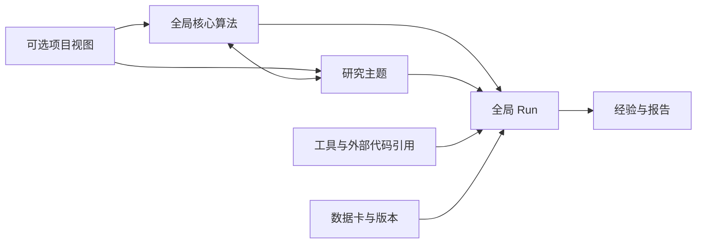

# 工作区架构

## 全局对象，不按项目分割算法

`core-algorithms/`、`runs/`、`research/`、`tools/` 平级。核心算法通过 MOD-ID、接口和文件引用关联；一次 Run 可关联多个核心算法和研究。项目只是可选的目标/交付聚合，同一算法不因参与不同项目而复制。

核心算法的身份来自公司算法/模块文档定义的关键模型算法，具体收录条件见 [核心算法规则](core-algorithms/AGENTS.md)。函数、类和脚本功能的模块化组织不产生新的核心算法对象。

箭头是显式 ID/文件关系。检索已实现按阶段的一至两跳有界扩展，尚无通用知识图谱或自动验证全部语义关系。

## 检索执行链

1. 扫描获准业务目录和逐文件登记的外部来源，计算 SHA-256。
2. 文本/代码保留正文；PPT、PDF、图片和表格转可定位单元，图片做本地 OCR 并保存可重建资产。
3. SQLite 保存当前正文、元数据、片段、FTS5 词项及历史指纹；Qdrant local 保存本地模型生成的片段向量。
4. 查询也在本地编码，全文与向量候选用排名融合；按文件去重，回查当前指纹与 Run/跨文档证据风险。
5. context_engine 按目标算法基线、来源角色和用户选择规划阅读；focus/investigate/wide 扩展一至两跳关联。输出全文、Run 字段摘录或片段及完整选择清单。AI 读取后作答。
6. 查询、CTX 调查链、解决/未解决/冲突反馈、单源反馈与固定问题评估形成维护闭环。未解决反馈触发下一阶段，最多两次；不训练模型或自动修改基础模型权重。

正式用途另走逐结论准入：`--purpose formal --scope` 保留到后续扩展，只导出已复核且版本、适用范围和依赖仍有效的 claim。Run 还须通过记录检查并封存；正式读取重新检查输入/产物文件。此机制控制 CLI 生成的证据包，不能代替领域验收或阻止外部工具自行写报告。见 [证据准入手册](docs/EVIDENCE_CONTROLS.md)。

## 实现与恢复边界

| 部分 | 当前实现 |
|---|---|
| 业务事实 | 文件为主；Run 复核、纠错和已登记依赖影响可追溯 |
| 结论与失效 | evidence.py；Run/研究/算法 claims 与知识/报告旁文件；按 supports/input 传播，复核历史与版本绑定 |
| 能力验收 | health.py；doctor 分组件检查，verify full 要求向量/OCR 实测且无 skipped；业务验证另行进行 |
| 证据查看 | evidence_view.py + automation/ui/evidence.html；本机只读 HTTP 或离线快照，按记录/结论查看依据与报告影响 |
| 只读监测 | evidence_observer.py；复用获准来源及证据图，context/monitor 保存原子基线、观察事件与维护候选；不执行实验或晋升可信状态 |
| 文本索引 | automation/scripts/retrieval.py，SQLite FTS5，增量更新/移除 |
| 语义索引 | qdrant_backend.py，Qdrant Python local 持久化，CPU FastEmbed 离线推理 |
| 上下文选择 | context_engine.py，角色/长度/预算、用户偏好、受限扩展；是否解决由 AI/用户判断 |
| 多格式解析 | material_extract.py，PPTX/PDF 页与图像、CSV/XLSX 行段 |
| 服务部署 | services/qdrant 内的 Windows x64 便携运行时；Qdrant 无 HTTP 服务、Docker 或外部账号；证据查看可另启 127.0.0.1 只读页面 |
| 并发 | 本地数据库单进程访问；当前不支持多个任务同时访问同一库 |
| 大批量材料 | 查询时扫描哈希，按变化增量编码；未做大型公司语料性能验收 |
| 视觉理解 | OCR/替代文字可检索；图形含义和复杂公式需另行视觉核对 |
| 旧布局 | 读取 projects/*/analysis/runs 的历史 Run；新对象始终使用全局布局 |

原件及 Run/反馈不可用缓存替代；索引可重建，但历史原文需获批备份或版本控制保存。迁移路径后重建索引，不能依靠绝对路径派生的旧来源 ID 不变。操作与配置见 [检索手册](docs/RETRIEVAL.md)。
