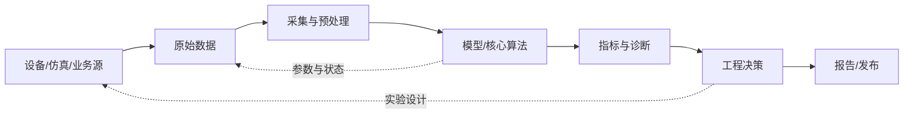

# 系统地图

这是全局算法与研究的高层地图。这里只记录稳定关系，不复制核心算法正文。

## 核心算法与领域

当前尚未登记真实业务核心算法。运行 new-core-algorithm 后由 refresh-index 生成全局核心算法列表；project 是可选视图。

## 通用链路

核心算法卡可将节点替换为稳定核心算法 ID，必要时在本页或可选项目地图中汇总，并为边标注接口、数据资产、单位、频率、延迟和责任人。

## 共享约定

- 同一概念尽量使用 `context/GLOSSARY.md` 的标准术语。
- 跨核心算法数据以 `DATA-*` 标识，并有数据卡和契约。
- 模型以 `MOD-*` 标识，验证证据以 `RUN-*` 标识。
- 跨项目共享工具以 `TOOL-*` 标识，并登记在 `tools/registry.json`。
