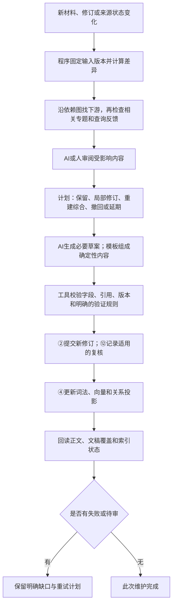
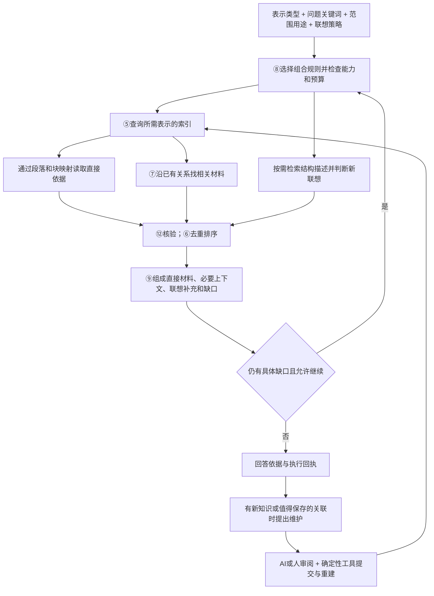

> 后续实施定义已收敛到 [v0.2 契约、工作台与测试计划](../README.md)。G03 类型/实例、联想和维护以新版实施设计为准；本页与 Python v0.1 保留前一版设计，不代表产品已接入。

# 表示组合、经验联想和维护分工：细化设计提案

日期：2026-09-10。本页回应表示类型与实例混淆、表示如何组合现有记录、经验联想、AI维护边界和关系图生命周期。它是在v0.1之上的**行为与下一版字段提案**，尚未接入运行代码。新增的表示定义查询、组合规则、联想策略和图字段尚未加入现有Python类型/Protocol；旧类型检查通过不代表这些扩展已经实现。

## 1. 先区分三件事：类型、已有内容、查询结果

**表示类型是规则；表示实例是具体内容；查询材料包是针对当前问题选出的结果。** 原说明把第二件事当成了用户的入口，需要纠正。

| 对象 | 说明 | 举例 | 是否需要先指定某篇分析 |
|---|---|---|---|
| 表示类型定义 | 规定目标详细程度、优先内容来源、如何组织、怎样回到依据 | “专题概览：优先地图和简报，补经验和关键技术单元引用” | 不需要 |
| 表示实例或可组装内容 | 某份来源在某版本下实际具有的文字，或可从固定字段读取组合的内容 | 某技术单元的检索说明；某研究r2的简报 | 查询前不要求用户知道它；维护时可以指定 |
| 面向问题的组合结果 | 根据问题、关键词、范围和所选类型，选择多个实例，组装本次材料 | 从3个专题选出与“不收敛原因”有关的概览和证据 | 不需要；实例由搜索找到 |

用户入口应是：**选择表示类型＋问题/关键词＋范围＋用途＋是否联想＋预算 → 搜索现有索引 → 选择实际内容 → 按类型组合输出。**

“根据问题进行索引”在这里更准确地说是“根据问题查询索引”。持久索引通常在内容变更后建立；一次提问可以编码查询向量或形成子问题，但不为每个提问重新给全库建索引。确有新的持久知识时，再进入内容保存和索引维护。

不存在“只定义摘要类型，就天然具有每条资料的完整摘要”。但当前L1本来就有问题、方法、主要发现和限制等检索说明，可以直接组合成单元概览，**不要求另存一条摘要副本**。只有指定来源确实缺少必要字段或只有L0原件时，才报告相应内容缺口。类型存在、文字存在、可按规则组装、已经可搜，是四种不同事实。

## 2. 每种表示预期怎样组合L0–L4与双文稿

下表是建议的默认组合，可按目的覆盖；不是每次把所有层都加进去，也不是把层级强制转换成另一层。共同原则是引用原记录，不复制同一次实验、不把旧认可自动传给新综合。

| 类型与注册键 | 优先主体 | 按需补充 | 预期首期实现 | 深入入口 |
|---|---|---|---|---|
| 原始证据 `original` | L0已登记原件、输入、日志、图表或Run材料 | L2发生背景、L1对该证据的定位说明；补充与原文分开 | 精确读取或获准抽取，显示原路径、页/块、指纹；默认不让AI改写原文 | 原件位置；相关L1与Run |
| 完整技术说明 `full` | 一项问题对应的L1完整技术块；需要完整研究叙事时用完整过程稿的章节顺序 | 必要L2决策/失败过程、L3边界、L0引用 | 优先固定读取和章节组合；已有过程稿不重写，缺正文不以摘要冒充 | 每个技术块、定义依赖和原始证据 |
| 局部技术说明 `section` | L1选中块，或完整过程稿的选中章节 | 必需定义、参数、条件；有关L2与L0定位 | 按块ID与依赖关系确定性展开；只加理解当前块所必需内容 | 同单元全文、相关块、L0 |
| 单元概览 `unit_digest` | L1的retrieval_description；若目标是L3经验，则取问题结构、建议和适用/禁用边界 | 必要L2观察或决策引用；关联L0入口 | 用固定字段模板组合；已有单元摘要可复用。新增语义压缩或解释时由AI/人写入新版本 | 被概括的具体L1/L3版本与块 |
| 专题概览/综合 `topic_synthesis` | 一个研究/专题的L4地图和简报 | 关键L3经验、L2尚未解决的决策/冲突；所涉及L1索引与过程稿目录 | 有简报优先使用固定简报。缺少已写综合时，可列出证据和缺口；产生新的跨记录判断才启动AI综合并保存 | 简报段落到具体单元/块；地图到相关问题和过程章节 |
| 领域概览/综合 `domain_synthesis` | 获准范围内多个专题的L4和简报，或已有领域综合 | 跨专题L3模式、差异、反例、关键L1来源 | 先返回专题导航和已有概述；真正形成跨专题结论需AI/人综合，不直接拼接成“已验证规律” | 领域段落→专题→技术单元→原始材料 |

“完整研究过程”与“简报”本身仍是独立文稿，可以直接阅读。这里只说明它们怎样作为表示组合的材料来源。完整过程稿保留研究顺序与论证，简报承担专题的紧凑表达；两者都应保留精确到技术单元的引用。

例如“专题综合＋迭代不收敛”可以先命中某简报的失败原因段落，再通过该段的固定引用直达某个L1的实验条件块。**从浅到深是切换读取的对象和块，不只是改一个表示标签。**

## 3. 接口怎样重新解释，哪些要补齐

应区分面向调用者的查询入口与面向存储维护的操作。

| 层次 | 建议接口/现有映射 | 输入 | 输出 |
|---|---|---|---|
| 类型定义查询（待补） | `RepresentationDefinitions.list/get` | 类型键或用途，不传分析ID | 定义版本、内容组合规则、适用目的、必要字段、支持状态 |
| 统一知识查询（现有G08） | `SearchCoordinator.search` | QuerySpec中的问题、范围、RepresentationSpec等 | 实际命中、所用实例、缺口及可选材料包 |
| 当前结果组装（现有G09/G10） | `ContextBuilder.build` / `ReadViewService.render` | 已选固定内容、类型规则和预算 | 对本问题有用的正文、结构、引用与遗漏 |
| 指定来源的可用性检查（现有G03） | `RepresentationCatalog.list` | 已知来源引用＋类型键 | 指定来源有无实例/必需内容；它不执行按问题搜索 |
| 读取已存在的内容（现有G03） | `RepresentationCatalog.read` | 搜索或可用性检查取得的固定引用 | 对应实例的实际内容和版本 |
| 内容生成维护（现有G03） | `RepresentationBuilder.plan/build` | 具体来源集合、目标类型、生成方法、范围和预算 | 生成计划，以及派生结果或交G02保存的内容草案 |

原G03四个方法仍有用途，但不能用它们代替“列出表示类型”或“按类型搜索全部资料”。下一版应增加定义注册表，并将“可直接读／可确定性组合／需要内容生成／已存在但来源变化／不支持”细化为可区分状态；不能把所有情况压成“摘要缺失”。

建议的字段概念如下，**字段名尚待下一版类型契约落实，不是当前可提交JSON**：

- `RepresentationDefinition`：类型键、定义版本、目标读者/目的、主体类型和字段、补充规则、必需证据、输出结构、可深入关系、是否允许生成。
- `RepresentationRealization`：定义版本、实际内容/块引用、贡献来源、生成或组合方式、来源指纹、当前可读性。可以指向已有字段，不强制创建新的存储副本。
- `AssemblyManifest`：本次问题、选用类型、实际用了哪些字段和版本、深入入口、哪些内容被省略。临时组合结果默认属于查询回执；可复用的新解释才另存知识。

原文是否更新、AI是否需要重新生成，由下面的维护流程判断。用户查询不因选择一种类型，就隐式获得改写知识的权限。

## 4. 经验联想应成为所有表示可用的补充通道

“经验联想”指：寻找表面主题不同、但问题结构、机制、约束或干预方式存在可解释联系的材料。例如迭代振荡和控制回路振荡可能共享反馈放大的结构，值得参考某些分析方法；但数学假设、时间尺度和稳定性条件可能不同，不能直接套用结论。此例只是设计说明。

不建议把经验联想塞进每一种表示的正文，也不把它当成与全文/摘要并列的第七档详细程度。建议所有表示共用：

```text
表示：专题概览（也可以是原件、全文或局部正文）
联想：关闭 / 仅沿已有关系 / 探索新的结构类比
联想范围：在实际授权及本次明确允许的范围内
输出：直接材料 + 必要上下文 + 经验联想补充 + 缺口
```

“都可以启用”不等于“每次强行加几条”。原始证据模式仍保留原文原样，联想只出现在独立补充部分。若没有说得清的联系，应返回没有合格联想。

### 4.1 联想怎样找到？

1. 从问题或已经命中的材料提取**结构描述**：要解决的问题、变量角色、约束、因果/反馈机制、尝试的干预、成功/失败条件。这些描述可以由已有结构字段提供；缺少时AI提出带来源的候选描述。
2. 同时检索主题文本、结构描述和已登记的相似结构关系。关键词和向量帮助找候选，重合词少不等于不相关，向量相近也不证明机制相同。
3. 在较小候选集中比较共同结构、关键差异和是否对当前问题有帮助。新颖度只能用于合格候选间的多样性选择，不能把“越不像越好”作为检索目标。
4. 用G06去重排序，并通过G12检查可读范围和用途；G09在单独的“经验联想补充”部分输出。

每条联想至少给出：两端固定引用、对应的共同结构、关键差异、可借鉴的思路、不能直接迁移的条件、建议怎样验证、候选来自已有关系/规则/向量/AI哪一种方式。没有可核对来源的自由联想不能伪装成知识库命中。

### 4.2 预算与筛选如何保留？

建议给补充通道单独的结果数与篇幅上限，并受原始总预算约束。例如最多2条、占材料正文不超过15%，只是可调起始配置，不是已验证最优值。主问题材料和必要定义优先，联想不能挤掉它们。

默认继承原硬筛选。若主查询明确限定“失败案例”，不能借联想通道静默混入成功案例。确需比较成功经验时，在请求中显式配置独立的补充筛选，但仍受全程排除项和授权范围约束。

新联想默认只是本次查询候选。采用后由G02保存关系记录，仍区别“导航有用”和“科学支持已复核”；未采纳的不全部写入永久关系图。被明确判为不适用的候选可以留反馈及适用域，防止同一条件下反复推荐。

## 5. AI主导什么，哪些工作不必调用AI？

建议**语义维护由AI/人主导，机械维护由确定性程序执行，最后按范围验证**。赞同让AI统筹内容简洁、正确表达和连贯性，但不建议把所有更新都变成全量AI重写：重写可能改变原有准确表述、增加来源漂移，AI审核本身也不保证业务结论正确。

| 工作 | 默认方式 | AI的必要作用与边界 |
|---|---|---|
| 检查字节、版本、引用、Schema、公式变量是否缺定义 | 确定性校验 | 可解释问题，不能用“看起来正确”跳过校验 |
| 从已批准字段拼出单元概览、章节和目录 | 模板＋固定引用 | 不改变含义时不必重新生成措辞 |
| 从原始资料首次提炼技术单元、概括新结果 | AI/人阅读 | 保留来源、未知项与适用边界；需要相应事实或实验复核 |
| 判断新增内容是否影响既有结论、综合或推荐 | 依赖/专题检索先筛，AI审阅语义影响 | “没有引用关系”不等于“不相关”；不确定就保留待审 |
| 修改摘要、跨材料综合、结构类比、解释冲突 | AI/人提出局部修改计划和草案 | 尽量保持未受影响内容；显示修改理由、差异和固定依据 |
| 写版本、并发冲突检查、索引和图投影更新、失败恢复 | 确定性工具 | AI选择获准操作和阅读结果，不直接手改存储或发明Schema |
| 判断模型或工程结论在现实中正确 | 对应实验/证明/授权复核流程 | AI可辅助，不能仅凭自身文字审查宣布通过 |

### 5.1 无需生成式AI的可行方案

把关键事实和条件保存为结构化字段；摘要优先采用已批准字段的模板；章节引用技术块；目录和依赖由程序生成；使用版本化规则定位变化。这可以稳定维护结构、引用、已明确字段和检索数据。

代价是自由文本的新含义、跨材料冲突和新类比不能靠模板可靠判断。传统抽取式摘要可以选择原句，但选择是否覆盖了条件仍需评估；不能把抽取当成语义正确性的保证。完全不用AI时，这部分由人审阅，或明确不生成新综合。

因此，“不依赖AI”的强项是**可重复的维护与已知结构内的组合**；开放领域知识的一致性仍需要语义判断和证据。向量编码模型也属于模型计算，这里“不调用AI”主要指不调用生成式模型作判断或写新内容，不应偷换成完全没有模型。

### 5.2 一次更新的具体闭环



AI给出计划不等于必须全部重写。“经检查保留原文”也是有效决策。纯排版变化可经固定规则处理；模型/索引配置变化只触发相应派生重建。对不确定是否相关的新增资料，先进入候选区或待审状态，再检查相关专题；不能默认追加与旧结论完全无关。

并发新修改出现时重新检查版本，不覆盖。单对象内尽量将相互依赖的变更按明确事务保存；跨对象维护逐项记录完成状态。综合或文稿尚未同步时，继续保留其旧固定依据并提示待维护，不声称新旧内容已全局一致。

## 6. 加深查询有三种不同动作

| 动作 | 实际发生什么 | 是否需要图遍历 |
|---|---|---|
| 读取更细的正文 | 从命中简报段落取得L1和块引用，再读必要定义、全文或L0 | 精确引用/父子映射即可；一跳通常不需要搜索算法 |
| 沿已有关系扩展 | 找引用的反例、支持来源、相关方法、同专题单元或多步路径 | 用有方向、有类型的图遍历，控制跳数和数量 |
| 探索新的经验联想 | 抽取结构描述，检索其他材料，比较联系与差异 | 起初可无现成边；先检索再判断，获采用后才形成持久边 |

例子：先命中简报中的“多次发生振荡” → 通过该段的依据进入某L1结果块 → 按依赖读初值和更新公式 → 沿“反驳/适用限制”边找相反工况 → 若仍缺方法启发，按“反馈、增益、约束”的结构描述检索其他专题。

如果浅层段落没有精确来源映射，则报告定位缺口并继续检索，不能假装有一个确定跳转。要使“浅层命中直达细节”可靠，摘要生成/组合时就应保存**段落→单元→块/原件位置**的映射，而不是只给整份报告一个模糊链接。

研究参考：GraphRAG的Local Search使用实体到文本单元等映射取回细节；DRIFT结合较广概览与后续局部查询。这支持组合不同查询尺度的思路，但不证明本工作区的召回质量或本文配置有效。[Local Search](https://microsoft.github.io/graphrag/query/local_search/)，[DRIFT](https://microsoft.github.io/graphrag/query/drift_search/)。

## 7. 哪些地方使用图？图里具体存什么？

图是节点和边组成的数据结构，不要求新建图数据库。建议使用统一的固定身份，按边类型分别维护和查询：

| 图的用途 | 节点/边示例 | 建立方式 | 使用场景 |
|---|---|---|---|
| 正文定位 | 文稿→章节→技术单元→技术块→原始证据位置 | 从已有固定引用、章节顺序、块依赖抽取 | 从概览直达细节、补定义、追溯 |
| 更新依赖 | 摘要/综合/文稿→它依赖的单元或来源版本 | 从实际生成输入和字段引用确定性提取；可保守记录整条依赖 | 原文变化时沿反向边找需要检查的结果 |
| 证据关系 | 某主张→支持、反驳或限制它的证据 | 人/AI登记，按适用流程复核 | 保留反例，判断正式用途，发现影响 |
| 语义与经验关系 | 方法→相似结构、同一对象、相关约束或候选类比 | 关键词/向量/规则提议，AI/人解释与采用 | 扩展联想、跨专题复用 |
| 专题组织 | 专题→所属单元、专题→子专题 | 明确归属先登记；自动聚类只能提供候选分组 | 领域概览、筛选范围、更新影响的补充检查 |

同一对节点可有不同关系，不能压成一个无类型“相关”。章节顺序另外保留位置号。依赖边指向输入，用反向索引找下游；引用/支持等有方向的边不能因查询“邻居”而被解释为反向事实。

### 7.1 建议的持久记录与辅助表

规范内容和获保存的关系是事实来源；图索引只是可重建的查询投影。现有程序已有`memory_edges`及关系提议/采用入口，但不等于下面所有图类型、段落定位和结构联想都已实现。

| 记录/表 | 建议字段（下一版细化） | 目的 |
|---|---|---|
| 节点版本 | 固定引用、对象归属、内容类型、块定位 | 精确读回，避免把新旧版混为一体 |
| 关系记录 | 边ID、两端固定引用、关系类型、方向、来源、生成方法版本、提出者、采用/复核状态、适用条件、差异 | 保留关系为什么存在及何时可以使用 |
| 正向/反向邻接索引 | 起点/终点ID、版本、关系类别、规范边引用、索引代次 | 快速查邻居和受影响下游 |
| 摘要段落定位 | 概览/段落版本、对应单元/块/原件位置、定位依据 | 支持浅层命中直接进入具体材料 |
| 结构描述索引 | 目标版本、问题结构、机制、约束、干预、结果边界、各字段依据 | 在表面主题之外寻找类比候选 |

可以先以SQLite表和索引保存邻接信息；有限深度遍历用程序中的队列或递归SQL。SQLite官方文档提供递归CTE遍历树/图的能力，因此“用图结构”不意味着必须引入图数据库。[SQLite WITH](https://www.sqlite.org/lang_with.html)。

查询按关系类型、方向、允许范围、已访问版本集合和预算控制，避免循环及高连接度节点把整库拉入。默认只沿已允许使用的关系扩展；提议边只能在显式探索模式中使用，并保留标识。

### 7.2 图什么时候更新？

| 触发 | 程序先做什么 | AI/人何时介入 |
|---|---|---|
| 新增单元/章节/文稿 | 提取已有引用、块依赖与归属，更新相应投影 | 需要新语义关系或专题判断时 |
| AI/人接受新联想 | 先保存带依据的关系记录，再更新邻接索引 | 接受或否定该关联，并写差异和适用范围 |
| 原文/摘要/关系修订 | 保留旧版边，创建新版本投影，反查依赖并标记当前待检查项 | 判断旧关系是否仍适用于新版，不自动转移认可 |
| 来源撤销、结论撤回、权限变化 | 当前查询立即重新核验并阻止不合格使用，排队维护索引 | 解释语义影响、修订下游结论 |
| 索引或编码配置变化 | 重建对应辅助表/向量；保留规范关系和内容 | 原结构描述含义未变时无需重写知识 |
| 单次查询发现临时联想 | 保存在查询回执中，未采用不永久加边 | 认为有复用价值时再提出保存 |

来源变化“使关系需要复查”与“证明关系错误”不同；旧引用仍反映旧时点。关键字段变动是否影响关系可由AI判断，无法确定时保持待查。要使正文与图一致，必须记录每个索引实际处理进度、失败项和重试身份，不只显示一个笼统成功。

依赖图只覆盖已经登记的依赖。新材料可能改变某专题的总体结论，即使旧综合没有引用它，所以还要检查专题成员变化、语义近邻与已保存问题；系统仍须披露检查范围，不能宣称发现了所有潜在影响。

确定性维护是可行的：SQLite FTS5支持通过更新逻辑保持外部内容索引同步，并有重建机制；但这类机制只能维护索引一致性，不能判断自由文本的新含义。[SQLite FTS5](https://www.sqlite.org/fts5.html#external_content_tables)。

## 8. 完整查询闭环与实施顺序



建议顺序：先完成类型定义与L0–L4/文稿组合映射、精确段落回源；再维护正反向依赖与已有关系；然后增加结构描述和有上限的联想候选；最后引入跨专题AI维护。无需先把全部资料抽成实体图，也无需先替换数据库。

验收分别看：类型查询不需要来源ID；可从既有字段组合的摘要不误报缺失；浅层命中可定位真实块；联想继承排除且说明差异；原文更新能找到已登记下游并保留旧版；未关联新增材料进入专题影响检查；AI计划的每项修改有实际回读；索引失败不会重复写内容。联想质量和维护正确性需另有真实标注/反例，不能用结构检查替代。
