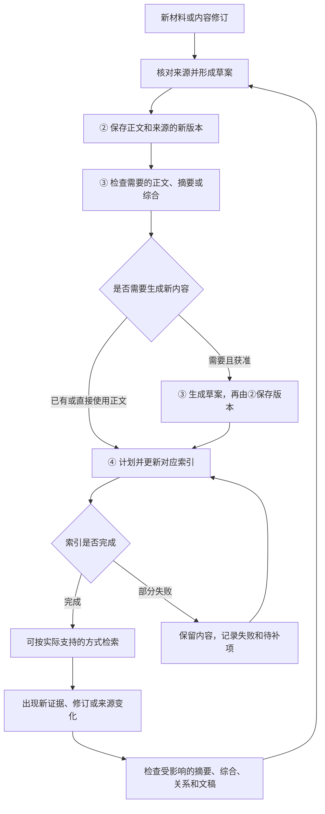
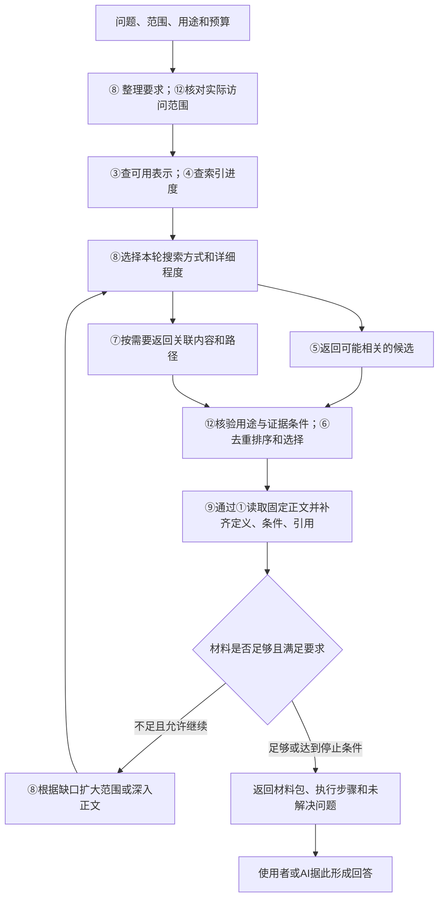

> 后续实施定义已收敛到 [v0.2 契约、工作台与测试计划](../../../../docs/design/representation-query-v0.2/README.md)。G03 类型/实例、联想和维护以新版实施设计为准；本页与 Python v0.1 保留前一版设计，不代表产品已接入。

# 核心功能说明：材料怎样保存、被找到并用于回答问题

这份设计要解决两件事：**把材料整理成可以追溯、持续更新的知识；在需要时找到合适内容，并连同条件和依据一起交给使用者。**

下面先定义概念，再解释保存端的维护功能，最后展开查询、补查、使用结果和修订知识的完整闭环。英文类型和方法名用于对应详细接口，理解功能时可以先看中文。

**当前状态：**这是接口设计说明，尚未整体接入产品运行链路。已实际修改的是Project默认记录规则，使其与Research一致。v0.1已定义40个领域方法、3个执行控制方法和72种数据结构。本轮进一步提出表示类型注册、内容组合和经验联想的设计；新增字段及接口尚待下一版类型契约落实，不把它们算作已实现。精确的现有契约见[SPEC.md](SPEC.md)，新增设计见[表示组合与图维护提案](REPRESENTATION_AND_GRAPH.md)。

## 1. 先把容易混淆的概念讲清楚

以下使用一个假想例子：项目有一份“某迭代方法为什么不收敛”的分析，包含输入条件、公式、尝试过程、结果和限制。示例只用于解释设计，不代表本项目实际做过该实验。

| 概念 | 具体定义 | 在例子中是什么 |
|---|---|---|
| 原始材料 | 获准读取的原件或执行产物，是分析的来源 | 原始报告、输入文件、运行日志 |
| 规范内容 | 由版本存储统一管理、具有稳定身份和修订号的记录。“规范”指管理方式，不代表结论已经正确 | 保存完整方法、结果和边界的一条分析，第1版、第2版都能追溯 |
| 技术单元 | 围绕一个方法、实验、推导或分析组织的完整内容 | 对“不收敛发生的条件、尝试方法和结果”的完整说明 |
| 技术块 | 技术单元内部可单独选择的正文部分，可以声明必需依赖 | 读取“更新公式”块时，必须同时读取“符号定义”和“适用条件”块 |
| **材料表示** | 为阅读或检索提供的一种内容形式或详细程度；可以指向原文、正文的一部分，也可以是有来源的摘要或综合 | 完整分析、某个章节、分析摘要、汇总多次失败的专题综合 |
| **索引** | 为快速查找内容而建立的辅助数据，记录哪些内容可能匹配查询，以及到哪里读取 | 关键词到记录的对应表，或用于寻找语义相近内容的向量 |
| 固定引用 | 明确定位到某个内容版本的地址，包括身份、版本、指纹和必要位置 | 指向“分析第2版的更新公式”，不会默默跳到第3版 |
| 候选 | 初步搜索找到、可能有用但仍需筛选的内容 | 5篇相关分析，其中部分仅关键词相同，未必适用于当前问题 |
| 上下文材料包 | 为当前问题实际选出并展开的文字、定义、条件和引用 | 两篇分析的关键方法、失败边界及原始依据，供人或AI使用 |
| 执行回执 | 记录一次操作实际做了什么、完成了什么、还缺什么 | 哪些版本已保存，哪些索引更新失败，查询因什么原因停止 |

### 表示、索引和L0–L4有什么关系？

还要区分：**表示类型**是“怎样组织材料”的规则；**具体表示内容**是按规则可读取或组成的文字；**查询材料包**是针对当前问题选出的结果。用户先选类型，再给问题、关键词和范围，不需要先知道某篇分析。原先的说明把查询类型与维护具体内容混在了一起，这里明确拆开。

**表示决定“用哪种形式看内容”，索引决定“怎样快速找到这种内容”。** 同一分析可以有全文和摘要；全文、摘要又可以分别建立关键词索引或向量索引。支持读取全文，不等于已经建好全文搜索索引；搜索了摘要，也不能声称搜索过全文。

L0–L4描述记录的职责：L0保留来源，L1保存完整技术内容，L2记录事件和决策，L3保存有边界的经验，L4组织知识地图。它们不等于五档文字长短。L1可以有全文和摘要，一份专题综合也可以引用多个层级的材料。**改变阅读详细程度，不要求改变原记录的层级。**

完整过程稿和简报属于独立文稿：它们组织已有内容供人阅读，可以共用固定技术单元。文稿、表示和索引不需要各复制一套原始资料。

## 2. 保存端的三个职责

用户所说的“存储端功能”，在本设计中包括三个相互连接、可以分别维护的职责：

| 职责 | 需要回答的问题 | 负责的结果 |
|---|---|---|
| ② 内容与版本管理 | 内容归谁所有？新增还是修订？怎样保留旧版和修改原因？ | 正文、来源、修订历史及提交结果 |
| ③ 材料表示维护 | 需要全文、章节、摘要还是综合？是否已有？是否仍对应所需来源版本？ | 可用形式清单、实际文字、构建计划、派生结果或新内容草案 |
| ④ 索引维护 | 已保存内容能否被指定搜索方式找到？查找用的辅助数据更新到哪里？ | 关键词/向量等索引、更新进度、失败项和续做位置 |

三者分开的原因很具体：修正适用条件要保存正文新版本；增加摘要不一定改原正文；更换向量编码模型只应重建对应索引，不能顺便改写研究结论。

## 3. ③ 材料表示维护：管理不同阅读和检索形式

### 3.1 为什么需要它？

每次都读取全部报告，材料量会很大；永远只读摘要，又容易漏掉公式、前提和反例。表示维护使查询可以先了解大意，再按需要深入，并始终知道所读文字来自哪个版本。

“维护”具体包括：**查明已有形式、读取指定形式、计划补齐缺失形式、执行构建，以及发现来源变化后哪些结果需要重新处理。** 它不意味着每保存一份资料，就自动生成所有形式。

### 3.2 有哪些表示？

| 表示名称 | 默认主体怎样组合 | 按需补充与预期实现 |
|---|---|---|
| 原始证据 `original` | L0原件、输入、日志、图表或Run材料 | 用L2交代事件背景、L1提供证据定位；原文单独呈现，默认精确读取，不让AI改写 |
| 完整技术说明 `full` | 相关L1完整块；要看完整研究叙事时按完整过程稿的章节组织 | 补必要L2决策/失败经过、L3边界和L0引用；优先读取与组合已有内容 |
| 局部技术说明 `section` | L1选中块，或完整过程稿选中章节 | 沿依赖补定义、参数、条件及原件定位；确定性展开，不重写整篇 |
| 单元概览 `unit_digest` | L1已有问题/方法/发现/限制等检索说明；目标为L3时读取经验结构与适用边界 | 用固定字段模板组成，避免另存重复摘要；确有新解释才由AI/人生成并保存 |
| 专题概览/综合 `topic_synthesis` | 一个研究或专题的L4地图和简报 | 补关键L3、L2冲突/决策、L1引用和完整过程目录；新综合由AI/人形成，已有简报直接复用 |
| 领域概览/综合 `domain_synthesis` | 多个专题的L4、简报或已有领域综合 | 补跨专题经验、差异和反例；先返回导航，跨材料的新判断需AI/人综合并保存 |

这些是设计允许的类别，不表示当前都已有自动生成能力。系统必须报告实际支持哪些类别。关键词特征还可形成检索用的`lexical_card`；关系图和独立文稿由关系、阅读功能呈现。

这些是默认组合规则，不是每次必须把所有层都加进去。“专题概览＋某问题”可以搜索多个研究的简报和地图，选出相关段落，再按其引用进入具体技术单元。完整版与简报仍是独立文稿，只是在此被用作组合材料。

### 3.3 类型查询、按问题搜索和具体内容维护要分开

**用户查询：选择表示类型＋问题/关键词＋范围 → 查询相应索引 → 找到实际内容 → 按类型组合结果。** 通常不需要先生成摘要，也不为每个问题重新建全库索引。

建议增加`RepresentationDefinitions.list/get`：不传分析ID，返回类型定义、来源组合规则、支持状态及可深入入口。这是待加入下一版契约的定义查询。现有⑧`SearchCoordinator.search`负责按问题找材料，⑨负责组合当前结果。

下面原有四个接口服务于**具体内容的维护和读取**，不是用户的统一搜索入口：

| 接口 | 输入 | 实际动作 | 输出 |
|---|---|---|---|
| `RepresentationCatalog.list`：查询可用形式 | 固定内容引用、想用的表示类别 | 检查指定版本具有哪些表示及其来源状态 | 可用、来源已变化、缺失或不支持；已有表示的固定引用 |
| `RepresentationCatalog.read`：读取已有形式 | 上一步取得的表示引用 | 按固定版本读取，核对实际来源是否可访问 | 文字、版本、必要引用和缺口 |
| `RepresentationBuilder.plan`：制定构建计划 | 来源版本、允许范围、目标形式、生成方法及预算 | 确定使用哪些输入、哪个方法版本、预计工作量 | 可检查的计划；此时还没有生成结果 |
| `RepresentationBuilder.build`：执行构建 | 已确定的计划 | 按指定方法处理固定输入 | 机械派生结果或需要②保存的新内容草案；来源、实际消耗和失败情况 |

例如，L1已有问题、方法和限制等字段，就可以按模板组合单元概览，不应因为没有单独的摘要文件而报告缺失。若只有L0原件、尚未形成分析，则类型仍然存在，但该来源缺少所需技术内容。系统要区分“可直接读”“可从已有字段组合”“需要生成新内容”“旧来源待维护”“不支持”，而不是统称摘要缺失。现有v0.1可用性类型还不够细，需要在下一版同步扩展。

### 3.4 哪些结果要正式保存？

固定规则的分词、特征提取等机械结果，可以作为可重新计算的派生数据，但仍需记录输入版本和处理方法。**包含内容取舍、解释或新判断的摘要和综合，应作为版本内容保存。**

例如，“三次失败可能都与初值有关”已经是一项解释。③可以生成草案，但要交给②记录正文、来源和修改原因；是否有证据支持该解释，由⑫证据与复核功能判断。生成摘要成功，不等于确认了一条规律。

### 3.5 原文更新后怎样维护？

**涉及含义、结论、摘要和连贯性的更新，建议由AI或人主导审阅；程序负责找影响、校验和执行。** AI先提出“保留、局部修订、重建综合、撤回或延期”的计划，不默认把全部内容重新生成。AI检查也不等于已经证明科学结论正确。

假设分析第2版补充了“仅适用于某类输入”的限制，已有摘要仍基于第1版：

1. 第1版正文和摘要继续保留，历史引用仍指向原版本。
2. 程序比较输入与依赖，检查哪些字段可直接组合、哪些既有摘要或综合仍基于旧来源。没有依赖边的新材料，也要检查相关专题，不能自动判为无关。
3. AI或人检查含义影响，决定保留或修改哪些内容；必要时生成新草案。确定性工具校验引用、版本和结构，再由②保存新修订，⑫按需要复核新内容。
4. ④更新新摘要的索引；依赖它的专题综合、章节和简报也进入影响检查。

综合引用多个来源时，要检查所有贡献来源的版本和访问范围，不能只检查综合文件本身。来源失效或不可访问时，保留缺口，不能借旧摘要绕过来源限制。

不借助生成式AI也能做很多维护：结构化字段模板、固定章节组合、字节/版本比较、引用和定义校验、依赖追踪、索引重建、失败恢复。这些适合确定性程序。自由文本的新含义、冲突与跨领域类比，则由AI或人审阅；完全不用AI时应交给人，或明确不产生新的综合判断。向量编码仍是模型计算，不能把“不调用生成式AI审阅”说成完全没有模型。

AI也不直接决定任意文件布局或数据库Schema：它从已注册记录类型与操作中提出内容和维护计划，由工具执行保存、并发校验和恢复。[详细分工及更新闭环](REPRESENTATION_AND_GRAPH.md)。

## 4. ④ 索引维护：让已保存内容能够被正确找到

### 4.1 索引里存什么？

索引保存查找所需的数据和回到正文的地址，常见形式包括：

- **关键词索引**：哪些词出现在什么内容中，适合术语、名称和编号匹配。FTS是文本检索的一种实现方式，实际搜全文还是摘要，取决于纳入了哪种表示。
- **向量索引**：编码模型把选定文字转换成数值向量，用来找语义相近的内容。Qdrant是首期计划复用的向量检索后端。
- **关系查询辅助结构**：保存便于查询的节点和边，帮助找到引用、支持、反驳或已登记关联。关系依据仍来自对应内容，辅助结构不创造事实。

同一内容可以出现在多个索引中。每个索引都应明确自己的**搜索通道、材料表示、处理方法版本和来源版本**。“摘要的向量索引”和“全文的关键词索引”有不同覆盖范围，不能笼统说成“材料已建好索引”。

关系辅助结构建议拆清五类用途：正文定位、更新依赖、证据支持/反驳、语义或经验关联、专题归属。它们可以共用固定节点身份，但边必须带类型、方向和依据。原文→摘要的影响检查、简报→技术块的深入、方法→相似结构的联想，不能混成一种无类型“相关”。

首期可以用SQLite保存节点/边的正反向索引，不必先引入图数据库。规范记录是来源，辅助图可重建：提交章节时抽取引用，接受联想时保存关系再建边，修订来源时保留旧边并检查新版适用性，索引失败时重试原计划。单次查询的未采纳联想只留在回执，不全部永久加边。[图字段、维护触发与使用方式](REPRESENTATION_AND_GRAPH.md)。

### 4.2 “更新进度”是什么意思？

详细契约使用`Watermark`，原先简称“水位”。本页称为**索引已处理进度**：在指定范围内，哪些内容变化已经处理，哪些仍待处理，依据的是哪一批来源版本。

例如，项目完成了第12次内容提交，关键词索引处理到了第12次，向量索引只处理到第10次，则第11、12次的新内容可能只能被关键词搜索找到。数字只是示意，实际还需绑定范围、索引版本和未完成项，不能用一个数字表示全库所有索引均已同步。

**内容保存成功、索引更新成功、结论通过复核，是三个独立状态。** 根据已知ID读出了新记录，也不能证明搜索已经能找到它。

### 4.3 四个接口分别做什么？

| 接口 | 输入 | 实际动作 | 输出 |
|---|---|---|---|
| `ChangeReader.read`：读取内容变化 | 指定范围、上次位置、本次数量上限 | 分页读取新增、修订等变化，不一次装入全部正文 | 一批变化、依据版本、下一页位置 |
| `IndexLifecycle.status`：检查进度 | 要检查的索引及范围 | 查询实际已处理状态 | 来源依据、已处理进度和待处理状态 |
| `IndexLifecycle.plan`：制定更新计划 | 更新模式、目标索引、范围；一批变化或一页当前内容清单 | 决定本批需要新增、重算或清理哪些索引项 | 固定输入与处理配置的计划，含后续分页位置 |
| `IndexLifecycle.execute`：执行计划 | 已制定的索引计划 | 读取对应内容或表示，更新辅助索引并核对结果 | 完成项、失败或待补项、实际推进的进度及续做位置 |

分页就是每次只处理有限数量，之后从保存的位置继续，便于控制工作量和中断恢复。下一页位置不授予扩大材料范围的权限。

### 4.4 三种维护方式

| 方式 | 使用时机 | 实际处理范围 |
|---|---|---|
| 增量更新 `incremental` | 新增或修订内容后 | 指定起点后的变化及受影响索引项 |
| 全量重建 `rebuild` | 首次建索引，或编码模型、分词规则、索引结构变化后 | 分页读取指定范围的当前内容清单，建立新的索引版本；不假定历史变化日志永远完整 |
| 失败补做 `repair` | 更新失败、漏项或局部损坏 | 核对并补齐计划要求的部分，保留已确定完成的工作 |

全量重建先建立并检查完整的新索引，再切换查询使用的版本，避免把半成品直接交给查询。向量索引还需区分模型、编码方式和维度；本设计不改变当前部署对标准模型及兼容384维的限制。

### 4.5 失败和版本变化怎样处理？

若摘要已保存而向量更新失败，应保留摘要新版本，报告“内容已保存、向量索引待补做”，再次执行原索引计划；不重复提交摘要。相同计划重试应避免重复索引项，这就是这里所说的“幂等”。一批任务有失败项时，不能把整批进度标为完整。

内容撤回或权限变化后，索引也需要相应维护。在维护完成之前，查询和读取仍要重新核验权限与有效性，不能只相信旧索引。

查询要求最新内容但索引落后时，⑧可以在明确允许的预算内安排补做；无法满足就返回“索引尚未跟上”及已有结果。不能把漏检伪装成“资料里没有答案”，也不能静默改读旧版。

## 5. 保存端闭环：从新材料到可检索，再到更新

图示表达功能关系，不表示后台任务已自动开启。谁提出维护、何时执行、允许处理哪些材料，由用户操作或⑪获准整理策略决定。

一次维护应返回：保存了哪些版本、哪些表示已可用、哪些索引已更新、哪些仍缺失、哪些下游内容待检查。只有实际完成的步骤才记为完成，历史版本和恢复入口继续保留。

## 6. 查询端的五个核心功能

| 功能 | 直白解释 | 典型输入 | 典型输出 |
|---|---|---|---|
| ⑤ 候选召回 `recall` | 从大量内容里先找出可能相关的一批 | 问题、范围、筛选条件、表示、搜索方式和数量上限 | 候选身份、命中表示、片段、分数、来源版本及实际索引覆盖情况 |
| ⑥ 去重与排序 `rank` | 合并重复命中，把更有用且不过度重复的内容放前面 | 多路候选、排序规则、必要的有界正文片段 | 排名、保留理由、未选原因和降级情况 |
| ⑦ 关系导航 `neighbors/paths/suggest_links` | 沿引用、支持、反驳或关联找内容，并解释为什么有关 | 起始内容、关系类型、范围、最多走几跳 | 相邻内容、路径、依据；新关联建议的差异与待确认状态 |
| ⑧ 渐进查询协调 `search/resume/next_step` | 决定先查什么、不足时做什么、何时停止 | 查询要求、允许扩展方向、实际搜索能力和累计预算 | 结果、步骤、消耗、缺口、停止原因及续查位置 |
| ⑨ 上下文组装 `build` | 把选中材料展开为能够理解和使用的正文 | 固定候选、详细程度、用途、篇幅、必要依赖 | 文字、定义、条件、反例、引用及未能装入的部分 |

⑥内部处理去重、多路结果融合、可选的进一步重排和最终选择。同一版本被关键词与向量搜索同时命中，可以合并展示并保留两路依据；标题相同、版本不同或出处不同的内容，不能简单当作重复删除。

正式用途还要由⑫核验当前证据要求，再决定最终保留数量。合格项不足时，⑧可以继续找候选。排序高不代表结论正确，关系上接近也不代表方法能直接迁移。

### 所有表示都可以带“经验联想补充”

经验联想是寻找表面主题不同、但问题结构、机制或约束有可解释联系的材料。建议作为**可选补充通道**，而非第七档表示：原件、局部正文、摘要和综合都可启用，主体内容保持自己的用途。

先从问题或命中材料取得结构描述，例如变量角色、反馈机制、约束、干预与失败条件；再结合结构描述检索、关键词/向量和已有关系找候选；最后比较共同点、差异和对当前问题的帮助。并非必须先有图边，新候选可通过检索得到，采用后才保存关系。

每条联想给出固定来源、共同结构、不可迁移差异、可借鉴思路和验证建议。没有合格关联时可以不返回。给它单独的数量/篇幅上限，同时受总预算控制；不能挤掉直接证据和必要定义。默认继承原筛选与排除，需要扩展到不同结果类型时应在请求中显式规定补充范围。

例如迭代振荡与控制回路振荡可能共享反馈放大的结构，值得比较分析方法，但数学前提和稳定性条件可能不同。它只是带验证要求的启发，不是可以直接套用的结论。[联想字段与流程提案](REPRESENTATION_AND_GRAPH.md)。

## 7. 一次查询的输入是什么？

用户可以直接提出：

> 在本项目关于迭代不收敛的记录里，找以前失败的尝试，解释失败条件和可借鉴的处理方法。先看摘要，不够时读公式和完整分析；允许查已关联的其他专题，但排除某份过期资料。最后给出带依据的说明。

应用把它整理成以下要求。多数技术参数可使用明确的默认策略，不必让用户逐项填写。

| 输入项 | 含义 | 本例选择 |
|---|---|---|
| 问题 | 要回答什么 | 失败条件及值得参考的处理方法 |
| 材料范围 | 搜哪些对象、来源和时间范围；排除什么 | 本项目起步，获准时扩到关联专题；始终排除指定资料 |
| 内容筛选 | 找哪类知识和尝试结果 | 相关失败尝试、分析或经验；未知结果不能当作失败 |
| 阅读形式 | 先用什么详细程度，允许怎样深入 | 摘要优先，必要时读局部正文和完整技术单元 |
| 用途与适用条件 | 探索、正式引用还是追溯；匹配什么场景 | 探索；保留对应输入条件，不能直接推广 |
| 搜索与扩展策略 | 允许哪些搜索方式，能否扩大范围、沿关系继续 | 使用已支持通道，在允许范围内扩展 |
| 预算与输出 | 时间、候选数、模型消耗、最终篇幅等上限 | 按本次要求或配置上限执行，各步骤共同累计 |

材料范围和内容筛选始终有效。允许扩大到其他专题，不等于能读任意来源；深入全文也不能重新纳入已排除的材料。

## 8. 查询完整调用链：每一步拿到什么、交出什么

**第1步：明确要求。** 输入是自然语言或结构化查询；输出是可执行要求、实际访问范围和累计预算。缺少决定性条件时说明未知项，不能凭空假设其他工况的结论适合用户。

**第2步：检查能查什么。** ③返回表示的存在情况，④返回相应索引是否已跟上来源。结果可能是“摘要可搜，全文可读但尚无全文索引”。⑧选择真实支持的方式，必要时说明回退或缺项。

**第3步：找候选。** ⑤通过已支持的关键词、语义相近等方式返回候选，保留各通道的分数和实际命中片段。⑦按需要补入引用的反例或相关专题，并返回连接理由。此时得到候选清单，还不是答案。

**第4步：筛选与排序。** 检查候选是否仍在范围内、固定版本可否读取、是否满足当前用途的证据要求；合并重复命中，比较相关性、必要覆盖和重复程度。输出是选中内容的固定引用及理由。候选不够，不代表整个资料范围没有答案。

**第5步：展开关键正文。** ⑨把已选引用交给①读取。读取“更新公式”时，补齐符号定义、条件和依赖块。输出真正可使用的文字，不仅是标题和链接。必要定义超出预算、来源不可读或条件缺失时，要返回具体缺口。

**第6步：继续或带缺口停止。** ⑨把“缺少初值条件”等问题交回⑧。⑧决定是读同一记录的更多正文，还是到允许的其他专题找资料；也可以因没有新线索而停止。各轮保留排除项、已读版本和已用预算，不能换一次调用就重新归零。

加深查询有三个不同动作：①通过浅层段落的固定引用进入L1、技术块和L0；②沿已有证据或导航关系找补充材料；③通过结构描述检索新类比。第一个动作通常只需精确映射，第二个使用有界图遍历，第三个可以先无图边。摘要/简报在形成时就应保存“段落→单元→块/原件位置”，缺少映射时报告定位缺口，不能只改表示标签就声称读到了更深证据。

**第7步：返回材料和执行说明。** 可以完整返回，也可以返回带缺口的部分结果，至少包括：

- 找到哪些内容，实际使用摘要还是全文，对应哪个固定版本。
- 能支持怎样的回答，适用条件、反例和限制是什么。
- 哪些内容因范围、来源缺失、索引落后或篇幅不足而未纳入。
- 为什么停止：材料足够、无新增线索、预算耗尽、取消或错误。
- 如果允许继续，保存的续查位置是什么；继续时仍沿用原范围和累计记录。

查询系统直接产出的是**候选结果、可使用的材料包和执行回执**。最终回答由使用者或AI依据材料形成。“材料足够”是针对本次问题的判断，不是对结论的科学证明。

## 9. 使用结果之后，怎样回到保存端？

只是读取已知内容并回答问题时，查询无需额外改写知识。若发现新证据、在新条件下验证了方法，或纠正原记录，则进入新的保存流程：

1. 人或获准AI整理新内容，写明来源、实际观察和适用范围。没有检索到，只能先记为检索缺口，不能直接写成“这种方法不存在”。
2. ②保存新记录或修订，保留旧版与修改原因；⑫单独记录所需复核，旧认可不自动转给新解释。
3. ⑪检查受影响的摘要、综合、关系和文稿，调用③准备相应内容；新解释继续通过②保存。
4. ④更新受影响索引，返回实际完成状态；后续查询检查这些状态并使用合适版本。

完整闭环是：**材料进入 → 版本保存 → 准备阅读/检索形式 → 更新索引 → 查询、筛选与展开 → 使用和发现新证据 → 保存修订并维护下游。** 自动整理可以按获准策略修订正式知识，但要保留版本、依据、复核和恢复入口。

## 10. 其他功能与详细设计入口

| 功能 | 在闭环中的作用 |
|---|---|
| ① 固定读取与引用解析 | 按身份、版本、位置读取真实内容，将已有引用格式转成统一引用并核对来源 |
| ② 内容与版本管理 | 校验、提交、历史和恢复；恢复也留下新记录，不抹掉后来发生的历史 |
| ⑩ 阅读视图 | 把已有内容组织为全文、局部阅读、过程稿或简报等页面及导出 |
| ⑪ 按策略整理 | 制定维护计划，协调修订、表示生成、证据检查和索引更新，记录各项结果 |
| ⑫ 来源、权限与证据复核 | 判断能否读取、是否适合当前用途、来源是否失效，以及哪些下游内容受影响 |

这些是功能边界，不要求拆成十二个后台服务。首期可在现有程序内复用版本存储、关键词搜索、Qdrant和显式引用，再逐步替换策略。

Project默认记录规则已经调整：实质工作保留L0来源、L1完整技术内容和L2事件/决策；阶段结束维护有依据的L3经验、L4地图及完整/精简文稿。程序默认`explore/fine`、保留L0–L4并建议总结，显式策略优先。没有可推广经验时留缺口，简单查询不凑层数；默认值不等于启动了后台自动维护。

继续阅读：[完整行为与错误约定](SPEC.md)、[逐函数必要性及输入输出](FUNCTIONS.md)、[数据字段](DATATYPES.md)、[现有代码落点和实施顺序](IMPLEMENTATION.md)。本页解释“是什么、为什么、怎样衔接”；方法签名和精确约束以详细契约为准。
