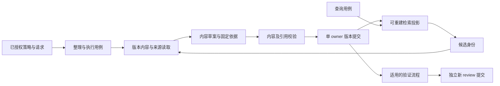

# 存储、版本、表示与自动整理的边界讨论

核对日期：2026-09-09。固定 Run：`RUN-20260909T155125Z-2961BDF175A8`。实现基线：当前工作区的 `647d786` 源码及本轮现行文档。本文是能力与取舍讨论，不是已经批准的接口定义，也不表示下述设计已实现。仅作只读源码核对与三个公开一手来源阅读，未运行性能、并发故障或模型质量实验。

建议保留现有单 owner 版本提交和固定引用，把检索投影从业务保存调用中解开；先建立有界读取能力，再考虑更换底层数据库。L0–L4、材料抽象程度和检索视图回答不同问题，不能据此各建一套存储。自动整理可以按已授权策略修订正式知识对象；新内容是否获得有效复核，需要另一条有依据的状态转换。

## 1. 当前哪些内容具有权威性

| 对象 | 当前权威来源与行为 | 架构含义 |
|---|---|---|
| 原件与 Run 材料 | 原件/Run 的 inputs、artifacts、代码快照引用，以及来源登记。`raw_materials.py:1,37,84,99,164` 生成只读 L0 视图，不建立第二份原件库 | L0 接入应是受限引用解析与读取能力，不是任意文件 CRUD |
| 规范记录与历史 | `store.py:99,140,158,226` 以 owner 的 HEAD、不可变 manifest 和修订文件为准；更新生成新修订 | 当前原子事务边界是 owner，不是 L1、L2 或文稿类型 |
| 复核与适用性 | 独立 review 绑定 claim、容器内容 hash、scope 与依据；`evidence_adapter.py:197,203,207,313` 分开返回 review_state 和 effective_validity | 旧 review 的历史状态可仍是 accepted，但内容或依据变化后有效性不能沿用 |
| L1 检索说明与完整正文 | `technical_units.py:1,23,73` 明确 retrieval_description 是编写的知识；完整正文保存在块列表，选块补齐局部前置定义 | 短文本不是可以随时删除的缓存；全文也不应为每种搜索方式重复存储 |
| 独立章节和双文稿 | `documents.py:1,39,133` 使用现有版本存储，按固定章节/技术单元引用组合；读取不改正文或指针 | 文稿是独立编写内容，既不等于 L4，也不应因为是长文另造一套版本系统 |
| representation 规范记录 | `index.py:389–447` 从规范 representation 记录生成 target+slot 检索条目；目标变化使表示过期 | 当前 representation 的文本本身是版本内容，SQLite 中的表示行才是派生副本 |
| FTS、向量与索引元数据 | `index.py:357,476,674,710,816,827` 由规范快照生成、对账和重建；记录代次、投影版本及编码器版本 | 可重建加速结构；不是结论、复核或权限的最终权威 |

表中 Python 路径均从 `automation/scripts/memory/` 起算。`contracts.py:17–25` 维护 v1/v2/v3 层级兼容与内容 hash 字段；当前层级为 L0 来源、L1 技术单元、L2 事件、L3 经验、L4 地图，document/document_section 为 `level=null`。因此“分级 CRUD”应理解为按内容语义校验的读写用例，共用身份、固定引用和提交机制，不等于五个 repository。

## 2. 材料抽象程度与表示方式需要分轴讨论

依据本轮用户澄清，查询分档指搜索材料的抽象程度，而不是投入多少次模型调用。建议预留以下可选能力，具体命名、字段和默认行为留到下一轮接口定义：

| 材料范围或抽象程度 | 语义 | 与当前对象的关系 |
|---|---|---|
| original | 可追溯的原始材料及定位 | 通常从 L0/Run/来源登记读取；不承诺全文都可访问 |
| full | 所选对象的完整正文 | L1 技术单元、研究文稿或其他规范对象都可能提供；“完整”不等于“原始” |
| section | 有完整上下文边界的章节或片段 | 独立章节或带必要定义的技术块 |
| unit_digest | 单个技术单元的短说明 | 当前 L1 retrieval_description 可提供一部分基础 |
| topic_synthesis | 同一主题多份材料的综合 | 可能是经验、地图、专题文稿；需要固定依据与适用边界 |
| domain_synthesis | 跨主题的领域综合 | 同样需要版本与来源；当前不存在自动且完备的领域综合能力 |

这些值不是严格的全序：一份 full 报告可能比 original 数据小得多；一个 section 可能含多次实验；topic_synthesis 可能既有长正文也有短表示。L0–L4 是知识角色，不能直接映射成由长到短的压缩梯子。

lexical_card、graph、process、report 更适合作为表达或访问视图：词项卡辅助精确定位，图表示关系，过程视图表达时间/决策顺序，报告视图服务叙述。它们可以覆盖不同抽象程度，不必再排成“更高级的一层”。检索应允许请求某些程度/视图，并显式返回缺失与实际返回类型；不能在不存在领域综合时，悄悄把地图命中宣称为领域综合。

进一步区分三个动作：作者编写内容、程序生成表示、查询使用表示。编写可能新增结论或解释；生成表示只应产生有固定来源与版本标识的访问形式；查询只选择并读取。若表示生成引入了新综合判断，它应通过作者修订流程保存，不能伪装成机械投影。

## 3. 最少必要的稳定能力边界

下面是职责划分建议，不要求现在拆出这些类、服务或数据表。

| 能力边界 | 应承诺的稳定语义 | 应隔离的变化 |
|---|---|---|
| 版本内容访问与提交 | 定位 owner；按固定身份/修订批量读取；有界列出元数据/变化；比较预期 HEAD 后提交单 owner 批次；读取幂等回执和历史 | 文件目录、manifest 组织、未来 SQLite 实现、索引后端 |
| 来源与证据解析 | 从固定引用取得获准材料、指纹、当前访问状态、复核与适用性；返回明确缺口；支持提交前重检 | Run/旧卡片/登记文件等来源适配；权限读取实现。不能让普通查询直接拼原件路径 |
| 检索投影维护与候选查询 | 从固定输入构建/删除派生条目；公布就绪水位；按范围、抽象程度和预算返回候选身份、得分依据与缺口 | FTS、向量模型、图邻接、融合或重排。维护写入与查询读取使用分开的窄入口，但不因此部署两个服务 |
| 整理与执行控制 | 依据策略选择材料，生成修订计划与内容，调用校验、提交和适用的验证流程，记录执行依据和结果 | 模型、提示词、整理策略、触发器；不能把生成模型装入版本存储或检索后端 |

review 的业务准入规则应是内层规则，review 的读取可由证据解析提供，review 的写入仍走受控版本提交；不需要为每种状态另建数据库。实现上可先保留一个包、一次进程和现有数据库，先收窄依赖方向。

现有两个具体耦合值得先处理：`service.py:390–408` 在提交后直接调用 index；`index.py:219` 的目标解析又依赖服务引用解析；`summaries.py`、`consolidation.py` 和 `packets.py` 多处使用服务私有方法。建议先让应用用例按“版本提交 → 索引投影”编排，并让检索通过窄的读取/证据能力取数据。否则只是把现有私有方法改名为接口，变化仍会互相传播。

图描述建议的数据流；验证不必全部发生在内容提交后，必要的输入/草案验证可前置。图中不同提交不是一个全局事务，失败时应报告实际已完成部分。

## 4. 版本、快照与删除的准确语义

**单 owner。** `store.py:239,255,284–327` 使用 owner 写锁、预期 HEAD、staging 和 HEAD 原子替换。manifest 固定 record_heads、幂等 ledger 和索引待处理意图；HEAD 发布是当前业务可见性边界。索引不在该事务内。`store.py:1–3` 也明确没有承诺任意文件系统下断电无损，不能扩大成数据库级耐久性保证。

**跨 owner。** `packets.py:49–50` 已明确一次材料包记录各 owner 的读取水位，并在返回前复核，不声称跨对象原子快照。`service.py:411–421` 逐一核对 basis_heads，并在提交前通过 `_recheck` 再核对；只锁目标 owner，没有同时锁住所有被读 owner。因此它是乐观的依据一致性检查，不是跨对象可串行化事务，也不能保证返回后的来源继续不变。

固定 Ref 和 basis_heads 不能互相替代：固定 Ref 回答“使用了哪个修订的哪些字节”；basis_heads 回答“准备材料时观察到哪些对象状态，提交前是否已变化”。前者支持旧结果复现；后者防止无意用旧计划覆盖新进展。外部原件还需要来源指纹/访问状态，因为它们变化时未必产生 memory HEAD。当前 `consolidation.py:65–68,173–176,220–224` 正是同时使用两者。

建议初期保留这种语义，并把严格依赖的范围缩到实际使用的对象与固定依据。若以后出现必须原子更新多个 owner 的真实用例，再选择共同事务域或有显式恢复的协调流程；不要把“快照”一词当作已经解决跨对象事务。如果需要返回“当前最新”结果，应说明它截至哪次检查；回读历史则保留旧版本并同时显示当前访问/有效性状态。

**删除与撤回。** 当前公开 Operation 枚举没有通用硬删除（`automation/schemas/memory-v3.schema.json:1994–2003`）。内容修订通过 `service.py:220–229,275–290` 递增版本；复核可标记 disputed/retracted/superseded。建议普通整理继续采用新修订、替代关系与复核历史；相似去重不能直接删除另一条知识。L3 与 L4 合并也不应把记录 kind 原地改掉，当前代码拒绝修订改变 kind。

派生索引的删除属于可恢复维护。规范内容/原件的真正清除则会影响审计、引用与备份，应是单独治理操作；本轮不需要为了补齐 CRUD 字母而增加它。将旧内容恢复成当前版本时宜新增恢复修订并重新判断复核，而不是移动 HEAD 丢掉之后的有效历史。现有 `recovery.py:1,96–119` 只在能证明进程退出时归档旧写锁，保留孤立提交与历史；它不是任意知识回滚功能。

## 5. 摘要、投影与可重建性的判定

| 内容 | 可否直接丢弃重建 | 理由 |
|---|---|---|
| 当前 L1 retrieval_description | 不可作为缓存丢弃 | 是技术单元的一部分，包含适用/不适用与限制 |
| summary.save 保存的 L3/L4 | 不可作为缓存丢弃 | 是新解释和知识内容；`summaries.py:59–94` 经版本提交保存 |
| 当前规范 representation 文本 | 不可作为缓存丢弃 | 自身有记录身份与修订；目标过期使其停止被用于活跃索引，不删除历史 |
| 独立章节、完整过程文稿、精简报告 | 不可作为缓存丢弃 | 包含作者的结构与表述，不能仅凭底层技术单元确定性还原 |
| SQLite 投影行、FTS、向量、邻接查询结构 | 可从仍可访问的权威输入重建 | 重建必须绑定来源/投影/模型版本，旧索引失效不能变成新事实 |
| 将来自动生成的纯检索摘要 | 可以设计成派生数据，但需先定边界 | 应保留输入版本、生成规则/模型版本及失效条件；再生成未必字节相同，若作为证据引用或有独立编辑，应按版本内容保存 |

真正的判断标准是：删除后能否不丢失人工/AI判断、复核历史和已经引用的依据。不是“文本短”“由 AI 写过”就可以重建。当前没有把所有摘要都自动物化、过期重算的统一机制。

当前投影已有有用的状态基础：`index.py:476–529` 在 SQLite 事务内同步 FTS 与对应水位，`index.py:674–707` 比较 HEAD generation、native_fingerprint、projection_version 和 encoder_version；`service.py:390–408` 对外报告保存成功但索引 pending。建议继续让一个业务内容状态有一个权威来源，不把索引状态写回不可变提交回执，也不因换模型触发知识“重新验证通过”。

## 6. 按策略自动整理和正式知识修订

用户本轮已允许按策略自动修订正式知识，同时保留版本、复核与恢复，因此后续设计不应把所有动作永久限制在“仅候选”。已有授权可以覆盖执行范围，不需要每次重新请求确认。策略必须区分可自动改写的对象、可采用的验证流程，以及是否涉及超出既有来源权限的新读取。

当前实现只能作为基础：`summaries.py:8–54` 准备固定材料且明确 `ai_summary_completed=False`；`consolidation.py:71–177` 生成 changed/affected/remaining/source_states 和 basis_hash；`consolidation.py:180–269` 核对处置、新修订操作和幂等性，将修订与 consolidation 在同一 owner 批次保存。它们都不负责调用模型。`policy.py:1,7–12,32–47` 返回建议策略及逐字段来源，auto_summary=True 本身还不是已实现的后台执行器，也不授予 review 权限。

建议自动整理用例按以下顺序执行，具体接口下轮再定：

1. **固定执行依据。** 记录触发原因、实际策略版本/有效字段、适用的既有授权范围、执行者、目标 owner、固定来源、basis_heads 和缺口。策略说明与工具返回不能自行扩大权限。actor 字符串只解决审计归属，不能当作身份认证或授权凭据。
2. **生成并校验修订计划。** 在持久化写锁之外调用模型；保留草案、变更理由、计划涉及的旧版本及可重试身份。按策略可直接进入执行；需要额外决策的部分才留待用户。模型建议合并、撤回或更新报告，要转换成明确的版本/复核动作，不能隐式改写整片知识。
3. **提交内容。** 提交前再次核对策略适用性、权限、固定依据与目标 HEAD；成功后记录实际修订和提交回执。同一请求重试复用同一身份；相同 request_id 但不同语义不得被当成原操作成功。
4. **更新有效性。** 内容变化后生成新修订与新内容 hash；有新结论时创建合适的 claim 身份，或按既定 claim 修订规则保存变化，不能靠沿用旧 claim_id 继承认可。当前复核绑定容器 content_hash 和 claim hash，旧 review 留在历史里，新内容不自动得到有效 accepted。
5. **执行适用的已授权验证流程。** 若流程、输入与适用范围匹配，可自动形成新的 review，并固定实际程序版本、证据和结果；否则新正式内容保留未获有效复核的状态。一次模型自评不自动等价于完成领域验证；不能让同一次内容生成自我证明 accepted。
6. **投影与补偿。** 索引失败保留业务成功，按已保存目标水位对账；复核或后续 owner 修订失败保留具体待处理事项，不假装整次任务原子完成。重试从已提交回执续接，不重复新增内容。涉及知识恢复时生成可审计的新修订；不可把索引 reconcile、退出锁恢复和业务知识恢复合并成一个“rollback”。

这些记录的所有权应集中：内容和 review 归版本记录；索引水位归投影维护；策略归其配置/规范记录；一次长期执行才需要一份执行回执或日志。暂不为每次同步函数调用创建额外“任务状态库”。跨 owner 整理先允许逐 owner 执行及明确部分完成，只有真实原子需求出现时才引入协调事务。

## 7. 性能优先级与外部方法的取舍

当前值得先优化的不是数据库品牌。`store.py:99–116` 为读取快照装载 owner 全部当前记录；`read_record` 从快照/历史链定位；`packets.py:85–100` 可能遍历多个 owner；`consolidation.py:154–169` 在本 owner 事件/经验间枚举成对候选。这些都是源码可见的成本来源，尚未通过本轮规模实验证明是实际瓶颈。

建议先提供可验证的记录定位、固定批量读取、轻量元数据和按提交游标列出变化能力；检索先缩小候选，再读取正文、检查证据和补齐必要定义。可重建的 record→owner/修订定位表能减小扫描成本，但读取最终仍要核对权威身份，且需处理移动、权限变化与索引过期。不要用跳过权限或引用检查换取性能，也不要为了避免一次扫描先加入跨进程缓存。

只选三个一手来源作设计参照，不将其宣传或架构直接当作本工作区测试结果：

- SQLite 官方说明 WAL 模式下读事务看到开始时的固定数据库快照，写入仍需要相应事务控制。这提供了明确的事务语义参照；**推断**：如果实测当前文件读取/提交成本成为瓶颈，可在相同版本内容能力之后实现 SQLite 存储。但 SQLite 单库事务不自动覆盖外部原件、Qdrant 或多份独立文件，本轮没有建议立即迁移。[Isolation In SQLite](https://www.sqlite.org/isolation.html)
- Qdrant Query API 支持多个 prefetch 候选步骤及在候选上运行主查询；官方多阶段检索先使用较便宜表示召回，再用较昂贵表示重评分。**推断**：抽象应保留“同一规范对象的多种表示”和“分阶段候选”的能力，具体 prefetch/向量类型留在后端。材料抽象程度与执行阶段是两个维度；当前本地后端并未因此自动具备这些 API 的全部能力。[Qdrant Hybrid and Multi-Stage Queries](https://qdrant.tech/documentation/search/hybrid-queries/)
- Graphiti 项目强调实体/事实/episode、时间有效性和保留历史，并结合关键词、语义和图检索。**推断**：可以借鉴“关系随时间变化而历史仍可回读”，不应直接采用自动事实失效作为本工作区科学结论撤回的授权。引入完整时间图库还会增加图后端、抽取模型和运维状态，需由真实时间查询或关系维护需求证明收益；其仓库性能描述不是本地基准。[Graphiti 官方仓库](https://github.com/getzep/graphiti)

下一轮应先明确四件事再写正式契约：哪些对象提供哪些材料程度/视图；固定读取和最新读取分别承诺什么；哪些自动修订与验证流程已获授权；目标规模下哪些延迟、读取量和误联想指标必须改善。本文没有改动可执行代码、规范记忆或安装依赖，也未声称现有系统已经实现新的自动整理执行器。
