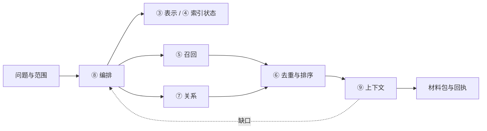

# 接口契约与Project记录：核心简报

本项目接口契约v0.1；仅Project默认策略已实际修改，运行适配待实施。

## 七个重点功能和调用链

# 核心接口简版

本版已把十二组功能落实为 **40 个领域方法、3 个共享执行控制方法和 72 个数据结构**。这是接口及实现路线设计，尚未切换现有检索算法。已实际修改的是 Project 默认记录策略，使其与 Research 一致。

## 一次查询怎么表达

调用方只需要说明五件事：范围、知识筛选、材料表示、检索方式、预算。例如：

> 在本项目的失败经验中，先检索专题综合和单条摘要；不足时允许深入技术块与关联专题；最后返回方法、适用条件、失败边界和固定依据。

来源通过 FixedRef 表达；知识角色、尝试结果、确信程度和适用条件通过 KnowledgeFacets 描述。复核与当前有效性由 EvidencePolicy 核验。筛选统一放入 CorpusScope/FacetFilter，不为“失败经验”“确定事实”分别新增搜索函数。

## 重点功能

| 功能 | 核心接口 | 返回什么 | 首期实现方式 |
|---|---|---|---|
| ③ 表示维护 | list / read / plan / build | 可用表示、来源版本、缺失状态、派生结果或新内容草案 | 复用技术单元/已有摘要；新解释走正式内容提交 |
| ④ 索引维护 | read_changes / status / plan / execute | 增量或重建计划、实际水位、完成与待补偿项 | 从现有提交代次和索引补偿拆出独立端口 |
| ⑤ 候选召回 | capabilities / recall | 候选、命中表示、通道分数、来源与续接位置 | 先接身份、FTS、Qdrant；稀疏和复杂图策略预留 |
| ⑥ 排序 | rank；内部 deduplicate / fuse / rerank / select | 去重后的排名、排序依据、未选和降级原因 | 复用现有融合，再按需替换重排/多样性策略 |
| ⑦ 关系导航 | neighbors / paths / suggest_links | 有类型邻居、固定路径、关联建议及不可迁移差异 | 先显式引用和已有关系，后续接结构类比 |
| ⑧ 渐进编排 | search / resume / next_step | 实际步骤、已用预算、缺口、停止原因、续查游标 | 同时支持扩大语料和深入表示，保留原始排除 |
| ⑨ 上下文组装 | build | 可直接使用的材料包、定义、条件、反例和固定引用 | 只展开已选候选；缺口交还编排器决定下一步 |

表内 read_changes 对应精确方法 `ChangeReader.read`；同名 plan/read 属于各自端口，不是一个任意参数的大函数。完整方法签名见 [逐函数目录](../../design/interfaces-v0.1/FUNCTIONS.md)。

## 主要调用链

所有阶段共用范围、证据规则和累计预算。召回不写知识；排序不决定真假；上下文不隐藏启动第二轮搜索。不同索引水位和部分失败保留在回执中。

## 其余五组保留的边界

①固定读取与引用解析；②分级内容、版本、历史与恢复；⑩完整/精简文稿及其他阅读视图；⑪按策略自动整理；⑫来源授权、复核、有效性及下游影响。

自动整理可以正式修订知识，必须保留新旧版本、依据和恢复入口。新内容是否有效复核单独判断；已授权流程可以追加新复核。跨对象执行逐项记账，索引失败不重做内容提交。

## Project 默认记录已调整

- 程序默认：explore、fine、保留 L0–L4、建议总结；显式对象策略仍优先。
- 每轮实质工作保存 L0 依据、L1 完整技术单元和 L2 实际事件/决策。
- 阶段结束维护 L3 经验、L4 地图，以及完整过程与简版报告。
- 没有可推广经验时记录缺口；简单查字段不凑层数；自动总结建议不等于后台任务。

接口定义与调用图在 [SPEC.md](../../design/interfaces-v0.1/SPEC.md)，数据字段在 [DATATYPES.md](../../design/interfaces-v0.1/DATATYPES.md)，后续实施顺序及验收在 [IMPLEMENTATION.md](../../design/interfaces-v0.1/IMPLEMENTATION.md)。

## 验证、边界与实施顺序

程序实际完成Project默认explore/fine、保留L0–L4与总结建议，显式策略优先。

接口设计完成40个领域方法、3个执行控制方法和72种数据结构，结构检查12个正负样例通过；尚未接入运行检索算法。

quick实际135项Python通过、1项既有冻结夹具失败；19项前端因缺开发依赖未运行。真实setup扩展旧工作区升级/重复升级/恢复通过，但未进行第二台物理机验收。

后续按G01固定读取与范围 → 表示和索引 → 召回/排序/关系 → 渐进编排和上下文实施。每步保留实际水位、失败和固定证据。保存成功不提升科学复核状态。
