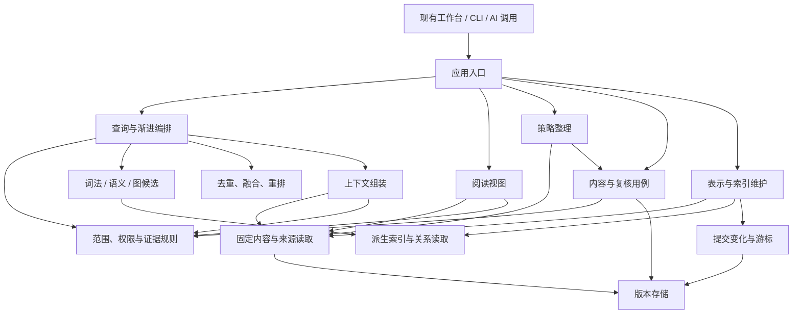
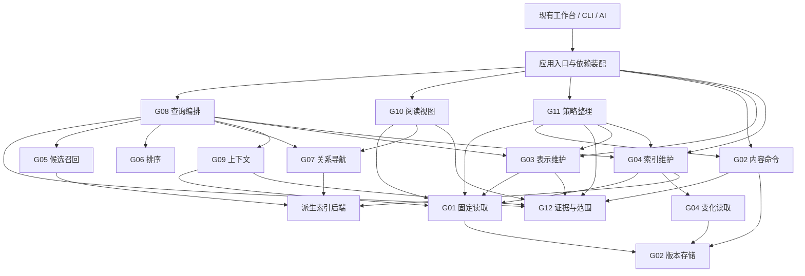
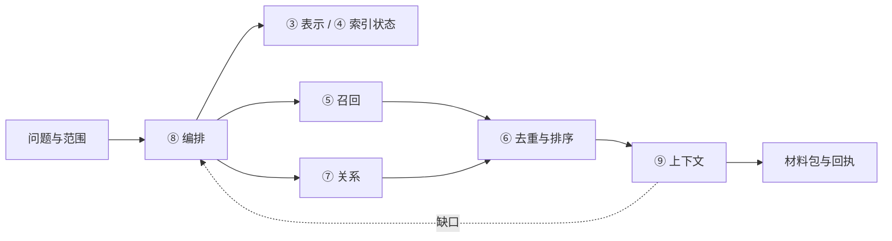

# 接口契约与Project记录：完整设计过程

本项目接口契约v0.1；仅Project默认策略已实际修改，运行适配待实施。

## 设计方向与原始讨论依据

先保留讨论问题与依据，区分旧讨论行序和最终契约编号。

本单元保存设计与实际观察。接口定义不等于已运行接入；用户认可方向不等于科学复核。

本轮整理的历史讨论，不表示重新运行文献检索；最终编号以本轮契约为准。

# 检索、存储与自动整理的抽象能力讨论稿

建议将能力划分为版本内容、检索表示与索引、查询与上下文、阅读视图、策略整理五个协作部分，证据与权限规则贯穿其中。工作台继续使用现有操作方式，通过应用入口调用这些能力。抽象的目标是使内容模式、存储介质、召回算法和 AI 整理策略可以分别演进，同时保留来源、状态与错误的可解释性。

本稿用于收敛功能和边界；接口名称、结构字段与调用图均是候选设计，尚未成为代码契约。已经明确的需求包括按材料抽象程度选择检索内容，以及按策略自动修订正式知识并保留版本、复核和恢复。实现基线、资料时点和验证范围列在文末。

## 1. 先区分五个问题

| 问题 | 应表达的概念 | 例子 |
|---|---|---|
| 搜哪些材料 | 语料范围、内容语义、时间与访问边界 | 只查指定研究；只查失败经验；排除某来源 |
| 搜多抽象的材料 | 搜索表示或聚合程度 | 完整技术内容、单条摘要、专题综合、领域总览 |
| 用什么方法发现 | 召回与规划策略 | 关键词、语义、已知引用、图邻居、类比、多步查询 |
| 给读者看什么 | 返回内容与阅读视图 | 摘要列表、完整块、研究经过、简要报告、关系子图 |
| 允许做多少工作 | 候选、时间、图扩展、模型与上下文预算 | 最多读取若干来源、重排上限、截止时间、正文长度 |

这五个问题可以组合。例如，可以先在本专题的综合摘要中做关键词检索，再沿固定引用读取完整技术块；也可以在全文词法索引中发现候选，却只返回关键词卡。SQLite FTS5 已将按列匹配作为查询能力，说明“搜索哪部分文字”可以独立于“返回哪些文字”。[^1]

材料更精简，通常有利于降低后续阅读和匹配成本，但不能仅凭层号保证响应时间。每条记录各生成一个摘要，条目总数仍可能不变；预先聚合成专题条目才可能减少候选单位。现场生成摘要、构建图或补偿过期索引则会增加延迟。应同时报告**实际使用的表示、索引水位、候选量和耗时**，不把抽象程度当作未经实测的速度承诺。

## 2. 保留 L0–L4，另设可选择的材料表示

L0–L4 继续表示内容职责：原始依据、技术单元、事件决策、可复用经验、知识地图。这些职责有逐层提炼的关系，但不是所有内容都严格由长到短；L2 的一次简短决策可能比 L3 的完整经验更短。独立章节和两类文稿仍不强行增加为 L5。

建议对外提供以下具名表示，按“逐步概括”的思路组织，但不依赖编号大小判断真实性、长度或执行速度。接口允许多选，也允许请求不存在的能力时得到明确结果。

| 建议表示 | 内容与目的 | 当前可复用基础 | 首期处理建议 |
|---|---|---|---|
| `original` 原始材料 | Run 输入/产物、获准原文与数据定位；用于查证 | L0、固定文件/Run 引用 | 保留显式来源选择；原件全文索引单独按策略建立 |
| `full` 完整内容 | 所选技术单元、记录或文稿的完整正文 | L1 技术块、规范正文、独立文稿 | 提供固定版本读取；完整技术块索引作为明确能力，不把现有 FTS 默认视为已有它 |
| `section` 结构化局部 | 章节、技术块及不可缺的定义和限制 | document_section、block_id、requires_block_ids | 优先复用；片段不能脱离变量定义和适用条件 |
| `unit_digest` 单条摘要 | 问题、方法、发现、适用与限制等短说明 | retrieval_description、已有短投影/representation | 区分作者保存说明、确定性摘录和模型生成表示 |
| `topic_synthesis` 专题综合 | 一个研究或主题的主要结论、分歧、失败、未决问题 | L3/L4、已有专题文稿及总结准备能力 | 首期读取已有综合；自动生成与增量更新接入策略整理 |
| `domain_synthesis` 领域综合 | 多个专题之间的共同结构、差异和边界 | 跨对象引用与 summary 准备是基础，尚无完备自动能力 | 预留；须先明确聚合范围、责任归属、来源覆盖和失效传播 |

另预留四类正交视图：`lexical_card`（关键词、别名、实体及定位）、`relation_graph`（有类型的节点/边和路径）、`research_process`（研究经过）、`research_report`（简要研究报告）。其中最后两项沿用现有文稿概念。时间线可作为研究经过的一种布局。它们可使用不同抽象程度，不应排列成比“经验”更高或更低的知识等级。

同一对象可以拥有全文、摘要和词项卡，也可能只有原文；表示请求应返回 `available / missing / stale / unsupported` 等明确信息。若允许回退，回执列出实际使用类型和原因；不能把全文切下来的前几百字标成完整摘要，也不能用一张地图冒充已经形成的领域综合。

聚合表示还必须保留贡献来源及其访问边界。一个领域概要包含多个来源时，不能只检查概要自己的标签就返回全文；需确认所有贡献来源对本次调用仍可见，否则选择符合范围的已有表示、按策略另行生成或报告不可用。来源失效也不能仅靠结果页隐藏链接处理。

多表示会带来重复证据风险。因此候选必须同时携带“命中的表示身份”和“被表示的规范内容身份”。Qdrant 的多表示教程演示标题、摘要、片段分别召回后按文档聚合；可借鉴其身份归并思想，无需将 Qdrant 的具体模型或请求结构写入公共契约。[^2]

**摘要聚合与 L4 的关系。** L4 是可维护、有依据的知识地图；摘要聚合是读取或组织多个内容的能力。聚合可以读取 L4，也可以读取 L1 说明、经验或文稿。若生成了新的跨材料解释，应保存为有版本的内容；若只是按固定引用拼装已有内容，则属于阅读视图。当前 L1 检索说明、summary.save 生成的 L3/L4、规范 representation 和研究文稿都包含版本内容，不能统一当缓存丢弃。可以重建的是它们进入 SQLite/向量索引后的派生行与加速结构。

## 3. 经验、事实、洞见和第一性原理如何表达

建议把这些需求组织为可组合的语义筛选，而不是继续扩展 L 编号。

| 维度 | 建议内容 | 应避免的误用 |
|---|---|---|
| 知识角色 | 事实主张、洞见、假设、经验、方法、原理、定义、约束 | 不能仅因命名为“事实”或“第一性原理”就跳过证据 |
| 尝试结果 | 成功、失败、混合、尚无结果；绑定实际尝试与条件 | 成功经验不是全场景有效；失败记录也可能是高价值依据 |
| 复核状态 | 未复核、接受、有争议、撤回、被替代及对应历史 | 旧 accepted 不自动适用于修改后的内容 |
| 有效性 | 在给定时间、版本、适用域下是否有效及原因 | “当前有效”不能被简化为最新创建；历史查询不等于允许正式复用 |
| 确信程度 | 高/中/低/未知或可校准数值，带评估者、方法和依据 | 相似度、图中心性、模型自述置信度都不是事实真值概率 |
| 适用与反例 | 工况、前提、禁止迁移范围、支持与反证 | 上层摘要应保留限制，不能只留下成功结论 |

界面可以提供“非常确定的事实”“比较确定的事实”“当前适用但有争议”等便捷预设，内部则展开成有版本的策略条件。这样不必把相互独立的状态压进一个等级枚举。对于第一性原理，还应标明它是数学前提/定义、物理规律在某域的模型、已推导不变量，还是工程假设；这些对象的验证方法不同。

“大范围联想”属于查询范围和扩展策略。它可以跨领域寻找相似问题结构，同时返回差异与不能迁移的部分；不能据跨领域相似就把来源当作支持当前结论的证据。

## 4. 应包含的抽象功能

下面分为十二组功能，一组可以由多个窄接口组成，一个实现也可提供多组能力。这里定义变化边界，不要求部署十二个服务。

| 功能组与候选接口 | 应覆盖的功能 | 关键返回信息或不变量 |
|---|---|---|
| 1. `ContentReader` / `ReferenceResolver` | 按 ID 定位、批量读取、固定修订、受控原件定位、轻量元数据和有界分页 | 实际版本/指纹、读取依据、访问状态；未知引用不能悄悄改读最新版 |
| 2. `ContentCommands` / `RevisionStore` | 按类型校验的创建与修订、单 owner 原子批次、预期 HEAD、幂等回执、历史与恢复修订 | 保存是否完成、产生哪些修订；存储不依赖召回器、模型或 UI |
| 3. `EvidencePolicy` / `ReviewService` | 来源授权、claim 与固定依据检查、适用域准入、复核及失效影响 | 复核历史与当前有效性分别返回；召回分数不能替代准入 |
| 4. `ChangeReader` / `IndexLifecycle` | 按变化游标增量更新、重建、补偿、废弃派生项、公开每种索引的水位 | 哪些源版本已经可查、哪些仍待处理；不因索引失败重做业务提交 |
| 5. `RepresentationCatalog` / `RepresentationBuilder` | 声明可用抽象程度，读取/构建检索表示，维护来源到表示的依赖 | 表示类型、作者/生成方式、来源版本、规则/模型版本及过期状态 |
| 6. `RecallProvider` | 精确 ID、词法、稠密/稀疏语义等候选召回；按统一范围和能力约束执行 | 规范候选、命中表示、原始分数与通道状态；不泄漏数据库私有类型 |
| 7. `RankingPipeline` | 多表示去重、多通道融合、相关性重排、多样性及解释 | 排名依据、策略版本、各阶段候选量；权重与模型可替换 |
| 8. `RelationNavigator` | 显式引用、关系邻居、结构类比、图路径、关系建议及过期检查 | 有类型的边、固定两端、路径、共享结构和差异；图浏览和图召回可复用读取端口 |
| 9. `SearchCoordinator` / `ExpansionPolicy` | 请求规范化、查询规划、一次/多阶段执行、渐进扩大或深入、停止/取消/降级 | 继承的范围与排除、已消耗预算、继续游标、停止原因、部分完成情况 |
| 10. `ContextBuilder` | 按已选固定候选展开，补定义，选择摘要/块/全文，去重并保留限制 | 正文、固定引用、覆盖、遗漏、预算消耗；不另起一套隐藏召回政策 |
| 11. `ReadViewService` | 全文聚合、L0–L4 视图、摘要聚合、研究经过、简要报告、关系子图 | 实际引用版本、所用视图、完整性与缺口；读取不隐式生成新结论 |
| 12. `MaintenancePlanner` / `MaintenanceExecutor` | 增量归类、摘要/图候选、冲突与过期检查、文稿影响、按策略正式修订、验证和恢复 | 固定计划/策略/依据、差异、执行回执、复核结果、恢复入口 |

此外，所有外部调用共同使用能力描述、预算、取消和诊断结构；评估与反馈消费实际回执。无需为这些横切数据建立一套独立业务数据库。

词法、稀疏语义、稠密语义和多向量精排可以是不同实现。公共契约不应强制所有后端实现一套任意查询语言，也不要求每个后端都支持全部范围；不能满足硬过滤或固定版本要求时应明确拒绝。兼容适配器可以补足能力，但必须报告额外成本并保持同样的语义。

Qdrant 的多阶段查询和 Vespa 的分阶段排序都把较便宜的候选发现与较贵的后续排名分开。这支持分别设置召回上限、重排上限和最终返回量，而非只设置一个 Top-K。[^3][^4] 融合算法也应可替换；RRF 适合做候选基线，但已有研究显示其参数敏感性，不能固定为普遍最优方案。[^5]

## 5. 分级 CRUD 的具体边界

| 对象 | 创建/修改 | 删除或恢复语义 |
|---|---|---|
| L0 原始依据 | 登记获准来源及指纹；更新登记形成可追溯变化 | 不通过普通知识 CRUD 覆盖或删除外部原件 |
| L1–L4、章节、文稿、规范表示 | 按各自内容规则校验，共用身份与版本存储；批次归属明确 | 修订、替代、撤回、归档按业务含义区分；不得为了去重删掉固定来源历史 |
| claim/review/关系 | 固定目标与依据，按独立状态转换保存 | 新疑点或替代保留历史；相似关联的采纳不变成科学支持 |
| FTS、向量、邻接加速与临时投影 | 从权威内容增量生成，带代次和版本 | 可删除重建；不能连带删除内容、原件和复核记录 |

接口可以在最外层提供统一 create/read/update/retire 操作形式，但内部必须执行类型规则。例如更新技术块不能省略依赖定义；修订文稿要固定章节引用；撤回结论要考虑下游引用。按层另建数据库或 repository 会重复维护身份、版本、权限和事务，反而增大耦合。

当前存储保证的主要单位是单 owner。跨 owner 的 `basis_heads` 是对所读依据的乐观检查，并不等价于全库原子快照；外部原件还需要独立指纹与当前权限检查。若未来采用 SQLite，单库 WAL 快照也不会自动覆盖 Qdrant 与外部文件。[^7] 初期应保持这一边界，跨对象整理采用明确的分步提交和补偿，直到真实用例证明需要更强事务。

## 6. 自动整理可以修订正式知识，但有两条独立状态线

自动整理的动作权限按策略决定，可以生成并提交正式对象的新版本。其结果是否满足有效复核，则由适用的证据和验证流程决定。新内容需要新判定；旧版本上的认可留作历史，不自动传播到新内容。

建议整理流程为：**发现变化 → 固定计划与依据 → 生成修改 → 校验和影响检查 → 内容提交 → 适用验证/新复核 → 投影更新与结果记录**。实际输入/草案验证可以前置，后续验证与复核可以是独立提交。顺序由任务规则决定，但每步的已完成部分必须可回读。

整理策略至少应明确目标对象和内容范围、允许的修改类别、触发条件、来源要求、可用模型/工具、总预算、冲突处理、复核流程和恢复方式。执行时绑定实际策略版本、授权上下文、输入版本、预期 HEAD 与同一次重试身份。策略文件中自报“已授权”不能扩大真实授权；本轮已明确允许的修订范围不需每次重复询问。

以下三类情况应分开处理：

1. **索引或纯派生结构变化。** 没有内容/claim/依据变化时，可重建相应索引，不生成假的知识修订或新科学复核。
2. **正文、结构或来源变化。** 生成新版本，检查关联 claim 的内容 hash、容器依据与适用域。不能只由模型声称“意思没变”就继承旧认可；若可机械证明复核依赖未变，按该复核的真实绑定规则判断。
3. **结论或支持依据发生变化。** 进入适用的重新验证。已授权且满足条件的流程可以自动追加新 review；流程缺失或失败时，正式存储可以已有新内容，但不能伪装成已获得有效接受。

恢复也分三类：索引对账重建、进程/写锁恢复、知识内容恢复。最后一类宜新建恢复修订并重新检查当前授权与有效性，而不是倒退 HEAD 抹掉后续历史。跨 owner 计划部分完成时记录每个提交和补偿；不能把一个字段 `success=false` 当成所有内容已自动恢复。

时间图系统可借鉴“事实适用时间”和“记录进入系统时间”的区分，但知识复核还受领域依据约束。Graphiti 的时间关系建模可作为参考，不能把自动关系失效策略直接用来撤回本工作区的科学结论。[^8]

## 7. 逐步检索需要两条扩展路径

第一条是**扩大语料范围**：当前对象 → 关联专题 → 获准领域范围；必要时改变时间窗口或增加检索通道。第二条是**深入表示**：关键词卡/领域概要 → 专题综合 → 单条摘要 → 技术块 → 原始证据。两条路径可组合，也可以被显式请求跳过。

每一步保留起始范围、当前范围、永久排除、已访问对象、固定依据、索引水位、已花费预算和具体缺口。停止原因至少区分找到足够证据、没有新增候选、预算耗尽、来源缺失/过期、能力不支持、权限限制和执行错误。“没有命中”不能自动解释为“没有相关知识”。

使用固定上下文包继续查询时，应沿用原始选择与剩余总预算。若改用新来源版本，则明确建立新的读取依据，而不是把旧包内容悄悄替换。题目拆分、改写和复杂度判断可以由规则或模型策略提供，输出只保留可审计的子问题、证据缺口和动作，不依赖私有推理过程。

Adaptive-RAG 的研究支持针对不同问题复杂度选择不同检索策略；它的分类器和无检索路径都只是可替换选择，不是所有证据任务的默认政策。[^6] 图检索也应通过候选和扩展端口接入；高层摘要命中后仍须回到固定原文，图相关性不授予事实可信等级。

| 前沿路线 | 值得吸收的机制 | 应留在可替换策略内部的部分 |
|---|---|---|
| HippoRAG 2 | 从短语与段落种子进入图，再取回原段落；支持“联想到证据”的路径 | 三元组过滤、个性化 PageRank、种子权重；论文收益和索引代价依赖其数据与模型，不能直接推定本地效果[^9] |
| LightRAG | 实体与高层关系/主题的不同检索入口 | 图抽取、双路候选融合和特定存储；其“高层”不对应本系统的复核等级[^10] |
| GraphRAG DRIFT | 由社区综合指导局部追问，显式维护尚待展开的查询状态 | 追问模型、社区策略、展开深度；统计 token 消耗并不等同于强制全程预算[^11] |

这些方法共同支持“表示可选、候选可追溯、展开可控制”的接口方向，尚不足以选择一种作为全部任务的默认引擎。详细证据、对照条件和反例见 [图与逐步检索研究](../run-20260909t155125z-2961bdf175a8/graph-research.md)。

## 8. 后续正式设计至少需要哪些数据结构

以下名称展示需要表达的内容，尚不是最终 JSON Schema、Python Protocol 或 HTTP 请求。正式设计应明确枚举、可空字段、错误和版本兼容，不用任意字典掩盖差异。

| 候选结构 | 最少应包含 | 关键约束 |
|---|---|---|
| `FixedRef` | 目标类型/身份、固定修订、内容指纹、块/原件定位 | 与当前六字段 Ref 通过适配保持可回读；不把 latest 写成固定引用 |
| `ReadBasis` | 已使用 owner 的 HEAD、原件指纹、读取语义/时点 | 明确单 owner 快照与跨 owner 乐观检查；只固定真正使用的范围 |
| `CorpusScope` | owner/类型/层级/时间窗/语义标签/包含与排除 | 与证据 `applicability_scope` 分开；访问权限由可信上下文施加 |
| `RepresentationSpec` | 原始/全文/局部/摘要/综合类型、视图偏好、允许回退 | 指明搜索表示与返回表示分别选择；返回实际可用类型 |
| `KnowledgeFacets` | 知识角色、结果极性、复核/有效性、确信评估与适用边界 | 各维度不互相冒充；“大范围联想”不放这里 |
| `QuerySpec` | 查询文本/语法、语料范围、表示、用途、通道与策略要求 | 不向下层传任意 SQL、路径或数据库专有对象 |
| `ExecutionBudget` | 候选/重排/图节点与跳数、时间、读取字节、字符/token、模型额度 | 单位明确；token 指定 tokenizer；硬取消能力须真实支持 |
| `FreshnessPolicy` | 固定历史、要求当前、允许声明过期或按预算补偿的策略 | 索引落后可能漏掉新内容，最终回源校验不能证明召回已完整；实际水位必须返回 |
| `CandidateBatch` | 内容与表示固定身份、匹配证据、各通道分数、范围与水位 | 多表示归并；部分结果、缺失通道及过滤损失不能隐去 |
| `GraphSlice` / `AssociationPath` | 有类型节点/边、端点版本、方向、路径、来源、过期/采纳状态 | 科学支持、引用、类比、展示连线分开 |
| `SearchReceipt` / `ExpansionCursor` | 规范请求、实际计划、阶段结果、预算消耗、水位、降级/停止原因 | 可续接但不能增权；不冒充整次查询全局原子快照 |
| `ContextPacket` / `ReadView` | 已用固定 Ref、正文/节点、必要定义、遗漏与未完整项 | 输出顺序不重写证据；真实缺口和部分覆盖显式表达 |
| `CommitReceipt` / `ProjectionState` | 保存结果、实际修订、索引目标/可用代次及待补偿原因 | 两者分别拥有状态，失败重试不复制业务内容 |
| `MaintenancePlan` / `MaintenanceReceipt` | 策略版本、授权范围、basis、差异、依赖影响、复核/恢复步骤、逐步结果 | 预期版本冲突时重规划；幂等身份绑定完整操作语义 |
| `Capabilities` / `Diagnostics` | 支持的字段/表示/通道、固定读取/取消能力、错误码、阶段指标 | 未实现预留项必须可发现；不能静默丢弃硬约束 |

未来的用户请求可以自然表达：“在指定专题中找失败经验，先搜索已有专题综合和单条摘要，允许向技术块深入；最终交付完整方法与限制，给出对应 Run。”字段设计必须能够无歧义表达这句话，而不要求调用方了解 SQLite、Qdrant 或目录结构。

## 9. 候选调用关系与依赖方向

下图表示建议的**调用关系**。节点是职责，不预设进程、包数量或部署方式。



实际查询按“规范化与范围校验 → 根据表示和能力规划 → 有界召回 → 准入/去重/排序 → 固定内容展开 → 材料包与回执”执行。准入中可下推的部分先过滤，正文返回前再回源检查；证据合格候选不足时应在剩余预算内继续补召回或返回覆盖不足，不能简单丢掉前 K 个不合格候选后宣称库中为空。

**代码依赖方向**另有一条规则：领域规则和应用用例依赖窄接口；文件存储、SQLite、Qdrant、模型和工作台适配器依赖这些契约并提供实现。底层 `RevisionStore` 不导入索引模块；查询层不导入写服务的私有方法；纯排序不调用规范写入。装配放在应用启动入口，先使用同进程构造注入即可。

“变化后怎样更新索引”可以从现有提交代次和待补偿记录形成拉取式变化入口，不必先增加消息队列。定义变化语义和可重放游标，才能在未来需要时接入任务队列；先上队列不会自动解决事务与复核语义。

投影维护由应用入口显式调用：直接维护请求或内容/整理提交后的应用编排都可以触发它，按已保存变化游标消费增量。是否同步等待以及允许的耗时由该用例规定；未完成时返回待补偿状态。版本存储只保存提交和变化依据，不反向调用索引。

## 10. 与当前代码的衔接

| 当前已经存在的基础或缺口 | 初期应做的隔离 |
|---|---|
| `retrieval_interfaces.py` 已有 EmbeddingProvider/VectorStore/Reranker，但实际后端未通过它们统一装配 | 优先建立真实调用边界与适配器契约测试，避免只新增未使用 Protocol |
| MemoryService 提交后调用具体 index；索引解析又需要服务 | 提取只读内容/引用/证据端口；在应用用例中编排提交后的投影 |
| 两条检索路径拥有不同范围、默认值、ID 和回执 | 新公共请求与结果由兼容适配器映射，不重写历史 Q/CTX/QMEM/PKT |
| SearchRequest.scope 是正式证据适用域字符串 | 新建独立语料范围，明确与适用域、工作归属、访问权限的差别 |
| context 的搜索转发未完整覆盖 kinds/levels/retrieval_mode；未连续传递所有搜索诊断 | 把约束和回执贯穿调用链作为第一批验收项；不支持时返回明确错误 |
| v3 L1 的默认 FTS 正文是检索说明，完整 blocks 未进入该普通投影 | 把已有摘要召回和新增全文表示分开声明；显示能力与缺失，不冒充已有全文检索 |
| 小 Top-K 仍可能伴随大范围元数据/向量窗口读取 | 建立批量定位、过滤下推和候选计算预算；随后用固定题集检查召回是否退化 |
| 当前完整记忆图扩展在评估链路 | 通过图候选/路径端口试接，不直接改为默认无界遍历 |
| 当前有 prepare/consolidate、版本和复核基础，但没有完整自动执行器 | 先明确 MaintenancePlan、策略权限、执行状态和恢复，再接入生成与触发机制 |

这些是源码核对得到的设计入口，并非本轮已经修复。详细路径与行号见 [retrieval-boundaries.md](../run-20260909t155125z-2961bdf175a8/retrieval-boundaries.md) 和 [storage-boundaries.md](../run-20260909t155125z-2961bdf175a8/storage-boundaries.md)。当前模型/维度和 Windows 离线升级约束继续成立；接口预留不等于任意模型或数据库现在即可无缝替换。

## 11. 首期与后续能力

首期应优先统一身份/范围/表示/回执四类契约，提取固定读取和证据端口，接通现有关键词与向量策略，再将排序、上下文、视图和整理写入分开。每一步先确保原有固定引用、旧版本、权限、失败回执和运行行为可回归，再改变检索算法。

预留但可暂不实现的能力包括跨专题领域综合、学习式稀疏召回、多向量精排、复杂度自适应规划、多跳结构类比、时间图查询、其他存储适配器及跨 owner 协调事务。预留方式是有版本的能力名、清楚的输入/输出和 `unsupported` 行为；不创建空跑且返回“成功”的实现，也不把所有未来算法塞进一个万能类。

后续正式接口设计需要同时交付：语言无关的数据契约、Python Protocol/数据类型、兼容映射、调用与状态图、各操作的前置/后置条件、错误/降级/取消语义以及验收矩阵。工作台功能布局沿用当前形态，由应用适配层转换新契约；前端类型与预构建资源只在实际代码变化时更新。

## 12. 应当怎样验证接口确实达到了分离目的

设计验收应包含替换后端而不改调用方、单路失败且完整保留降级信息、未实现表示明确返回缺口、不同入口保留同一范围、旧固定引用不漂移、权限/来源变化立即影响可读性，以及按计划正式修订后的有效性重检。多表示同源不能被算成多份独立支持；图邻居、关键词命中和 accepted 标签都不能绕过正式证据准入。

性能验收则区分抽象程度、语料范围和查询方法，在相同数据与总预算下比较候选召回、最终依据覆盖、误联想、P50/P95 延迟、读取字节、模型调用/上下文成本及索引维护成本。要有热/冷索引、摘要缺失、来源过期、表示不齐全、中文术语/别名、固定版本和反例检索场景。这里没有承诺具体毫秒或准确率，数值目标应由实际基线确定。

整理验收还要证明：同一执行重试不重复写入；新内容不会继承失配复核；授权流程可以自动形成新复核；跨 owner 部分成功有精确回执；恢复不会覆盖后续新修改；知识恢复、索引补偿和锁恢复各自有清楚作用域。讨论稿没有执行这些功能测试，后续不能把当前静态研究记录替代实现验收。

## 来源与适用范围

[^1]: SQLite，[*SQLite FTS5 Extension — Column Filters*](https://www.sqlite.org/fts5.html#fts5_column_filters)，动态官方文档，访问于 2026-09-09。
[^2]: Qdrant，[*Multi-Representation Search Across Titles, Abstracts, and Chunks*](https://qdrant.tech/documentation/tutorials-search-engineering/multi-representation-search/)，动态官方教程，访问于 2026-09-09。教程语料和云推理设置不等于当前离线工作区配置。
[^3]: Qdrant，[*Hybrid and Multi-Stage Queries*](https://qdrant.tech/documentation/search/hybrid-queries/)，动态官方文档，访问于 2026-09-09。各算子的版本要求分别适用。
[^4]: Vespa，[*Phased Ranking*](https://docs.vespa.ai/en/ranking/phased-ranking.html)，动态官方文档，访问于 2026-09-09。
[^5]: Sebastian Bruch、Siyu Gai、Amir Ingber，[*An Analysis of Fusion Functions for Hybrid Retrieval*](https://arxiv.org/abs/2210.11934v2)，2023-05-04 修订。结论限定其对比条件。
[^6]: Soyeong Jeong 等，[*Adaptive-RAG: Learning to Adapt Retrieval-Augmented Large Language Models through Question Complexity*](https://aclanthology.org/2024.naacl-long.389/)，NAACL，2024-06。开放域 QA 实验不是本工作区质量保证。
[^7]: SQLite，[*Isolation In SQLite*](https://www.sqlite.org/isolation.html)，动态官方文档，访问于 2026-09-09。
[^8]: Zep / Graphiti 项目，[*Graphiti*](https://github.com/getzep/graphiti)，官方仓库，访问于 2026-09-09。仓库可继续变化，采用前须固定提交并验证运行依赖。
[^9]: Bernal Jiménez Gutiérrez 等，[*From RAG to Memory: Non-Parametric Continual Learning for Large Language Models*](https://proceedings.mlr.press/v267/gutierrez25a.html)，ICML/PMLR，2025-07；[所查 arXiv v2 全文](https://arxiv.org/html/2502.14802v2)，2025-06-19。
[^10]: Zirui Guo 等，[*LightRAG: Simple and Fast Retrieval-Augmented Generation*](https://aclanthology.org/2025.findings-emnlp.568/)，Findings of EMNLP，2025-11。相关官方实现入口和版本限制列于 graph-sources.json。
[^11]: Microsoft GraphRAG，[*DRIFT Search*](https://microsoft.github.io/graphrag/query/drift_search/)，动态官方文档，访问于 2026-09-09；[官方方法与评估文章](https://www.microsoft.com/en-us/research/blog/introducing-drift-search-combining-global-and-local-search-methods-to-improve-quality-and-efficiency/)，2024-10-31。

当前代码依据是 main `647d7862331e283439d06d42ec01d3882a32d163` 与本轮工作树；已有文档修改并未自动成为新代码提交。主要核对 `retrieval_interfaces.py`、memory 的 store/service/contracts/index/search/packets/documents/technical_units/associations/summaries/consolidation/evidence_adapter，以及旧 retrieval/context_engine/qdrant_backend。来源所述机制、当前代码事实与本稿工程建议分别陈述；未运行外部方案、规模实验或性能比较。固定研究记录为 `RUN-20260909T155125Z-2961BDF175A8`，人工审查与正式接口定稿尚未完成。


## 来源、知识属性与公共数据契约

明确输入概念与共同约束，是所有后续接口的前提。

本单元保存设计与实际观察。接口定义不等于已运行接入；用户认可方向不等于科学复核。

## 1. 输入来源与知识属性

**来源**是原件、Run、规范记录/claim、技术块或表示的固定引用。**知识属性**描述内容属于什么、曾有什么结果、如何判断适用性。它们不是同一种“输入类型”，也不需要为每种属性建立独立存储或搜索函数。

| 类型 | 所有者与最小语义 | 不能从中推断什么 |
|---|---|---|
| FixedRef / EvidenceLink | 固定目标/版本/指纹/定位；另标 input、supports、contradicts 等关系 | hash 正确不等于结论正确；同源多表示不构成独立证据 |
| KnowledgeFacets | 角色、实际尝试、适用条件、反例、确信评估及分类依据 | unknown 不变成成功；失败不意味着来源无价值 |
| EvidenceAssessment | 证据服务按当前时点、用途与适用域计算；列出已评估/未解决 claim | 历史 accepted 不自动覆盖新正文、其他 claim 或其他工况 |
| CorpusScope | owner、kind、L0–L4、来源、时间、属性、包含/排除 | 项目归属不自动是语料过滤；语料范围不授予权限 |
| RepresentationSpec | 请求表示、允许的回退顺序和缺失处理 | 摘要不一定更快；缺少摘要不能把截断正文改名冒充 |
| ReadBasis | 实际 owner HEAD、来源固定引用和读取时点/一致性 | 多个 HEAD 不等于全库事务快照 |

角色可多选。第一性原理用 `role=principle` 加 `principle_kind`，区分定义、数学前提、已推导不变量、物理规律模型和工程假设，保留证明或适用依据。确信程度绑定具体目标、评估者和方法；数值概率必须给校准依据。未实施评估时可用 unknown，不把排序分数放到概率字段。

`FacetFilter` 的不同字段取 AND，同一字段取 OR；例如 failure + experience + valid 表示这三个条件都满足。字段为 null 表示不限制，空数组表示空集合，不能被适配器当成“搜索全部”。启用某个过滤且值未知时默认不匹配，只有显式 include_unknown 才纳入并标注。结构角色和尝试结果使用实际分类依据；复核、当前有效性与正式准入由 G12 再计算，索引只负责可下推的候选过滤。

“非常确定的事实”等 UI 预设展开为有版本的 FacetFilter + 用途/适用域，不新增混合等级枚举。涉及多个 claim 的记录不能因其中一个 accepted 就整体成为确定事实；按匹配 claim 返回或明确列出未评估部分。


## 2. 共同调用约定

所有端口接收可信应用装配的 `CallContext`，携带访问、累计预算和取消句柄。actor 名称、网页文本、模型结果或用户提交的字段本身不等于授权凭据。句柄不是新的数据库；同进程内可以是注册对象键，传输适配器负责绑定真实上下文。

有效范围遵守：

\[
S_{\mathrm{effective}}=(S_{\mathrm{request}}\cap S_{\mathrm{ceiling}}\cap S_{\mathrm{authorized}})\setminus E_{\mathrm{persistent}}.
\]

其中三个集合分别为当前请求范围、起始允许扩展上限、实际授权范围；\(E_{\mathrm{persistent}}\) 是全程保留的排除集合。主动扩大 owners/time 等维度只能在 QuerySpec.expansion_axes 中获允许的方向进行，角色/结果等硬筛选不随扩展自动取消。显式包含也不能覆盖排除或授权拒绝。

`Outcome[T]` 统一表达 ok / partial / rejected / failed。ok 必须有值；partial 必须有已完成值和具体 Issue；rejected 不返回业务值；failed 可在诊断中说明最后确定的状态，但不能捏造成功回执。业务缺口通过有类型字段返回，异常堆栈不作为公共错误协议。诊断不得泄漏调用方不可见对象的信息。

批量只读操作可以部分返回，逐项说明缺失；单 owner 内容事务不能以 partial 表示“部分提交”。跨 owner 整理可以 partial，列出真正完成的提交和待办对象。截止时间、取消、索引落后和无候选是不同状态。

序列化规定：UTF-8 JSON；tuple 对应数组；UTC 使用 RFC 3339 `Z`；bytes 不直接外传；NewType 在 JSON 中为字符串，SHA 为 64 位小写十六进制；禁止 NaN/Infinity，bool 不能充当整数。新增可选字段需声明兼容版本；新增必填字段、语义或枚举变更需新契约版本。表示名采用注册键，可预留而未实现；未注册键报 UNSUPPORTED，不能任意解释为路径、模型或 SQL。


## 全部数据类型定义
```python
"""v0.1 设计契约：语言无关字段的 Python 3.10+ 类型表达。

本文件是可导入、可检查的设计产物，尚未由产品路由/后端使用。
单位、空值、状态约束与错误语义见 SPEC.md；这里不实现算法或静默默认值。
仅依赖标准库。tuple 表示有序不可变集合；可空筛选的 None=不限制，()=空集。
"""
from __future__ import annotations

from dataclasses import dataclass
from typing import Generic, Literal, NewType, TypeAlias, TypeVar

OwnerId = NewType("OwnerId", str)
RecordId = NewType("RecordId", str)
CommitId = NewType("CommitId", str)
Sha256 = NewType("Sha256", str)
RepresentationKey = NewType("RepresentationKey", str)
Cursor = NewType("Cursor", str)
UtcTime = NewType("UtcTime", str)  # RFC 3339 UTC；不用文件 mtime 猜测业务时间。
Layer: TypeAlias = Literal["L0", "L1", "L2", "L3", "L4"]
KnowledgeRole: TypeAlias = Literal["fact_claim", "insight", "hypothesis", "experience", "method", "principle", "definition", "constraint"]
AttemptOutcome: TypeAlias = Literal["success", "failure", "mixed", "unknown"]
ReviewState: TypeAlias = Literal["not-reviewed", "accepted", "disputed", "retracted", "superseded"]
ValidityState: TypeAlias = Literal["valid", "invalid", "unknown"]
ConfidenceLevel: TypeAlias = Literal["high", "medium", "low", "unknown"]
RelationKind: TypeAlias = Literal["references", "input", "supports", "contradicts", "supersedes", "depends_on", "similar_structure", "same_entity", "mentions"]
Channel: TypeAlias = Literal["identity", "lexical", "dense", "sparse", "graph"]
StopReason: TypeAlias = Literal["sufficient", "exhausted", "no_gain", "budget", "cancelled", "missing_source", "stale", "unsupported", "denied", "error"]
T = TypeVar("T")


@dataclass(frozen=True)
class StrategyRef:
    """注册的策略身份；后端私有参数由装配配置管理，不透传任意 SQL。"""
    name: str
    version: str


@dataclass(frozen=True)
class FixedRef:
    """固定内容身份；关系语义另存 EvidenceLink，hash 不等于证据已复核。"""
    target_kind: Literal["record", "owner", "claim", "file", "representation"]
    target_id: str
    revision: int | None  # record 必须为正整数；原生对象/文件允许仅由 SHA 固定。
    sha256: Sha256
    locator: str | None   # 仅接受已登记且可验证的定位语法，不接受任意读取路径。


@dataclass(frozen=True)
class LegacyRef:
    """现有六字段 Ref 的兼容输入；不完整 SHA 只能由实际回源核验补齐。"""
    target_kind: Literal["record", "owner", "claim", "file"]
    target_id: str
    revision: int | None
    sha256: Sha256 | None
    locator: str | None
    relation: str


@dataclass(frozen=True)
class EvidenceLink:
    ref: FixedRef
    relation: RelationKind


@dataclass(frozen=True)
class OwnerHead:
    owner_id: OwnerId
    commit_id: CommitId | None


@dataclass(frozen=True)
class ReadBasis:
    """所用固定依据和真实读一致性；跨 owner 乐观检查不是全局快照。"""
    basis_id: str
    owner_heads: tuple[OwnerHead, ...]
    source_refs: tuple[FixedRef, ...]
    observed_at: UtcTime
    consistency: Literal["fixed_refs", "single_owner_snapshot", "cross_owner_optimistic"]


@dataclass(frozen=True)
class TimeWindow:
    field: Literal["recorded_at", "occurred_at", "valid_at"]
    start_inclusive: UtcTime | None
    end_exclusive: UtcTime | None


@dataclass(frozen=True)
class Applicability:
    """业务适用域；不能代替语料 owner 筛选或授权上下文。"""
    description: str
    conditions: tuple[str, ...]
    exclusions: tuple[str, ...]
    valid_from: UtcTime | None
    valid_until: UtcTime | None
    subject_versions: tuple[FixedRef, ...]


@dataclass(frozen=True)
class ConfidenceAssessment:
    target: FixedRef
    level: ConfidenceLevel
    assessed_by: str
    method: StrategyRef
    basis: tuple[EvidenceLink, ...]
    applicability: Applicability
    calibrated_probability: float | None
    calibration_ref: FixedRef | None  # 概率非空时必须有校准依据，不能用相似度顶替。


@dataclass(frozen=True)
class AttemptAssessment:
    attempt_ref: FixedRef
    outcome: AttemptOutcome
    conditions: tuple[str, ...]


@dataclass(frozen=True)
class KnowledgeFacets:
    """内容描述；roles/outcomes 可多值，缺少信息不自动补成成功或确定。"""
    roles: tuple[KnowledgeRole, ...]
    principle_kind: Literal["definition", "mathematical_axiom", "derived_invariant", "physical_law_model", "engineering_assumption"] | None
    attempts: tuple[AttemptAssessment, ...]
    applicability: Applicability
    counterexamples: tuple[EvidenceLink, ...]
    confidence: tuple[ConfidenceAssessment, ...]
    classification_basis: tuple[EvidenceLink, ...]


@dataclass(frozen=True)
class EvidenceAssessment:
    """由证据服务计算的读时状态；不得信任索引或调用方自报的 accepted。"""
    target: FixedRef
    review_state: ReviewState
    validity: ValidityState
    applicability: Applicability
    assessed_at: UtcTime
    review_refs: tuple[FixedRef, ...]
    evaluated_claim_refs: tuple[FixedRef, ...]
    unresolved_claim_refs: tuple[FixedRef, ...]
    reasons: tuple[str, ...]


@dataclass(frozen=True)
class FacetFilter:
    # 不同字段 AND；单字段候选值 OR。显式过滤时 unknown 默认不匹配。
    roles: tuple[KnowledgeRole, ...] | None
    outcomes: tuple[AttemptOutcome, ...] | None
    review_states: tuple[ReviewState, ...] | None
    validities: tuple[ValidityState, ...] | None
    confidence_levels: tuple[ConfidenceLevel, ...] | None
    applicability: Applicability | None
    include_unknown: bool


@dataclass(frozen=True)
class CorpusScope:
    """硬语料约束；include/exclude 按身份匹配，exclude 始终优先。"""
    owner_ids: tuple[OwnerId, ...] | None
    kinds: tuple[str, ...] | None  # 来自已注册内容类型，非数据库表名。
    layers: tuple[Layer, ...] | None
    source_ids: tuple[str, ...] | None
    time_window: TimeWindow | None
    facets: FacetFilter | None
    include_refs: tuple[FixedRef, ...]
    exclude_ids: tuple[str, ...]


@dataclass(frozen=True)
class RepresentationSpec:
    """具名表示可扩展；搜索表示和结果视图分别选择，不映射为速度等级。"""
    keys: tuple[RepresentationKey, ...]
    fallback_order: tuple[RepresentationKey, ...]
    missing: Literal["reject", "skip", "fallback"]
    allow_build: bool  # 允许本请求构建仍受能力/预算约束，不授予内容提交权限。


@dataclass(frozen=True)
class FreshnessPolicy:
    mode: Literal["fixed", "current", "allow_stale"]
    allow_index_repair: bool
    max_staleness_seconds: float | None


@dataclass(frozen=True)
class BudgetLimits:
    """全部是硬上限；不设无限默认。token 上限依赖指定 tokenizer。"""
    deadline: UtcTime
    max_candidates: int
    max_rerank: int
    max_graph_nodes: int
    max_graph_edges: int
    max_hops: int
    max_read_bytes: int
    max_model_calls: int
    max_model_input_tokens: int
    max_model_output_tokens: int
    max_context_chars: int
    tokenizer: StrategyRef | None


@dataclass(frozen=True)
class BudgetUsage:
    elapsed_ms: float
    candidates: int
    reranked: int
    graph_nodes: int
    graph_edges: int
    read_bytes: int
    model_calls: int
    model_input_tokens: int
    model_output_tokens: int
    context_chars: int


@dataclass(frozen=True)
class CallContext:
    """由可信应用装配；恢复查询沿用预算账本，不能用新调用 ID 重置额度。"""
    call_id: str
    root_operation_id: str
    access_handle: str
    budget_handle: str
    cancellation_handle: str


@dataclass(frozen=True)
class Issue:
    code: str
    message: str
    affected_refs: tuple[FixedRef, ...]
    retry: Literal["never", "same_request", "replan", "after_external_change"]


@dataclass(frozen=True)
class Outcome(Generic[T]):
    """成功/部分/拒绝/失败分开；拒绝无数据，部分结果必须列出缺口。"""
    status: Literal["ok", "partial", "rejected", "failed"]
    value: T | None
    issues: tuple[Issue, ...]
    usage: BudgetUsage


@dataclass(frozen=True)
class PageRequest:
    limit: int
    cursor: Cursor | None


@dataclass(frozen=True)
class Page(Generic[T]):
    items: tuple[T, ...]
    next_cursor: Cursor | None
    basis: ReadBasis


@dataclass(frozen=True)
class ContentMetadata:
    ref: FixedRef
    owner_id: OwnerId
    kind: str
    layer: Layer | None
    title: str
    facets: KnowledgeFacets


@dataclass(frozen=True)
class TextSlice:
    ref: FixedRef
    markdown: str
    required_refs: tuple[FixedRef, ...]
    complete: bool


@dataclass(frozen=True)
class ReadRequest:
    refs: tuple[FixedRef, ...]
    scope: CorpusScope
    representation: RepresentationSpec
    freshness: FreshnessPolicy


@dataclass(frozen=True)
class ReadBatch:
    items: tuple[TextSlice, ...]
    basis: ReadBasis
    missing: tuple[Issue, ...]


@dataclass(frozen=True)
class DraftDocument:
    """复用注册的内容 schema，不在接口包复制十五类业务 payload。

    body_json 必须通过 schema_key 对应的固定版本校验；不接受任意自由字典。
    新 v3 内容目前映射 memory-v3.schema.json 的 Draft/类型校验入口。
    """
    owner_id: OwnerId
    schema_key: str
    schema_version: int
    body_json: str


@dataclass(frozen=True)
class PutChange:
    client_key: str
    previous: FixedRef | None
    draft: DraftDocument
    reason: str


@dataclass(frozen=True)
class RetireChange:
    target: FixedRef
    action: Literal["archive", "retract", "supersede"]
    replacement: FixedRef | None
    reason: str


@dataclass(frozen=True)
class ChangeBatch:
    request_id: str
    owner_id: OwnerId
    expected_head: CommitId | None
    basis: ReadBasis
    changes: tuple[PutChange | RetireChange, ...]


@dataclass(frozen=True)
class ValidationReceipt:
    batch_sha256: Sha256
    validator: StrategyRef
    validated_basis: ReadBasis
    validation_handle: str  # 内部一次验证凭据；不能以这个字符串替代实际校验。


@dataclass(frozen=True)
class CommittedChange:
    client_key: str
    previous: FixedRef | None
    current: FixedRef | None
    action: Literal["put", "archive", "retract", "supersede", "restore"]


@dataclass(frozen=True)
class CommitReceipt:
    request_id: str
    owner_id: OwnerId
    commit_id: CommitId
    changes: tuple[CommittedChange, ...]
    change_cursor: Cursor
    follow_up_required: tuple[Literal["index", "review", "document_impact"], ...]


@dataclass(frozen=True)
class RestoreRequest:
    request_id: str
    owner_id: OwnerId
    expected_head: CommitId
    restore_refs: tuple[FixedRef, ...]
    reason: str


@dataclass(frozen=True)
class Representation:
    ref: FixedRef
    key: RepresentationKey
    represented_refs: tuple[FixedRef, ...]
    authority: Literal["canonical", "derived"]
    generator: StrategyRef
    state: Literal["available", "stale"]
    contributors: tuple[FixedRef, ...]


@dataclass(frozen=True)
class RepresentationAvailability:
    key: RepresentationKey
    content_ref: FixedRef
    state: Literal["available", "stale", "missing", "unsupported"]
    representation: Representation | None
    reason: str | None


@dataclass(frozen=True)
class RepresentationPlan:
    plan_id: str
    scope: CorpusScope
    source_refs: tuple[FixedRef, ...]
    requested: RepresentationSpec
    basis: ReadBasis
    builder: StrategyRef


@dataclass(frozen=True)
class RepresentationBuild:
    # 新解释先成为草稿，通过内容提交获得固定身份后才成为可索引规范表示。
    derived: tuple[Representation, ...]
    content_proposals: tuple[DraftDocument, ...]
    basis: ReadBasis


@dataclass(frozen=True)
class IndexKey:
    channel: Channel
    representation: RepresentationKey
    encoder: StrategyRef | None
    analyzer: StrategyRef | None
    dimension: int | None


@dataclass(frozen=True)
class Watermark:
    index: IndexKey
    covered_basis: ReadBasis
    cursor: Cursor | None
    coverage: Literal["complete", "partial", "unknown"]


@dataclass(frozen=True)
class ChangeEvent:
    event_id: str
    owner_id: OwnerId
    commit_id: CommitId
    previous_refs: tuple[FixedRef, ...]
    current_refs: tuple[FixedRef, ...]


@dataclass(frozen=True)
class IndexPlan:
    plan_id: str
    mode: Literal["incremental", "rebuild", "repair"]
    index: IndexKey
    scope: CorpusScope
    changes: tuple[ChangeEvent, ...]
    source_refs: tuple[FixedRef, ...]
    target_basis: ReadBasis
    from_cursor: Cursor | None
    next_scan_cursor: Cursor | None


@dataclass(frozen=True)
class IndexReceipt:
    plan_id: str
    completed_events: tuple[str, ...]
    pending_events: tuple[str, ...]
    watermark: Watermark
    resume_cursor: Cursor | None


@dataclass(frozen=True)
class ProviderCapabilities:
    provider: StrategyRef
    channels: tuple[Channel, ...]
    representations: tuple[RepresentationKey, ...]
    filter_fields: tuple[str, ...]
    query_dialects: tuple[Literal["plain", "phrase", "boolean"], ...]
    freshness_modes: tuple[Literal["fixed", "current", "allow_stale"], ...]
    supports_hard_cancel: bool
    supports_filter_pushdown: bool


@dataclass(frozen=True)
class QuerySpec:
    text: str
    dialect: Literal["plain", "phrase", "boolean"]
    seeds: tuple[FixedRef, ...]
    scope: CorpusScope
    scope_ceiling: CorpusScope
    representations: RepresentationSpec
    channels: tuple[Channel, ...]
    purpose: Literal["exploration", "formal", "audit"]
    applicability: Applicability | None
    freshness: FreshnessPolicy
    limits: BudgetLimits
    planner: StrategyRef
    ranking: StrategyRef
    result_limit: int
    expansion_axes: tuple[Literal["owners", "time", "representations", "channels"], ...]


@dataclass(frozen=True)
class ChannelHit:
    channel: Channel
    provider: StrategyRef
    representation_ref: FixedRef
    rank: int
    raw_score: float | None
    score_meaning: str
    matched_text: tuple[TextSlice, ...]


@dataclass(frozen=True)
class Candidate:
    content: ContentMetadata
    hits: tuple[ChannelHit, ...]
    evidence_state: EvidenceAssessment


@dataclass(frozen=True)
class CandidateBatch:
    candidates: tuple[Candidate, ...]
    basis: ReadBasis
    watermarks: tuple[Watermark, ...]
    omitted: tuple[Issue, ...]
    next_cursor: Cursor | None


@dataclass(frozen=True)
class RecallRequest:
    query: QuerySpec
    channel: Channel
    candidate_limit: int
    cursor: Cursor | None


@dataclass(frozen=True)
class RankingRequest:
    query: QuerySpec
    batch: CandidateBatch
    texts: tuple[TextSlice, ...]  # 需要的重排正文由应用显式有界读取，不隐藏二次召回。
    limit: int


@dataclass(frozen=True)
class RankedCandidate:
    candidate: Candidate
    position: int
    ranking_score: float | None
    explanation: tuple[str, ...]  # 已执行特征/规则，不要求模型私有推理。


@dataclass(frozen=True)
class RankedBatch:
    items: tuple[RankedCandidate, ...]
    basis: ReadBasis
    watermarks: tuple[Watermark, ...]
    omitted: tuple[Issue, ...]


@dataclass(frozen=True)
class GraphEdge:
    edge_id: str
    source: FixedRef
    target: FixedRef
    kind: RelationKind
    evidence: tuple[EvidenceLink, ...]
    state: Literal["proposed", "accepted_navigation", "verified_claim", "stale", "retracted"]
    differences: tuple[str, ...]


@dataclass(frozen=True)
class GraphRequest:
    seeds: tuple[FixedRef, ...]
    targets: tuple[FixedRef, ...]
    scope: CorpusScope
    edge_kinds: tuple[RelationKind, ...]
    direction: Literal["out", "in", "both"]
    max_hops: int
    max_nodes: int
    max_edges: int
    cursor: Cursor | None


@dataclass(frozen=True)
class GraphSlice:
    nodes: tuple[ContentMetadata, ...]
    edges: tuple[GraphEdge, ...]
    paths: tuple[tuple[str, ...], ...]  # 有序 edge_id；每条路径须能定位两端版本。
    basis: ReadBasis
    next_cursor: Cursor | None
    omitted: tuple[Issue, ...]


@dataclass(frozen=True)
class ContextOptions:
    representation: RepresentationSpec
    max_chars: int
    include_required_definitions: bool


@dataclass(frozen=True)
class ContextRequest:
    refs: tuple[FixedRef, ...]
    scope: CorpusScope
    purpose: Literal["exploration", "formal", "audit"]
    applicability: Applicability | None
    basis: ReadBasis
    freshness: FreshnessPolicy
    options: ContextOptions


@dataclass(frozen=True)
class ContextPacket:
    packet_id: str
    items: tuple[TextSlice, ...]
    basis: ReadBasis
    selected_refs: tuple[FixedRef, ...]
    omitted: tuple[Issue, ...]
    actual_chars: int


@dataclass(frozen=True)
class ExpansionStep:
    action: Literal["recall", "navigate", "deepen", "stop"]
    scope: CorpusScope
    representation: RepresentationSpec
    channel: Channel | None
    refs: tuple[FixedRef, ...]
    reason: str
    stop_reason: StopReason | None


@dataclass(frozen=True)
class SearchProgress:
    query: QuerySpec
    basis: ReadBasis
    visited_refs: tuple[FixedRef, ...]
    steps: tuple[ExpansionStep, ...]
    last_batch: RankedBatch | None
    gaps: tuple[Issue, ...]
    usage: BudgetUsage


@dataclass(frozen=True)
class SearchReceipt:
    search_id: str
    normalized_query: QuerySpec
    ranked: RankedBatch
    progress: SearchProgress
    context: ContextPacket | None
    next_cursor: Cursor | None
    stop_reason: StopReason
    unavailable_channels: tuple[Channel, ...]


@dataclass(frozen=True)
class ResumeRequest:
    cursor: Cursor
    version_action: Literal["keep_fixed", "restart_on_current"]
    additional_budget: BudgetLimits | None  # 显式追加，须经调用权限/策略核验并记账。


@dataclass(frozen=True)
class ViewRequest:
    view: Literal["full", "layers", "digests", "research_process", "research_report", "relation_graph"]
    refs: tuple[FixedRef, ...]
    scope: CorpusScope
    basis: ReadBasis
    max_chars: int


@dataclass(frozen=True)
class ReadView:
    view: str
    text: tuple[TextSlice, ...]
    graph: GraphSlice | None
    basis: ReadBasis
    omitted: tuple[Issue, ...]


@dataclass(frozen=True)
class MaintenanceRequest:
    mode: Literal["organize", "recover"]
    scope: CorpusScope
    policy: StrategyRef
    changed_refs: tuple[FixedRef, ...]
    basis: ReadBasis


@dataclass(frozen=True)
class ReviewRequirement:
    owner_id: OwnerId
    changed_client_keys: tuple[str, ...]
    previous_refs: tuple[FixedRef, ...]
    method: StrategyRef


@dataclass(frozen=True)
class MaintenancePlan:
    plan_id: str
    request: MaintenanceRequest
    changes: tuple[ChangeBatch, ...]  # 每项一个 owner；不宣称跨 owner 原子提交。
    review_targets: tuple[ReviewRequirement, ...]
    impacted_refs: tuple[FixedRef, ...]
    recovery_refs: tuple[FixedRef, ...]


@dataclass(frozen=True)
class MaintenanceReceipt:
    plan_id: str
    commits: tuple[CommitReceipt, ...]
    pending_owner_ids: tuple[OwnerId, ...]
    review_states: tuple[EvidenceAssessment, ...]
    pending_reviews: tuple[FixedRef, ...]
    index_states: tuple[Watermark, ...]
    resume_cursor: Cursor | None


@dataclass(frozen=True)
class ReviewCommand:
    request_id: str
    target: FixedRef
    expected_owner_head: CommitId | None
    state: ReviewState
    applicability: Applicability
    evidence: tuple[EvidenceLink, ...]
    method: StrategyRef
    reason: str


@dataclass(frozen=True)
class AccessDecision:
    allowed_scope: CorpusScope
    rejected_ids: tuple[str, ...]
    basis: ReadBasis


@dataclass(frozen=True)
class BudgetReservation:
    reservation_id: str
    budget_handle: str
    ceiling: BudgetUsage

```

## 表示与索引生命周期接口

在共同契约上分别定义表示和索引的生命周期。

本单元保存设计与实际观察。接口定义不等于已运行接入；用户认可方向不等于科学复核。

## 3. G03 表示维护

六种基础表示为 original/full/section/unit_digest/topic_synthesis/domain_synthesis；lexical_card 可用于召回特征，relation_graph、research_process、research_report 由视图或关系端口呈现。它们与 L0–L4 的内容职责独立。

1. `RepresentationCatalog.list` 按固定内容与请求键返回 available/stale/missing/unsupported。缺失项没有虚构 FixedRef。
2. `read` 读取已有表示及真实来源。所有贡献来源必须在本次范围和授权内；跨范围综合不能只检查综合文件自己的标签。
3. `RepresentationBuilder.plan` 固定源版本、生成器版本、表示选择和范围，估计工作是否在预算内。
4. `build` 执行固定计划，返回纯派生表示或内容草案。新解释、综合与正式摘要由 G02 保存为新内容版本，之后才可以进入索引；构建器不自行改写正式知识。

已有 L1 检索说明、规范 representation、summary.save 的 L3/L4 和研究文稿属于版本内容；它们的索引行才是可重建投影。纯机械关键词摘取、分词、向量和邻接加速可重建，但须保留生成器与来源指纹。可重建不等于可以绕过源权限。


## 4. G04 变化与索引生命周期

`ChangeReader.read` 有界返回提交变化和游标，不加载全部正文。`IndexLifecycle.status` 只检查水位；`plan/execute` 统一增量、重建和补偿三种工作。

- 增量使用 changes 页；全量重建使用 ContentReader 的 contents 页，不能假定历史变化流永久保存了所有对象。repair 可以使用其中一种明确输入；同时缺失或同时提供报 INVALID_ARGUMENT。
- 计划绑定 IndexKey（通道、表示、模型/编码器/分词版本及维度）、输入版本和下一页位置；只更新派生后端，不能删除原件或规范内容。
- 每页可重试，按 plan_id 与事件身份幂等。失败项未完成前不能把全页水位推进为完整；回执列出 completed/pending 和续接入口。全量重建先形成完整的新代次再切换，不用半成品代替当前完整索引。
- 内容提交回执和索引回执分别保存。索引失败走原计划补偿，不重复执行业务提交。当前内容可固定回读，不代表其新版本已经被索引召回。
- 固定历史查询不静默切换最新版；要求 current 而索引不能满足时，按显式补偿预算修复或返回 STALE/partial。最终回源只验证已找到候选，不能据此证明未召回的新记录已经覆盖。

首期基于现有提交代次与待补偿信息实现拉取，不先引入消息队列。索引覆盖描述依赖真实源集合，不将单个整数 generation 当作所有后端的共同水位。当前兼容模型与 384 维升级边界不因这里存在 dimension 字段而改变。


## G03 表示维护


规范内容和派生表示分开；贡献来源闭包与生成版本可查。


实现落点（待拆分/适配）：`automation/scripts/memory/index.py; automation/scripts/memory/summaries.py; automation/scripts/memory/technical_units.py`。


### RepresentationCatalog.list


```python

RepresentationCatalog.list(refs: tuple[t.FixedRef, ...], requested: t.RepresentationSpec, ctx: t.CallContext) -> t.Outcome[tuple[t.RepresentationAvailability, ...]]

```


- 抽象判断：保留：让调用方发现缺失和未实现层次。

- 前置条件：固定内容与请求键明确。

- 返回保证：逐项available/stale/missing/unsupported；不虚构引用。

- 调用：G01.describe；G12.authorize。

- 主要错误：NOT_FOUND, ACCESS_DENIED。


### RepresentationCatalog.read


```python

RepresentationCatalog.read(refs: tuple[t.FixedRef, ...], ctx: t.CallContext) -> t.Outcome[t.ReadBatch]

```


- 抽象判断：保留：复用已有表示而不重新生成。

- 前置条件：表示Ref及全部贡献来源满足范围和授权。

- 返回保证：返回固定正文与实际来源，过期状态可见。

- 调用：G01.read；G12.authorize。

- 主要错误：SOURCE_MISSING, VERSION_MISMATCH, ACCESS_DENIED。


### RepresentationBuilder.plan


```python

RepresentationBuilder.plan(refs: tuple[t.FixedRef, ...], scope: t.CorpusScope, requested: t.RepresentationSpec, strategy: t.StrategyRef, ctx: t.CallContext) -> t.Outcome[t.RepresentationPlan]

```


- 抽象判断：保留：生成前冻结依赖和策略。

- 前置条件：源版本、请求表示与builder能力已核验。

- 返回保证：计划给出固定basis、生成器和范围。

- 调用：G01.describe；RepresentationCatalog.list。

- 主要错误：UNSUPPORTED, BUDGET_EXHAUSTED。


### RepresentationBuilder.build


```python

RepresentationBuilder.build(plan: t.RepresentationPlan, ctx: t.CallContext) -> t.Outcome[t.RepresentationBuild]

```


- 抽象判断：保留：替换提炼/投影算法。

- 前置条件：计划输入未漂移且取得预算额度。

- 返回保证：纯派生表示或新内容草案；不暗中提交新解释。

- 调用：G01.read；ExecutionControl.reserve。

- 主要错误：BASIS_CHANGED, BUDGET_EXHAUSTED, PARTIAL_FAILURE。


## G04 变化与索引维护


内容提交与索引水位分离，增量/重建/补偿可重试。


实现落点（待拆分/适配）：`automation/scripts/memory/store.py; automation/scripts/memory/index.py`。


### ChangeReader.read


```python

ChangeReader.read(scope: t.CorpusScope, page: t.PageRequest, ctx: t.CallContext) -> t.Outcome[t.Page[t.ChangeEvent]]

```


- 抽象判断：保留：增量维护无需扫描所有正文。

- 前置条件：分页范围和变化游标有效。

- 返回保证：有界变化页与读取basis，可重放。

- 调用：RevisionStore.history。

- 主要错误：BASIS_CHANGED, ACCESS_DENIED。


### IndexLifecycle.status


```python

IndexLifecycle.status(indexes: tuple[t.IndexKey, ...], scope: t.CorpusScope, ctx: t.CallContext) -> t.Outcome[tuple[t.Watermark, ...]]

```


- 抽象判断：保留：查询前确认索引覆盖。

- 前置条件：索引键与范围已注册。

- 返回保证：返回每后端水位；读取状态不隐式修复。

- 调用：G12.authorize。

- 主要错误：UNSUPPORTED。


### IndexLifecycle.plan


```python

IndexLifecycle.plan(mode: Literal['incremental', 'rebuild', 'repair'], index: t.IndexKey, scope: t.CorpusScope, changes: t.Page[t.ChangeEvent] | None, contents: t.Page[t.ContentMetadata] | None, ctx: t.CallContext) -> t.Outcome[t.IndexPlan]

```


- 抽象判断：保留：三种维护共享计划契约。

- 前置条件：增量changes或全量contents恰有一种有效输入。

- 返回保证：固定IndexKey、源版本、工作项和续扫位置。

- 调用：ChangeReader.read；G01.list_page；G03.list。

- 主要错误：INVALID_ARGUMENT, BASIS_CHANGED, UNSUPPORTED。


### IndexLifecycle.execute


```python

IndexLifecycle.execute(plan: t.IndexPlan, ctx: t.CallContext) -> t.Outcome[t.IndexReceipt]

```


- 抽象判断：保留：索引可重试并隔离内容事务。

- 前置条件：固定计划未变，后端能力兼容。

- 返回保证：逐项完成/待办，未完成页不发布完整水位。

- 调用：G03.read；index adapters；ExecutionControl.reserve。

- 主要错误：INDEX_PENDING, BASIS_CHANGED, PARTIAL_FAILURE。


## 召回、排序与关系导航接口

用统一候选结果串联召回、排序和关系导航。

本单元保存设计与实际观察。接口定义不等于已运行接入；用户认可方向不等于科学复核。

## 5. G05 候选召回

`RecallProvider.capabilities` 声明支持的通道、表示、过滤、语法、新鲜度与取消能力；`recall(RecallRequest)` 返回 CandidateBatch。

算法输入是 QuerySpec 的当前范围/表示与本通道候选上限。输出至少包含规范内容 FixedRef、真正命中的表示 FixedRef、通道/策略版本、原始分数及含义、匹配片段、来源水位和续接游标。身份、词法、稠密、稀疏、图召回共用这个结果边界。

尽量先下推范围、权限和元数据过滤。无法下推但能在预算内通过适配器满足时，回执说明额外读取；否则拒绝硬约束。缺少全文表示不能把当前 retrieval_description 的 FTS 当作全文实现。没有命中、通道不可用和预算耗尽分别表达。

首期绑定现有身份、SQLite FTS 与 Qdrant 召回，暂不引入新模型。稀疏、多向量与图传播算法通过注册能力预留；未实现返回 UNSUPPORTED，不提供空跑成功。


## 6. G06 去重、融合与排序

`RankingPipeline.rank` 是应用入口；内部四个窄策略分别变化：

1. `deduplicate` 按固定规范身份合并多表示命中，同时保留全部 ChannelHit。同名不合并，不同版本不合并；哈希相同但出处不同也要保留沿袭关系。
2. `fuse` 合并多路候选相关性，保留原分数及方法版本。RRF 可以作为首期基线，权重/融合方法由注册策略替换。
3. `rerank` 使用调用方明确提供的有界 TextSlice 进行昂贵重排；不得隐藏启动新的召回。模型调用和文本量纳入共享预算。
4. `select` 按最终数量和多样性规则选择，保留未选与缺失原因。相似度、多样性或排序分数不修改任何复核状态。

正式用途由 G12 在最终截断前准入；合格项不足时由 G08 决定补召回。不能先取 K 个，再把不合格项过滤光，最后宣称语料没有答案。排序策略本身不写规范内容，也不决定“结论是否真实”。


## 7. G07 关系导航

`neighbors` 返回有界邻居；`paths` 查找种子与目标之间的有界路径；`suggest_links` 只返回 proposed 关联。采纳或正式支持关系通过 G02/G12 保存。

GraphSlice 包含节点、关系类型、方向、固定两端、路径 edge_id、依据和差异。accepted_navigation 表示已采纳导航，不等于 verified_claim；结构相似必须说明不可迁移之处。图浏览和图候选召回复用该端口，遍历使用不同策略即可。

每次展开前检查节点及聚合表示的实际可读性；来源撤销、失效或版本变化标记缺口。图跳数按起始种子累计，不能通过嵌套调用或续查重置。原文直接可答时不强制走图。


## G05 候选召回


实际范围、命中表示和通道诊断贯穿回执。


实现落点（待拆分/适配）：`automation/scripts/memory/search.py; automation/scripts/retrieval.py; automation/scripts/qdrant_backend.py`。


### RecallProvider.capabilities


```python

RecallProvider.capabilities(ctx: t.CallContext) -> t.Outcome[t.ProviderCapabilities]

```


- 抽象判断：保留：支持部分能力的后端可被发现。

- 前置条件：装配的provider身份/版本存在。

- 返回保证：真实通道、表示、过滤、语法和取消能力。

- 调用：configured backend。

- 主要错误：UNSUPPORTED。


### RecallProvider.recall


```python

RecallProvider.recall(request: t.RecallRequest, ctx: t.CallContext) -> t.Outcome[t.CandidateBatch]

```


- 抽象判断：保留：词法/向量/图召回统一边界。

- 前置条件：硬过滤可满足，candidate_limit不超本阶段额度。

- 返回保证：候选保留内容/表示双身份、分数含义、水位与续页。

- 调用：G04.status；backend；G12.authorize。

- 主要错误：UNSUPPORTED, INDEX_STALE, BUDGET_EXHAUSTED。


## G06 去重、融合与排序


相关性不替代证据准入；输入正文有界、无隐藏召回。


实现落点（待拆分/适配）：`automation/scripts/memory/search.py; automation/scripts/retrieval_interfaces.py`。


### CandidateDeduplicator.deduplicate


```python

CandidateDeduplicator.deduplicate(batches: tuple[t.CandidateBatch, ...], ctx: t.CallContext) -> t.Outcome[t.CandidateBatch]

```


- 抽象判断：保留：同源多表示需要归并。

- 前置条件：输入固定身份和哈希一致；不能用标题代替身份。

- 返回保证：合并同版命中并保留所有通道依据、遗漏和水位。

- 调用：no recall or writes。

- 主要错误：VERSION_MISMATCH, INVALID_ARGUMENT。


### FusionStrategy.fuse


```python

FusionStrategy.fuse(query: t.QuerySpec, batch: t.CandidateBatch, ctx: t.CallContext) -> t.Outcome[t.RankedBatch]

```


- 抽象判断：保留：融合方法和参数需要替换。

- 前置条件：去重候选及排名/分数含义可用。

- 返回保证：输出融合排名并保留候选来源。

- 调用：no source writes。

- 主要错误：INVALID_ARGUMENT, UNSUPPORTED。


### Reranker.rerank


```python

Reranker.rerank(query: t.QuerySpec, ranked: t.RankedBatch, texts: tuple[t.TextSlice, ...], ctx: t.CallContext) -> t.Outcome[t.RankedBatch]

```


- 抽象判断：保留：昂贵相关性模型可替换。

- 前置条件：明确提供所需TextSlice，模型额度足够。

- 返回保证：仅在输入候选中重排；模型失败与缺正文可见。

- 调用：ExecutionControl.reserve；configured model。

- 主要错误：BUDGET_EXHAUSTED, PARTIAL_FAILURE, UNSUPPORTED。


### DiversitySelector.select


```python

DiversitySelector.select(query: t.QuerySpec, ranked: t.RankedBatch, limit: int, ctx: t.CallContext) -> t.Outcome[t.RankedBatch]

```


- 抽象判断：保留：最终数量与覆盖偏好独立。

- 前置条件：limit不超请求，输入已满足当前准入要求。

- 返回保证：选择输入子集，保留次序依据和未选原因。

- 调用：no recall or writes。

- 主要错误：INVALID_ARGUMENT。


### RankingPipeline.rank


```python

RankingPipeline.rank(request: t.RankingRequest, ctx: t.CallContext) -> t.Outcome[t.RankedBatch]

```


- 抽象判断：保留：上层一次调用排序流程。

- 前置条件：批次和文本固定，ranking策略已注册。

- 返回保证：去重/融合/重排/多样性结果和阶段缺口不丢失。

- 调用：CandidateDeduplicator.deduplicate；FusionStrategy.fuse；Reranker.rerank；DiversitySelector.select。

- 主要错误：UNSUPPORTED, BUDGET_EXHAUSTED, PARTIAL_FAILURE。


## G07 关系导航


导航采纳与科学支持分开，路径固定且展开有界。


实现落点（待拆分/适配）：`automation/scripts/memory/associations.py; automation/scripts/memory/lineage.py`。


### RelationNavigator.neighbors


```python

RelationNavigator.neighbors(request: t.GraphRequest, ctx: t.CallContext) -> t.Outcome[t.GraphSlice]

```


- 抽象判断：保留：图浏览和图召回复用有界邻居。

- 前置条件：种子可见，方向/关系类型/节点边数上限明确。

- 返回保证：有类型邻居和固定来源，未遍历部分显式返回。

- 调用：G12.authorize；graph adapter。

- 主要错误：ACCESS_DENIED, BUDGET_EXHAUSTED, INDEX_STALE。


### RelationNavigator.paths


```python

RelationNavigator.paths(request: t.GraphRequest, ctx: t.CallContext) -> t.Outcome[t.GraphSlice]

```


- 抽象判断：保留：解释为何关联到某条知识。

- 前置条件：种子和目标均可读；累计跳数不重置。

- 返回保证：返回可回读的有序边路径和差异/缺口。

- 调用：RelationNavigator.neighbors。

- 主要错误：NOT_FOUND, BUDGET_EXHAUSTED, INDEX_STALE。


### RelationNavigator.suggest_links


```python

RelationNavigator.suggest_links(request: t.GraphRequest, strategy: t.StrategyRef, ctx: t.CallContext) -> t.Outcome[t.GraphSlice]

```


- 抽象判断：保留：类比策略可替换且不直接采纳。

- 前置条件：固定两端与策略版本可用。

- 返回保证：所有新建议保持proposed，科学支持不由相似度创建。

- 调用：G01.read；RelationNavigator.neighbors；ExecutionControl.reserve。

- 主要错误：UNSUPPORTED, BUDGET_EXHAUSTED。


## 渐进编排与上下文组装接口

进一步限定渐进扩展和上下文组装的职责。

本单元保存设计与实际观察。接口定义不等于已运行接入；用户认可方向不等于科学复核。

## 8. G08 渐进检索编排

`search` 初始化请求，`ExpansionPolicy.next_step` 根据 SearchProgress 返回 recall/navigate/deepen/stop；`resume` 验证已保存游标后继续。游标是不透明状态引用，绑定原请求、范围、排除、版本、策略和预算账本，不能由调用方自行拼装。

建议首期执行步骤：

```text
规范化输入，核验 scope 与能力，建立累计预算和读取依据
while 未停止:
    由 ExpansionPolicy 返回下一动作及理由
    申请本动作额度；不足则保留已完成结果并停止
    召回 / 关系导航 / 读取更详细表示
    核验候选证据准入，去重、融合、按需重排
    保存已访问版本、真实消耗、水位和缺口
    满足输出需求或无新增证据时停止；否则在允许方向继续
对已选固定候选构建上下文，保存完整回执与可续接状态
```

两个独立方向是扩大语料与深入表示。角色、失败结果等筛选保持不变，除非另起显式修改后的查询。切换到当前源版本应形成新的读取依据；keep_fixed 失败时明确报告，restart_on_current 保留原查询作为前序记录。新增预算须显式授权并在原账本记入，不能以新请求 ID 获得隐式无限额度。

StopReason 区分 sufficient/exhausted/no_gain/budget/cancelled/missing_source/stale/unsupported/denied/error。sufficient 是策略在当前任务下的判定，不是科学证明。记录可审计动作、子问题和缺口即可，不依赖模型私有思维过程。


## 9. G09 上下文组装

`ContextBuilder.build` 只接收已经选择的 FixedRef、ReadBasis、用途、范围及 ContextOptions。

先复核来源与当前可读性，再读取指定表示。展开技术块时自动补齐 requires_block_ids 定义，消除同源重复，保留条件、反例和限制，按预算输出。必要定义被排除或预算不足时，返回缺口，不将不完整结果标为完整。

ContextPacket 返回实际文字、来源、所用版本、遗漏和字符数；字符预算约束真正输出的正文。若模型参与压缩，则其输入/输出 token 另入账，且压缩解释不得冒充原文。组装器不另起隐蔽搜索；发现不足交还 G08。


## G08 渐进检索编排


拥有计划和续接状态，范围、排除及预算不丢失。


实现落点（待拆分/适配）：`automation/scripts/memory/search.py; automation/scripts/memory/packets.py; automation/scripts/context_engine.py`。


### ExpansionPolicy.next_step


```python

ExpansionPolicy.next_step(progress: t.SearchProgress, capabilities: tuple[t.ProviderCapabilities, ...], ctx: t.CallContext) -> t.Outcome[t.ExpansionStep]

```


- 抽象判断：保留：扩展策略与执行编排分离。

- 前置条件：已执行步骤/缺口/预算真实；原始上限不变。

- 返回保证：返回一个可审查动作或明确停止原因。

- 调用：capability descriptions only。

- 主要错误：UNSUPPORTED, BUDGET_EXHAUSTED。


### SearchCoordinator.search


```python

SearchCoordinator.search(query: t.QuerySpec, context: t.ContextOptions | None, ctx: t.CallContext) -> t.Outcome[t.SearchReceipt]

```


- 抽象判断：保留：单一查询入口保留约束和诊断。

- 前置条件：规范请求、授权、策略和额度可用。

- 返回保证：保存实际步骤/水位/停止原因及可续接状态。

- 调用：G12；G03；G04；G05；G06；G07；G09；ExpansionPolicy.next_step。

- 主要错误：INVALID_ARGUMENT, UNSUPPORTED, BUDGET_EXHAUSTED, PARTIAL_FAILURE。


### SearchCoordinator.resume


```python

SearchCoordinator.resume(request: t.ResumeRequest, ctx: t.CallContext) -> t.Outcome[t.SearchReceipt]

```


- 抽象判断：保留：真正续查而非重新开始扩大limit。

- 前置条件：游标绑定原请求/范围/预算；当前授权再次通过。

- 返回保证：继承排除与已花费额度；换版本或追加预算显式记录。

- 调用：saved search state；SearchCoordinator.search。

- 主要错误：BASIS_CHANGED, ACCESS_DENIED, IDEMPOTENCY_MISMATCH。


## G09 上下文组装


展开固定候选、补定义和边界，缺口交还编排器。


实现落点（待拆分/适配）：`automation/scripts/memory/packets.py; automation/scripts/memory/technical_units.py`。


### ContextBuilder.build


```python

ContextBuilder.build(request: t.ContextRequest, ctx: t.CallContext) -> t.Outcome[t.ContextPacket]

```


- 抽象判断：保留：召回与实际材料包生成分离。

- 前置条件：选择的Ref固定，预算/用途/表示明确。

- 返回保证：补齐必要定义，保留限制与遗漏，不隐藏二次召回。

- 调用：G01.read；G03.read；G12.assess。

- 主要错误：SOURCE_MISSING, VERSION_MISMATCH, BUDGET_EXHAUSTED。


## X01 共享执行控制


实际执行方预订/结算，父流水线不重复扣费；不构成第十三组业务功能。


实现落点（待拆分/适配）：`new internal execution control adapter`。


### ExecutionControl.reserve


```python

ExecutionControl.reserve(ceiling: t.BudgetUsage, ctx: t.CallContext) -> t.Outcome[t.BudgetReservation]

```


- 抽象判断：保留：工作开始前防止预算超支。

- 前置条件：成本上界非负，使用原操作账本。

- 返回保证：原子预约额度；无法保证上界时拒绝。

- 调用：shared execution ledger。

- 主要错误：BUDGET_EXHAUSTED, CANCELLED。


### ExecutionControl.settle


```python

ExecutionControl.settle(reservation: t.BudgetReservation, actual: t.BudgetUsage, ctx: t.CallContext) -> t.Outcome[t.BudgetUsage]

```


- 抽象判断：保留：真实消耗与未用额度分别处理。

- 前置条件：预约身份与原账本匹配，结算幂等。

- 返回保证：累计真实消耗并释放余额，父子层不重复扣费。

- 调用：shared execution ledger。

- 主要错误：INVALID_ARGUMENT, IDEMPOTENCY_MISMATCH。


### ExecutionControl.check_cancelled


```python

ExecutionControl.check_cancelled(ctx: t.CallContext) -> t.Outcome[bool]

```


- 抽象判断：保留：统一取消检查而非各引擎猜测。

- 前置条件：取消句柄绑定原操作。

- 返回保证：返回当前取消标志，不能宣称不支持的强制终止已完成。

- 调用：shared cancellation token。

- 主要错误：ACCESS_DENIED。


## 存储、视图、维护与证据边界

补齐持久化、视图、整理和证据端口，明确状态归属。

本单元保存设计与实际观察。接口定义不等于已运行接入；用户认可方向不等于科学复核。

## 10. 其他必要端口

- G01 批量元数据、固定读取、分页、旧 Ref 解析。拒绝版本漂移和未登记原件；同一范围不会因入口不同被丢弃。
- G02 分级校验、单 owner 提交、历史与恢复。DraftDocument 委托已注册 v3 schema 校验，避免复制现有业务 payload；验证凭据绑定完整批次哈希/依据，提交仍重新核验授权和 CAS。恢复生成新修订。撤回、替代、归档是 ChangeBatch 动作，不另建十几个 delete 函数。
- G10 列出和呈现已有全文/分层/摘要/文稿/图视图。研究过程和简版报告引用相同固定技术单元，组织方式独立；读取不隐式研究或生成新结论。
- G11 整理计划与执行/状态。策略可授权正式修订，实际新引用从 CommitReceipt.changes 的 client_key 映射取得，再执行新复核与索引维护。跨 owner 每项独立提交，partial 精确列出完成与待办；recover 模式新建恢复计划，不倒退 HEAD。
- G12 授权范围、有效性评估、追加复核与下游影响。复核绑定具体新内容/claim、适用域及依据；来源的 accepted 不自动传给新推论。校验通过、执行成功和结论复核分别记录。


## 11. 调用与状态所有权



图是运行调用，不代表模块互相导入具体实现。领域规则依赖 Protocol，文件/SQLite/Qdrant 等适配器实现 Protocol，启动入口完成装配。G08 只有在请求允许按预算补偿/构建时才调用 G03/G04；新解释草案交回应用或 G11/G02 保存，不由搜索暗中提交。

| 状态 | 唯一维护者 | 读者 |
|---|---|---|
| 内容、修订、HEAD、单 owner 原子性 | G02 RevisionStore | G01、G04 变化读取、G12 |
| 新解释是否提交、类型规则 | G02 ContentCommands | 应用、G11 |
| 派生表示生成版本与依赖 | G03 | G04、G05、G09 |
| 索引代次、水位和待补偿项 | G04 | G05、G08、应用 |
| 查询计划、续接、原始排除 | G08 | 调用方、评估与反馈 |
| 实际授权与复核/有效性 | G12 | 所有读写入口 |
| 整理计划、跨 owner 完成与恢复步骤 | G11 | 应用、人工审查 |
| 累计预算、预约、取消 | ExecutionControl | 每个执行端口 |

`ExecutionControl.reserve/settle/check_cancelled` 是共享控制，不是第十三个业务功能。每个耗时/模型/IO 阶段执行前预约上界，执行后结算真实消耗并释放未用额度。elapsed_ms 为计时信息，额度主要受 deadline 控制；不将各并行阶段耗时相加冒充端到端延迟。底层无法强制取消时，必须声明能力并按更保守的调用上界执行或拒绝严格请求。


## 12. 错误、兼容与未实现行为

| 公共错误 | 必要处理 |
|---|---|
| INVALID_ARGUMENT / INVALID_SCHEMA | 返回字段位置，未执行写入；空集合不当无限范围 |
| NOT_FOUND / SOURCE_MISSING / ACCESS_DENIED | 显式缺口；不改读其他版本或通过摘要绕过 |
| VERSION_MISMATCH / BASIS_CHANGED / CONFLICT | 保留原计划，重新准备；不得覆盖新修改 |
| UNSUPPORTED / INDEX_STALE | 声明实际能力；只有明确允许才回退或补偿 |
| BUDGET_EXHAUSTED / CANCELLED | 返回已完成结果、消耗与停止位置，续接不重置预算 |
| INDEX_PENDING / PARTIAL_FAILURE | 内容或部分步骤已完成，重试原索引/整理计划，不重复内容提交 |
| IDEMPOTENCY_MISMATCH | 相同 request_id 对应不同语义，拒绝执行 |

v0.1 的既有入口适配先保留 Q/CTX/QMEM/PKT 及六字段 Ref，稳定字段通过转换映射，未知硬字段返回错误。层、表示、语料范围和 applicability_scope 不混用。此版本不改写历史 record_hash、不强制迁移现有数据，也不承诺任意数据库或模型可直接替换。实现落点和可验证标准见 [IMPLEMENTATION.md](../../design/interfaces-v0.1/IMPLEMENTATION.md)。

## G01 固定读取与引用解析


保持固定版本，批量读取有上界；不依赖召回器。


实现落点（待拆分/适配）：`automation/scripts/memory/store.py; automation/scripts/memory/service.py; automation/scripts/memory/raw_materials.py`。


### ContentReader.describe


```python

ContentReader.describe(refs: tuple[t.FixedRef, ...], ctx: t.CallContext) -> t.Outcome[tuple[t.ContentMetadata, ...]]

```


- 抽象判断：保留：排序/导航只需元数据时避免读取全文。

- 前置条件：固定Ref可解析且来源获准。

- 返回保证：逐项返回真实身份、属性和标题；缺项显式说明。

- 调用：G12.authorize。

- 主要错误：NOT_FOUND, VERSION_MISMATCH, ACCESS_DENIED。


### ContentReader.read


```python

ContentReader.read(request: t.ReadRequest, ctx: t.CallContext) -> t.Outcome[t.ReadBatch]

```


- 抽象判断：保留：多入口共用固定正文读取。

- 前置条件：请求范围、表示、版本和预算均明确。

- 返回保证：返回实际正文、完整性、固定依据与缺口。

- 调用：ReferenceResolver.resolve；G12.authorize。

- 主要错误：SOURCE_MISSING, VERSION_MISMATCH, UNSUPPORTED。


### ContentReader.list_page


```python

ContentReader.list_page(scope: t.CorpusScope, page: t.PageRequest, ctx: t.CallContext) -> t.Outcome[t.Page[t.ContentMetadata]]

```


- 抽象判断：保留：避免枚举全库才能取前K项。

- 前置条件：limit为正；cursor与原范围一致。

- 返回保证：仅一页轻量元数据和有界续接位置。

- 调用：G12.authorize；RevisionStore.history。

- 主要错误：INVALID_ARGUMENT, BASIS_CHANGED。


### ReferenceResolver.resolve


```python

ReferenceResolver.resolve(refs: tuple[t.LegacyRef, ...], ctx: t.CallContext) -> t.Outcome[tuple[t.EvidenceLink, ...]]

```


- 抽象判断：保留：兼容旧六字段Ref，集中验证版本。

- 前置条件：原始引用真实存在；不猜测SHA或身份。

- 返回保证：保留关系语义并返回经回源核验的FixedRef。

- 调用：G12.authorize。

- 主要错误：NOT_FOUND, VERSION_MISMATCH, ACCESS_DENIED。


## G02 分级CRUD、版本与恢复


一个批次一个owner，CAS与幂等；新修订保留旧版。


实现落点（待拆分/适配）：`automation/scripts/memory/service.py; automation/scripts/memory/store.py; automation/scripts/memory/contracts.py`。


### ContentCommands.validate


```python

ContentCommands.validate(batch: t.ChangeBatch, ctx: t.CallContext) -> t.Outcome[t.ValidationReceipt]

```


- 抽象判断：保留：提交前提供准确可审查问题。

- 前置条件：单owner批次、注册schema、预期HEAD及来源可核验。

- 返回保证：验证凭据绑定批次SHA与依据；不写正式内容。

- 调用：G12.authorize；G12.assess；G01.read。

- 主要错误：INVALID_SCHEMA, BASIS_CHANGED, CONFLICT。


### ContentCommands.commit


```python

ContentCommands.commit(batch: t.ChangeBatch, ctx: t.CallContext) -> t.Outcome[t.CommitReceipt]

```


- 抽象判断：保留：统一类型规则与幂等用例入口。

- 前置条件：相同请求ID绑定同一完整语义；提交前再核验权限/CAS。

- 返回保证：单owner全部提交或不提交；client_key映射真实新Ref。

- 调用：ContentCommands.validate；RevisionStore.apply。

- 主要错误：IDEMPOTENCY_MISMATCH, CONFLICT, ACCESS_DENIED。


### ContentCommands.restore


```python

ContentCommands.restore(request: t.RestoreRequest, ctx: t.CallContext) -> t.Outcome[t.CommitReceipt]

```


- 抽象判断：保留：恢复是明确业务动作。

- 前置条件：旧Ref固定，当前HEAD与预期相同。

- 返回保证：创建恢复修订并保留后续历史；不倒退HEAD。

- 调用：G01.read；ContentCommands.commit。

- 主要错误：VERSION_MISMATCH, CONFLICT。


### RevisionStore.apply


```python

RevisionStore.apply(batch: t.ChangeBatch, validated: t.ValidationReceipt, ctx: t.CallContext) -> t.Outcome[t.CommitReceipt]

```


- 抽象判断：保留：隔离物理事务和内容规则。

- 前置条件：内部验证凭据匹配批次、规则与依据。

- 返回保证：原子生成提交/变化记录；不调用索引或模型。

- 调用：G12.authorize。

- 主要错误：CONFLICT, IDEMPOTENCY_MISMATCH。


### RevisionStore.history


```python

RevisionStore.history(owner: t.OwnerId, page: t.PageRequest, ctx: t.CallContext) -> t.Outcome[t.Page[t.CommitReceipt]]

```


- 抽象判断：保留：固定历史和恢复需要分页读版本。

- 前置条件：owner与cursor有效且可读。

- 返回保证：按固定历史链返回一页，不改变当前HEAD。

- 调用：G12.authorize。

- 主要错误：NOT_FOUND, ACCESS_DENIED。


## G10 阅读视图


读取已有正文和结构，不隐式生成新结论。


实现落点（待拆分/适配）：`automation/scripts/memory/documents.py; automation/scripts/memory/document.py; automation/scripts/memory/raw_materials.py`。


### ReadViewService.list


```python

ReadViewService.list(scope: t.CorpusScope, page: t.PageRequest, ctx: t.CallContext) -> t.Outcome[t.Page[t.ContentMetadata]]

```


- 抽象判断：保留：发现已有文稿/视图。

- 前置条件：scope与分页明确。

- 返回保证：列出已有可读视图及版本，不生成新文稿。

- 调用：G01.list_page；G12.authorize。

- 主要错误：ACCESS_DENIED, BASIS_CHANGED。


### ReadViewService.render


```python

ReadViewService.render(request: t.ViewRequest, ctx: t.CallContext) -> t.Outcome[t.ReadView]

```


- 抽象判断：保留：多阅读方式统一固定依据。

- 前置条件：视图类型受支持，来源范围可读。

- 返回保证：返回已有正文/图结构及缺口，生成新解释另走整理。

- 调用：G01.read；G07.neighbors；G12.assess。

- 主要错误：UNSUPPORTED, SOURCE_MISSING, BUDGET_EXHAUSTED。


## G11 策略整理


按策略正式修订；提交、复核、索引和恢复分别记账。


实现落点（待拆分/适配）：`automation/scripts/memory/consolidation.py; automation/scripts/memory/summaries.py`。


### MaintenancePlanner.plan


```python

MaintenancePlanner.plan(request: t.MaintenanceRequest, ctx: t.CallContext) -> t.Outcome[t.MaintenancePlan]

```


- 抽象判断：保留：正式修改先形成具体计划。

- 前置条件：策略版本、允许动作、依据和目标范围明确。

- 返回保证：按owner拆分固定批次与影响/复核/恢复要求。

- 调用：G01；G12；ImpactAnalyzer.affected。

- 主要错误：ACCESS_DENIED, BASIS_CHANGED, UNSUPPORTED。


### MaintenanceExecutor.execute


```python

MaintenanceExecutor.execute(plan: t.MaintenancePlan, resume: t.Cursor | None, ctx: t.CallContext) -> t.Outcome[t.MaintenanceReceipt]

```


- 抽象判断：保留：有状态、有恢复的正式整理。

- 前置条件：计划获准且输入未变，重试沿用计划/请求身份。

- 返回保证：逐owner记录提交、新复核、索引及待办；部分成功不冒充原子性。

- 调用：G02；G03；G04；G12；saved maintenance state。

- 主要错误：CONFLICT, PARTIAL_FAILURE, IDEMPOTENCY_MISMATCH。


### MaintenanceExecutor.status


```python

MaintenanceExecutor.status(plan_id: str, ctx: t.CallContext) -> t.Outcome[t.MaintenanceReceipt]

```


- 抽象判断：保留：续接先查看确实完成的工作。

- 前置条件：plan_id可访问。

- 返回保证：返回已保存状态，不自行执行下一步。

- 调用：saved maintenance state。

- 主要错误：NOT_FOUND, ACCESS_DENIED。


## G12 证据、复核与影响


实际授权和读时有效性由专门规则判定。


实现落点（待拆分/适配）：`automation/scripts/memory/evidence_adapter.py; automation/scripts/memory/impact.py; automation/scripts/evidence.py`。


### EvidencePolicy.authorize


```python

EvidencePolicy.authorize(scope: t.CorpusScope, action: Literal['read', 'query', 'write', 'review', 'maintain'], ctx: t.CallContext) -> t.Outcome[t.AccessDecision]

```


- 抽象判断：保留：可信范围不能由下游自行决定。

- 前置条件：可信调用上下文存在，动作明确。

- 返回保证：得到授权范围交集，未知权限按拒绝处理。

- 调用：trusted access adapter。

- 主要错误：ACCESS_DENIED, INVALID_ARGUMENT。


### EvidencePolicy.assess


```python

EvidencePolicy.assess(refs: tuple[t.FixedRef, ...], purpose: Literal['exploration', 'formal', 'audit'], applicability: t.Applicability | None, basis: t.ReadBasis, ctx: t.CallContext) -> t.Outcome[tuple[t.EvidenceAssessment, ...]]

```


- 抽象判断：保留：复核/有效性与相似性排序分离。

- 前置条件：目标固定，用途/适用域和读取basis明确。

- 返回保证：返回逐目标/claim读时评估及未解决部分。

- 调用：G01.read；evidence adapter。

- 主要错误：SOURCE_MISSING, VERSION_MISMATCH, BASIS_CHANGED。


### ReviewService.append_review


```python

ReviewService.append_review(command: t.ReviewCommand, ctx: t.CallContext) -> t.Outcome[t.EvidenceAssessment]

```


- 抽象判断：保留：新内容需要新复核历史。

- 前置条件：目标与owner HEAD未变，方法与依据满足实际规则。

- 返回保证：追加真实复核并返回状态，不覆写旧review。

- 调用：G02.commit；G12.assess。

- 主要错误：CONFLICT, INVALID_SCHEMA, ACCESS_DENIED。


### ImpactAnalyzer.affected


```python

ImpactAnalyzer.affected(refs: tuple[t.FixedRef, ...], scope: t.CorpusScope, page: t.PageRequest, ctx: t.CallContext) -> t.Outcome[t.Page[t.FixedRef]]

```


- 抽象判断：保留：更改后找已登记下游。

- 前置条件：变化Ref与可读范围固定。

- 返回保证：分页返回已知依赖，未登记关系不宣称不存在。

- 调用：G01；registered relation adapter。

- 主要错误：SOURCE_MISSING, BASIS_CHANGED。


## 完整端口签名
```python
"""十二组领域端口及共享执行控制；仅定义设计签名，不提供成功占位实现。

编号沿用用户所引用的核心功能⑤–⑨。所有方法均受 CallContext 的实际授权、
累计预算和取消状态约束。返回 Outcome 不替代 SPEC.md 中的操作级不变量。
同进程依赖注入即可，无需引入十二个服务或先安装新的数据库。
"""
from __future__ import annotations

from typing import Literal, Protocol
import contract_types as t


# G01 固定读取：批量端口避免 Top-K 之后仍逐项扫描整个目录。
class ContentReader(Protocol):
    def describe(self, refs: tuple[t.FixedRef, ...], ctx: t.CallContext) -> t.Outcome[tuple[t.ContentMetadata, ...]]: ...
    def read(self, request: t.ReadRequest, ctx: t.CallContext) -> t.Outcome[t.ReadBatch]: ...
    def list_page(self, scope: t.CorpusScope, page: t.PageRequest, ctx: t.CallContext) -> t.Outcome[t.Page[t.ContentMetadata]]: ...


class ReferenceResolver(Protocol):
    def resolve(self, refs: tuple[t.LegacyRef, ...], ctx: t.CallContext) -> t.Outcome[tuple[t.EvidenceLink, ...]]: ...


# G02 分级规则归 ContentCommands，原子写入归 RevisionStore；两个抽象不互相导入实现。
class ContentCommands(Protocol):
    def validate(self, batch: t.ChangeBatch, ctx: t.CallContext) -> t.Outcome[t.ValidationReceipt]: ...
    def commit(self, batch: t.ChangeBatch, ctx: t.CallContext) -> t.Outcome[t.CommitReceipt]: ...
    def restore(self, request: t.RestoreRequest, ctx: t.CallContext) -> t.Outcome[t.CommitReceipt]: ...


class RevisionStore(Protocol):
    def apply(self, batch: t.ChangeBatch, validated: t.ValidationReceipt, ctx: t.CallContext) -> t.Outcome[t.CommitReceipt]: ...
    def history(self, owner: t.OwnerId, page: t.PageRequest, ctx: t.CallContext) -> t.Outcome[t.Page[t.CommitReceipt]]: ...


# G03 多表示：缺失能力可被发现；有新语义的生成结果必须走内容提交。
class RepresentationCatalog(Protocol):
    def list(self, refs: tuple[t.FixedRef, ...], requested: t.RepresentationSpec, ctx: t.CallContext) -> t.Outcome[tuple[t.RepresentationAvailability, ...]]: ...
    def read(self, refs: tuple[t.FixedRef, ...], ctx: t.CallContext) -> t.Outcome[t.ReadBatch]: ...


class RepresentationBuilder(Protocol):
    def plan(self, refs: tuple[t.FixedRef, ...], scope: t.CorpusScope, requested: t.RepresentationSpec, strategy: t.StrategyRef, ctx: t.CallContext) -> t.Outcome[t.RepresentationPlan]: ...
    def build(self, plan: t.RepresentationPlan, ctx: t.CallContext) -> t.Outcome[t.RepresentationBuild]: ...


# G04 投影与索引：增量、全量、补偿共享计划/执行契约，水位与内容提交分别报告。
class ChangeReader(Protocol):
    def read(self, scope: t.CorpusScope, page: t.PageRequest, ctx: t.CallContext) -> t.Outcome[t.Page[t.ChangeEvent]]: ...


class IndexLifecycle(Protocol):
    def status(self, indexes: tuple[t.IndexKey, ...], scope: t.CorpusScope, ctx: t.CallContext) -> t.Outcome[tuple[t.Watermark, ...]]: ...
    def plan(self, mode: Literal["incremental", "rebuild", "repair"], index: t.IndexKey, scope: t.CorpusScope, changes: t.Page[t.ChangeEvent] | None, contents: t.Page[t.ContentMetadata] | None, ctx: t.CallContext) -> t.Outcome[t.IndexPlan]: ...
    def execute(self, plan: t.IndexPlan, ctx: t.CallContext) -> t.Outcome[t.IndexReceipt]: ...


# G05 召回：每个实现可支持一部分通道，但必须拒绝无法满足的硬约束。
class RecallProvider(Protocol):
    def capabilities(self, ctx: t.CallContext) -> t.Outcome[t.ProviderCapabilities]: ...
    def recall(self, request: t.RecallRequest, ctx: t.CallContext) -> t.Outcome[t.CandidateBatch]: ...


# G06 纯排序策略可逐个替换；外层流水线保留全部通道来源和降级信息。
class CandidateDeduplicator(Protocol):
    def deduplicate(self, batches: tuple[t.CandidateBatch, ...], ctx: t.CallContext) -> t.Outcome[t.CandidateBatch]: ...


class FusionStrategy(Protocol):
    def fuse(self, query: t.QuerySpec, batch: t.CandidateBatch, ctx: t.CallContext) -> t.Outcome[t.RankedBatch]: ...


class Reranker(Protocol):
    def rerank(self, query: t.QuerySpec, ranked: t.RankedBatch, texts: tuple[t.TextSlice, ...], ctx: t.CallContext) -> t.Outcome[t.RankedBatch]: ...


class DiversitySelector(Protocol):
    def select(self, query: t.QuerySpec, ranked: t.RankedBatch, limit: int, ctx: t.CallContext) -> t.Outcome[t.RankedBatch]: ...


class RankingPipeline(Protocol):
    def rank(self, request: t.RankingRequest, ctx: t.CallContext) -> t.Outcome[t.RankedBatch]: ...


# G07 关系导航：提出关联与正式知识写入分开，路径的固定来源可回读。
class RelationNavigator(Protocol):
    def neighbors(self, request: t.GraphRequest, ctx: t.CallContext) -> t.Outcome[t.GraphSlice]: ...
    def paths(self, request: t.GraphRequest, ctx: t.CallContext) -> t.Outcome[t.GraphSlice]: ...
    def suggest_links(self, request: t.GraphRequest, strategy: t.StrategyRef, ctx: t.CallContext) -> t.Outcome[t.GraphSlice]: ...


# G08 编排拥有查询状态；续查验证保存状态，不相信客户端重新传入的剩余额度。
class ExpansionPolicy(Protocol):
    def next_step(self, progress: t.SearchProgress, capabilities: tuple[t.ProviderCapabilities, ...], ctx: t.CallContext) -> t.Outcome[t.ExpansionStep]: ...


class SearchCoordinator(Protocol):
    def search(self, query: t.QuerySpec, context: t.ContextOptions | None, ctx: t.CallContext) -> t.Outcome[t.SearchReceipt]: ...
    def resume(self, request: t.ResumeRequest, ctx: t.CallContext) -> t.Outcome[t.SearchReceipt]: ...


# G09 组装只展开显式固定候选；发现缺口后交给 G08 决定是否再召回。
class ContextBuilder(Protocol):
    def build(self, request: t.ContextRequest, ctx: t.CallContext) -> t.Outcome[t.ContextPacket]: ...


# G10 阅读不是重新研究：拼装已有正文，有新解释时交给 G11/G02 保存。
class ReadViewService(Protocol):
    def list(self, scope: t.CorpusScope, page: t.PageRequest, ctx: t.CallContext) -> t.Outcome[t.Page[t.ContentMetadata]]: ...
    def render(self, request: t.ViewRequest, ctx: t.CallContext) -> t.Outcome[t.ReadView]: ...


# G11 整理可按策略正式修订；执行和复核状态独立，跨 owner 逐项回执。
class MaintenancePlanner(Protocol):
    def plan(self, request: t.MaintenanceRequest, ctx: t.CallContext) -> t.Outcome[t.MaintenancePlan]: ...


class MaintenanceExecutor(Protocol):
    def execute(self, plan: t.MaintenancePlan, resume: t.Cursor | None, ctx: t.CallContext) -> t.Outcome[t.MaintenanceReceipt]: ...
    def status(self, plan_id: str, ctx: t.CallContext) -> t.Outcome[t.MaintenanceReceipt]: ...


# G12 证据和授权是跨功能端口；检索分数与来源复核不得相互代替。
class EvidencePolicy(Protocol):
    def authorize(self, scope: t.CorpusScope, action: Literal["read", "query", "write", "review", "maintain"], ctx: t.CallContext) -> t.Outcome[t.AccessDecision]: ...
    def assess(self, refs: tuple[t.FixedRef, ...], purpose: Literal["exploration", "formal", "audit"], applicability: t.Applicability | None, basis: t.ReadBasis, ctx: t.CallContext) -> t.Outcome[tuple[t.EvidenceAssessment, ...]]: ...


class ReviewService(Protocol):
    def append_review(self, command: t.ReviewCommand, ctx: t.CallContext) -> t.Outcome[t.EvidenceAssessment]: ...


class ImpactAnalyzer(Protocol):
    def affected(self, refs: tuple[t.FixedRef, ...], scope: t.CorpusScope, page: t.PageRequest, ctx: t.CallContext) -> t.Outcome[t.Page[t.FixedRef]]: ...


# 横切控制不是第十三个业务模块；实现通常是进程内累计账本和取消令牌。
class ExecutionControl(Protocol):
    def reserve(self, ceiling: t.BudgetUsage, ctx: t.CallContext) -> t.Outcome[t.BudgetReservation]: ...
    def settle(self, reservation: t.BudgetReservation, actual: t.BudgetUsage, ctx: t.CallContext) -> t.Outcome[t.BudgetUsage]: ...
    def check_cancelled(self, ctx: t.CallContext) -> t.Outcome[bool]: ...

```

## 实现落点、默认策略与真实验证

最后把设计映射到现有代码，并完整披露已运行验证及缺项。

本单元保存设计与实际观察。接口定义不等于已运行接入；用户认可方向不等于科学复核。

# 实现映射与验收

本页规划如何把 v0.1 契约接入现有程序。下面的接口验收是**后续实施标准**，不代表已经运行通过。真实的本轮程序改动为 `memory/policy.py` 的 Project 默认值；本轮检查结果见固定 Run。

## 当前基础与需要改变的部分

| 功能 | 已有代码基础 | 接入契约时的具体工作 |
|---|---|---|
| 固定内容和版本 | memory/store.py、service.py、contracts.py、raw_materials.py | 提取批量元数据/固定读取；类型规则与物理事务分开；保留旧 Ref 及 request_id/CAS |
| 表示维护 | technical_units.py、index.py、summaries.py | 分开已保存规范摘要和可重建投影；补表示目录、来源闭包、构建计划与缺失状态 |
| 索引维护 | index.py 的 reconcile、提交代次和 pending 信息 | 提供 Changes/Watermark/IndexPlan；增量/重建/修复统一回执，存储不反向调用索引 |
| 召回 | memory/search.py::search、retrieval.py、qdrant_backend.py | 将身份/词法/向量分别适配为 RecallProvider，统一范围和结果；补完整技术块索引能力后才声明 full 可查 |
| 排序 | memory/search.py::rrf / topic_evidence_ranking；retrieval_interfaces.py | 提取去重/融合/重排/多样性；使当前声明的接口被真实装配使用，不只是增加未引用 Protocol |
| 关系 | associations.py::propose、lineage.py、现有图评估路径 | 把邻居读取、路径和建议提取为无隐式正式写入端口；复杂图召回保留评估状态 |
| 编排 | context_engine.py、memory/search.py、packets.py | 一份请求贯穿 kinds/layers/模式/排除与诊断；保存双方向扩展进度和累计预算 |
| 上下文 | packets.py::build_context、technical_units.py | 只接显式固定候选；补定义、保留失败/限制，准入不足时回传缺口而非隐藏重搜 |
| 视图 | documents.py、document.py、raw_materials.py | 统一读取视图适配，沿用双文稿；scope 与完整性始终保留 |
| 整理 | consolidation.py、summaries.py、版本/复核基础 | 新增有状态执行计划，正式提交、新复核、索引和恢复逐步记录 |
| 证据 | evidence_adapter.py、impact.py、evidence.py | 作为稳定只读准入/影响端口，明确已评估 claim 与未解决部分；写复核走单独命令 |

路径均相对于 `automation/scripts/`。这些文件与既有源码核对报告是输入依据，不宣称每个文件现在已经满足新端口。

## 实施顺序

1. **固定共同类型与适配边界。** 落实 FixedRef、CorpusScope、ReadBasis、Outcome、预算/能力描述；添加旧请求转换与双向回读，保留历史 ID 和版本字节。
2. **把读取与索引分开。** 先提取 G01 与 G04，建立真实批量读取和水位；G03 声明已有表示，缺少的明确返回。保持当前模型与布局。
3. **接现有召回与排序。** 先迁移身份、词法、向量和原融合，不同时更换算法；对相同输入比较候选、排除、引用及降级。再单独增加完整技术块召回或新重排策略。
4. **接编排、上下文与图。** 先修复约束/诊断全链路转发，再引入状态化扩展与可替换图策略。新策略走相同预算与证据验收。
5. **接视图与正式整理。** 整理先计划、预览、提交和恢复，接通适用的新复核；触发器与调度是后续能力，不因有计划接口就自动启用后台执行。

每一步以旧行为适配与可核验回执完成为准，再切到下一步。不同时重写存储、索引、召回、UI 与模型。工作台保留当前动作，由应用层转换请求；实际前端变更时再生成类型、构建资源及指纹。

## 必要验收矩阵（待接口接入后执行）

| ID | 场景与预期 | 涉及端口 |
|---|---|---|
| C01 | 旧六字段 Ref 指定旧修订，读取不漂移；SHA 冲突明确失败 | G01/G02 |
| C02 | owner_ids=null 不限、[] 空集；排除优先于显式包含 | G01/G05/G08 |
| C03 | 失败经验、知识角色、复核和当前有效性分别筛选；未知按策略处理 | G05/G12 |
| C04 | 一个记录多 claim，仅一项被接受时不整体变为确定事实 | G12/G09 |
| C05 | 关键词卡/摘要/全文同源命中只归并身份，不增加独立支持数 | G03/G05/G06 |
| C06 | 请求缺失或未实现表示，明确 missing/unsupported；回退必须获允许 | G03/G08 |
| C07 | 领域综合中一个贡献来源无权读取，不能通过概要泄露 | G03/G10/G12 |
| C08 | 正式摘要生成新解释时返回草案，提交后才有规范固定身份 | G03/G02 |
| C09 | 内容已提交而索引失败，重试原索引计划不产生第二内容修订 | G02/G04 |
| C10 | 全量重建有历史无变化流的对象仍被纳入；半成品不发布完整水位 | G04/G01 |
| C11 | 相同 IndexPlan 重试幂等，未完成事件保留；不跳过游标缺口 | G04 |
| C12 | current 请求碰到过期索引：显式补偿/降级/拒绝，不伪造已完整 | G04/G05/G08 |
| C13 | 小 result_limit 不触发全库正文/向量窗口读取；统计实际读字节 | G01/G05/G08 |
| C14 | 一个通道失败，其他结果与故障同时保留；最终材料包仍显示降级 | G05/G08/G09 |
| C15 | 更换融合或重排器不改业务调用方、身份或复核状态 | G06 |
| C16 | 正式准入后不足K项，在剩余预算中补召回或明确覆盖不足 | G05/G06/G08/G12 |
| C17 | 图同名实体歧义、错误连接与过期来源可见，路径保留差异 | G07 |
| C18 | 关联被采纳为导航，不生成 accepted 科学支持 | G07/G12 |
| C19 | 扩大范围与深入表示分别选择，原角色/结果筛选和排除保留 | G08 |
| C20 | 续查不能重置已用预算、累计跳数或提升权限；追加额度显式记账 | G08/ExecutionControl |
| C21 | 取消或截止后返回已完成部分、真实消耗与停止位置 | G08/ExecutionControl |
| C22 | 上下文补齐必需定义；定义被排除/预算不足时不标完整 | G09 |
| C23 | 同一工作区视图读取不产生规范修订；新报告解释走正式提交 | G10/G02 |
| C24 | 正式整理新版本不自动继承失配复核，适用流程可追加新复核 | G11/G12 |
| C25 | 跨 owner 部分完成列出每个提交；恢复不会覆盖后续新修改 | G11/G02 |
| C26 | 替换后端后调用方不变；不支持的硬语义不能被适配器忽略 | 所有端口 |

性能指标另外比较候选召回、最终证据覆盖、误联想、P50/P95 延迟、读取字节、索引时间和模型/上下文成本。抽象层级和策略分别对照，固定语料、版本及预算；本轮没有性能数值承诺，也未运行万条规模或第二台物理机测试。

## 本轮真实验证范围

类型与 Protocol 可解析，函数目录与签名一致；合成请求覆盖合法组合、空范围、预留表示、错误类型/未知字段、负预算、正式用途缺域、未固定引用与无依据概率。该检查不证明未来后端满足 C01–C26。

Project 策略通过现有程序回归验证，新值会用于没有显式覆盖的旧项目；显式 basic/false/空列表仍保留。依赖没有变化，Python 标准库即可使用设计包。真实 setup 扩展旧工作区测试沿用共享合成 fixture，保存结果及限制，不把本机隔离验证称为第二台物理机验收。

## 固定研究依据

上一轮 `RUN-20260909T155125Z-2961BDF175A8` 保存十四项一手来源、检索/存储边界核对与讨论稿，本轮沿用这些固定研究依据，未再次对外搜索或运行外部方案。[来源台账](../../runs/run-20260909t155125z-2961bdf175a8/sources.json)、[讨论稿](../../runs/run-20260909t155125z-2961bdf175a8/DISCUSSION.md)。工程建议、既有实现和本轮真实改动分别表述。


# Project 默认记录规则：实现与验证

本记录整理于 2026-09-10（北京时间）。事实来自本轮源码修改、公共 inspect 和实际测试回执，不把接口设计当作已运行的检索能力。

## 问题、依据与修改

Project 的规范记忆后端原本已支持 L1–L4 和独立文稿；该项目本轮开始时 HEAD=null，只有此前 Run/L0 记录。`memory/policy.py` 原类型默认将 Project 设为 basic，项目 README 还使用“按需采用对象记忆”。这使默认记录要求弱于 Research。

依据本轮用户要求，Research 与 Project 现共用同样的类型默认：explore、fine、retain=[L0,L1,L2,L3,L4]、auto_summary=true。公共 inspect 已返回这些值，来源均为 type；owner_only、auto_deepen=false、checkpoint=true 保持基础默认。

根规则、projects 规则和模板、研究记录标准、MEMORY、README、对象保存指南及相关 Skill 已同步。每轮实质工作保存 L0/L1/L2，阶段维护 L3/L4 与完整/精简文稿；无经验时说明缺口，不凑层数。程序只提供有效策略，不后台生成正文。已有显式对象策略和请求覆盖仍优先；原始记录、固定引用和历史复核保持原样。

## 已执行的验证

| 检查 | 实际结果 | 限制 |
|---|---|---|
| 策略与对象专用回归 | test_memory_owners 12 项通过 | 使用隔离合成对象，不是检索质量评测 |
| 冻结 quick 选择 v2 | 136 项 Python 执行：135 通过、1 失败；19 项前端未执行 | quick 整体 failed，不能写为全部通过 |
| 真实 setup 扩展旧工作区 | test_windows_zip_upgrade_entry_and_rollback_preserve_data 通过，约 92.6 秒 | 本机 Windows 隔离目录，非第二台物理机验收 |
| 新 Project 默认公共回读 | inspect 返回 explore/fine/L0–L4/auto_summary=true，来源为 type | 分层正文仍须由 AI 实际撰写和保存 |
| 抽象契约结构检查 | 40 个领域方法、3 个控制方法、72 个数据结构、12 个正反请求均通过 | 不证明后端行为、鉴权或性能已实现 |

quick 的唯一 Python 失败为既有冻结 fixture 自检：acceptance.json、records.json、work-packages.json 与冻结 manifest 不一致。三文件当前 SHA 与 HEAD 一致，也与前一轮 Run 已报告的差异相同。本轮未修改 fixture 或通过重算清单掩盖问题。19 项前端缺 frontend-dev，未执行原因已保存。

相关证据：testing/attempt-01/results.json、01-python.json/log、fixture-diagnostic.json、policy-inspect-before-save.json、contract-checks.json。完整机器回执与源文件由本 Run 固定登记。

## 不可推出的结论与后续

不能从上述结果推出新召回、图检索、渐进预算或自动整理执行器已经接入，也不能推出业务知识已经获得科学复核。下一步应从固定读取/范围/回执适配开始，按接口验收矩阵逐步实施；既有 fixture 指纹差异另行追溯。当前依赖和模型未变，沿用 Windows x64 源码加原配套依赖包的升级方式。

本轮将接口正文与实际事件保存为 Project 规范记忆及双文稿，保存成功、AI 自查和人工审查分别记录。


## 核心接口与Project记录简版

以核心功能简版收束本阶段，并明确后续实施入口。

本单元保存设计与实际观察。接口定义不等于已运行接入；用户认可方向不等于科学复核。

# 核心接口简版

本版已把十二组功能落实为 **40 个领域方法、3 个共享执行控制方法和 72 个数据结构**。这是接口及实现路线设计，尚未切换现有检索算法。已实际修改的是 Project 默认记录策略，使其与 Research 一致。

## 一次查询怎么表达

调用方只需要说明五件事：范围、知识筛选、材料表示、检索方式、预算。例如：

> 在本项目的失败经验中，先检索专题综合和单条摘要；不足时允许深入技术块与关联专题；最后返回方法、适用条件、失败边界和固定依据。

来源通过 FixedRef 表达；知识角色、尝试结果、确信程度和适用条件通过 KnowledgeFacets 描述。复核与当前有效性由 EvidencePolicy 核验。筛选统一放入 CorpusScope/FacetFilter，不为“失败经验”“确定事实”分别新增搜索函数。

## 重点功能

| 功能 | 核心接口 | 返回什么 | 首期实现方式 |
|---|---|---|---|
| ③ 表示维护 | list / read / plan / build | 可用表示、来源版本、缺失状态、派生结果或新内容草案 | 复用技术单元/已有摘要；新解释走正式内容提交 |
| ④ 索引维护 | read_changes / status / plan / execute | 增量或重建计划、实际水位、完成与待补偿项 | 从现有提交代次和索引补偿拆出独立端口 |
| ⑤ 候选召回 | capabilities / recall | 候选、命中表示、通道分数、来源与续接位置 | 先接身份、FTS、Qdrant；稀疏和复杂图策略预留 |
| ⑥ 排序 | rank；内部 deduplicate / fuse / rerank / select | 去重后的排名、排序依据、未选和降级原因 | 复用现有融合，再按需替换重排/多样性策略 |
| ⑦ 关系导航 | neighbors / paths / suggest_links | 有类型邻居、固定路径、关联建议及不可迁移差异 | 先显式引用和已有关系，后续接结构类比 |
| ⑧ 渐进编排 | search / resume / next_step | 实际步骤、已用预算、缺口、停止原因、续查游标 | 同时支持扩大语料和深入表示，保留原始排除 |
| ⑨ 上下文组装 | build | 可直接使用的材料包、定义、条件、反例和固定引用 | 只展开已选候选；缺口交还编排器决定下一步 |

表内 read_changes 对应精确方法 `ChangeReader.read`；同名 plan/read 属于各自端口，不是一个任意参数的大函数。完整方法签名见 [逐函数目录](../../design/interfaces-v0.1/FUNCTIONS.md)。

## 主要调用链



所有阶段共用范围、证据规则和累计预算。召回不写知识；排序不决定真假；上下文不隐藏启动第二轮搜索。不同索引水位和部分失败保留在回执中。

## 其余五组保留的边界

①固定读取与引用解析；②分级内容、版本、历史与恢复；⑩完整/精简文稿及其他阅读视图；⑪按策略自动整理；⑫来源授权、复核、有效性及下游影响。

自动整理可以正式修订知识，必须保留新旧版本、依据和恢复入口。新内容是否有效复核单独判断；已授权流程可以追加新复核。跨对象执行逐项记账，索引失败不重做内容提交。

## Project 默认记录已调整

- 程序默认：explore、fine、保留 L0–L4、建议总结；显式对象策略仍优先。
- 每轮实质工作保存 L0 依据、L1 完整技术单元和 L2 实际事件/决策。
- 阶段结束维护 L3 经验、L4 地图，以及完整过程与简版报告。
- 没有可推广经验时记录缺口；简单查字段不凑层数；自动总结建议不等于后台任务。

接口定义与调用图在 [SPEC.md](../../design/interfaces-v0.1/SPEC.md)，数据字段在 [DATATYPES.md](../../design/interfaces-v0.1/DATATYPES.md)，后续实施顺序及验收在 [IMPLEMENTATION.md](../../design/interfaces-v0.1/IMPLEMENTATION.md)。

