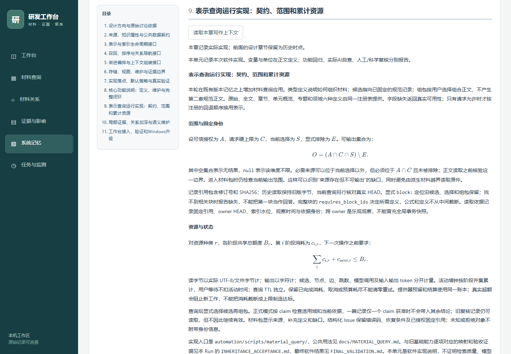

# 表示查询与语义维护首期实现

`RUN-20260909T194710Z-3CF36B2FDD60`，归属 `PRJ-ARCHITECTURE-EVOLUTION`。P0–P6 首期实现和本轮整合记录已完成；软件回归保留一项既有 B01 故障，人工和第二台机器验收待审。工作区保留原有未提交修改，本轮没有提交 Git 或发布 Release。

## 从哪里开始

- 使用功能：[材料查询手册](../../../../docs/MATERIAL_QUERY.md)。工作台“材料查询”或 `workbench.cmd material-query`；三个常用 Skill 已接入。
- 看实现：[技术说明](IMPLEMENTATION_CONTENT.md)、[局部证据与维护](EVIDENCE_MAINTENANCE_CONTENT.md)、[工作台和升级](WORKBENCH_VALIDATION_CONTENT.md)。
- 看结果：[固定软件验证](FINAL_VALIDATION.md)、[继承逐项验收](INHERITANCE_ACCEPTANCE.md)、[资源成本](COST_REVIEW.md)。
- 人工审查：[最终实际 AI 使用报告](actual-ai/reports/report-be6000af5c46421cb7d1f55575403d8d/REVIEW.md)，8个所选场景的真实调用、阅读和 AI 观察可追溯，人工待审。A05/A06的[交叉证据与补充执行](AI_CROSS_COVERAGE.md)单列，不伪装独立重演或盲测。
- 看影响：[模块/文档检查](IMPACT_REVIEW.md)、[可迁移性](PORTABILITY_REVIEW.md)、[最终指纹](final-source-fingerprints.json)。

## 实现结果

六种表示定义、固定候选、范围树和显式组包已接通；可信授权、硬上限、选择与排除贯穿实际读取。固定修订、块定位、必要定义、局部正式依据和结构化缺口保持可追溯。查询/续页/加深/组包共用累计账本，多通道故障保留已完成候选和缺口。

已有关系和有条件联想用于导航。维护任务包交付真实材料，由 AI 或人逐项阅读和审查；Writer 复用原 CAS 事务及 request_id 幂等，内容保存与索引补偿分别返回。工作台真实使用发现的有效 partial 阻断已修复并补入回归。

底层 43 方法逐项适配；具体旧义务、支持策略和未覆盖范围见继承验收，不承诺全部旧 DTO 或任意可选后端均已实现。模型/分词器未配置时不伪造调用或真实 token 消耗。

## 验证与限制

full v4 共 599 项，原始 596 通过、2 失败、1 错误；其中 C17 夹具和结构声明同步问题已分别修正并补测通过，原回执保留。B01 历史冻结指纹故障未关闭。类型、29 组件及 14 真实 Edge 场景均通过。quick v2 独立保留 516/517 通过的较早版本结果。

真实扩展旧工作区 setup 覆盖预览、升级、重复升级、恢复、完整数据保护和损坏拒绝。Python 锁/模型未变，前端资源和指纹已构建；本次未制作或发布依赖包。最终工作区校验0错误0警告。合成数据、小规模资源观测和本机升级不证明真实企业检索质量、科学有效性或第二机器兼容。

A05补充实际重新计划、阅读、retain并apply后零内容提交；来源缺失明确返回SOURCE_MISSING，恢复后55文件不变。A06补充从新自然语言问题发现4候选，再固定读取并保存有条件参考，文本索引补偿完成；四个原记录、旧导航与原件保持。两个场景均保留初始错误回执，未提高科学复核状态。

## 项目文稿与旧版

公开预检/提交/回读新增 3 个 L1 技术单元、L2 事件、L3 经验和 4 个独立章节；双文稿及 L4 地图更新到 r5，r4 保留。共同依据为 11 个固定技术单元，两个公开 document 均 complete，无遗漏单元。[规范回执](implementation-recording-checks.json)保存全部 ID、修订及 SHA。

工作台“系统记忆”选择本 Project，在“研究经过”中切换：

- 完整过程：`MEM-3264fce7-c63f-504e-bdb5-3aaa1169eb7b` r5，11 章。
- 当前简报：`MEM-ef137680-afa6-59b8-a263-f2bb33d256c4` r5，3 章，当前实现置前。

实际 UI 使用本 Project 字节相同的隔离副本，没有中断原工作区已有服务。目录跳转、两处公式和桌面/390px 窄屏正文可读，pageerror 和横向溢出均无；[响应与截图](project-ui-attempt-02/results.json)、[94 文件保护检查](project-ui-preservation.json)保留。三个范围句重复属于简报编辑冗余；本轮无插图，不虚构图像审查。

## 后续维护

按受影响能力复核本 Run 经验。保留 B01 原清单并另行追溯历史差异；人工、检索质量和第二机器验收分别开展。未注册策略在新需求触发后实现和验证。旧设计章节保持原时点，新事实另存修订；日常记录经公开记忆事务，验证回执经 run-register 登记。
