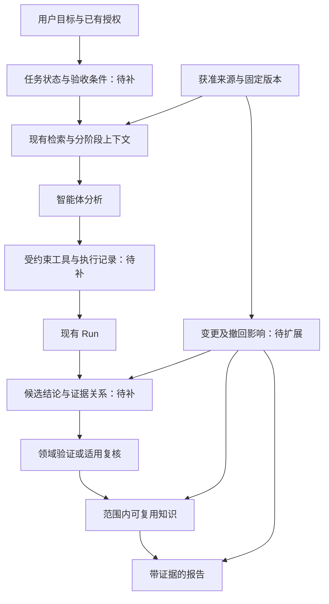

# 研发工作区与工作智能体结构评审

评审日期：2026-09-06。仓库基线：`8b54b060dd8d0366baf049f4851a40a7edd522bf`。
研究：RES-AGENT-WORKSPACE-REVIEW；验证：RUN-20260906T130218Z-252152E16BC5（历史记录已从 main 移除，原路径：`../../runs/run-20260906t130218z-252152e16bc5/README.md`）。
状态：评审完成，工程建议尚未由业务复核，不代表生产能力已验证。本轮未修改框架实现。

## 1. 判断与路线

当前架构值得保留。它已经形成“全局算法与数据 → 独立 Run → 可复用知识/报告”的组织方式，显式区分执行成功、结论复核和历史撤回，并把索引当可重建缓存。这些都适合研发证据管理。

主要缺口在于：**文件与提示词里的治理原则，尚未普遍转化为写入、复用和交付时的程序约束。** 当前更接近“由智能体操作的研发证据工作区”，持续任务执行、结论准入、跨文档失效、恢复与健康监控尚未形成完整闭环。多数问题是目标升级后的能力缺口，不是代码违反现有文档承诺。

建议保留现有目录和 CLI，逐步补齐三层能力：

1. **证据与结论层**：稳定来源版本、结论级复核、跨对象失效、数字与公式证据。
2. **执行层**：自动记录步骤、冻结输入、断点恢复、重试与预算、确定性验证。
3. **操作层**：可查看记忆变化、解释检索选择、环境健康、恢复与只读监测。

无需为了“像工作智能体”而先做全套聊天界面、个人画像、消息连接器或默认多智能体。当前宿主已经承担会话和工具调用，工作区优先承接它不能替代的研发证据约束。

## 2. 对 OpenClaw 的前提修正

当前官方文档描述的 OpenClaw 已使用 Markdown 记忆文件，并提供检索、整理、压缩前保存等机制。因此，“记忆存储完全黑盒”不适合作为当前比较前提。文件可见不等于选择、归纳和晋升过程可靠，研发关注的应该是来源、适用范围和使用限制。[OpenClaw Memory](https://docs.openclaw.ai/concepts/memory)

当前记忆架构还声明了来源分类、回忆内容防重复摄入、自动晋升限制及写入冲突检查。这些机制值得借鉴；但其来源识别依赖工具声明覆盖，不能自动证明一条技术结论正确。[Memory architecture](https://docs.openclaw.ai/concepts/memory-architecture)

官方也明确指出：直接编辑、任意 shell 写入、无血缘旧内容和改写副本不都在治理覆盖范围内，准入规则也不是文件权限。故不能把它描述成“已彻底解决污染”，也不宜仅凭旧印象否定它。[Memory provenance and deletion](https://docs.openclaw.ai/concepts/memory-provenance)

这里需区分两个维度：**来源是否有权发指令**，与**材料是否能支持科学结论**。论文作为外部内容不能修改智能体规则，但经核对后可以成为技术证据；用户有权指定任务，也不意味着其每个技术判断都自动为真。

## 3. 对标对象与适用边界

这些项目属于不同层次，不宜用功能数量直接排名。下表外部能力依据访问当日官方文档；未部署运行或绑定特定 release，不作性能、安全或准确率排名。

| 对象 | 可借鉴能力 | 对本工作区的启发 | 不能直接等同的能力 |
|---|---|---|---|
| OpenClaw | 定时执行、任务状态和重试 | 已授权范围内定期检查材料变化、实验完成和依赖失效 | 定时唤醒不保证科研步骤可恢复，也不证明结论有效。[Automations](https://docs.openclaw.ai/automation/cron-jobs) |
| OpenClaw Memory Wiki（需启用的插件） | 结构化 claim/evidence、矛盾与时效报告、可浏览知识页 | 将“哪些结论依赖这份材料”变为可查询关系 | 页面评分与状态字段不等于实验复核。[Memory Wiki](https://docs.openclaw.ai/plugins/memory-wiki) |
| Letta Code Context Repositories | Git 记忆版本、渐进装载、隔离修改再合并 | 记忆更改可比较、可回滚，整理操作不直接覆盖稳定知识 | Git 能合并文本，不能裁定相冲突的研发结论。[Letta 官方介绍](https://www.letta.com/blog/context-repositories/) |
| LangGraph | 持久化检查点与跨会话 store | 分开保存任务执行状态和长期知识，支持暂停与续作 | 检查点不自动冻结外部数据或模型版本。[Persistence](https://docs.langchain.com/oss/python/langgraph/persistence) |
| Deep Agents | 上下文卸载、技能、沙箱、任务拆分、人工介入 | 借鉴执行框架的接口与上下文隔离 | 多个智能体意见一致不等于独立科学验证。[Overview](https://docs.langchain.com/oss/python/deepagents/overview) |
| OpenHands | 事件与状态保存、行动前确认策略 | 自动记录执行轨迹，按风险和既有授权控制动作 | 会话恢复不等于可重复实验；风险分析也不能替代 OS 权限。[Persistence](https://docs.openhands.dev/sdk/guides/convo-persistence)、[Security](https://docs.openhands.dev/sdk/arch/security) |
| DVC（研发复现参照，非工作智能体） | 流水线命令、依赖、参数和产物版本 | Run 除了描述发生了什么，还应能定位并重跑固定输入 | 复现同一结果仍不证明现实模型有效。[dvc.yaml / dvc.lock](https://doc.dvc.org/user-guide/project-structure/dvcyaml-files) |

长任务恢复还需要固定执行语义。LangGraph 官方兼容性文档说明已有会话可能使用新部署的图代码，因此采用该框架也仍需自行设计版本绑定和迁移规则。[Backward compatibility](https://docs.langchain.com/oss/python/langgraph/backward-compatibility)

## 4. 当前已实现与仍属约定的能力

| 维度 | 已有实际能力 | 仍缺少或未验证 |
|---|---|---|
| 对象组织 | 核心算法、研究、Run、工具平级，项目可选；公司文档是算法准入依据 | 算法资格仍由接入者核对，非空文档引用不证明依据真实 |
| 记忆 | Run 的执行/复核分离；复核历史、撤回、替代；即时查询 | 普通知识与研究综合缺统一结论状态；未实现自动记录全部关键操作 |
| 检索 | FTS5 + 本地向量实现、指纹、来源去重、角色选择、两次有界扩展、用户排除 | 没有真实问题集；来源相关性不等于答案正确；本副本本地向量依赖不可用 |
| 纠错 | 已登记父 Run 多级失效传播；同目录关键输出继承风险 | 尚无跨研究、算法卡、ADR、报告的统一失效传播 |
| 可复现 | Run 有输入、代码、环境、种子、参数和产物槽位 | 多数靠填写；没有执行包装器、冻结/封存、统一重跑和产物校验入口 |
| 科学验证 | 工作流要求单位、基线、假设、反证与范围 | 数据契约和模型 V&V/UQ 主要为约定，缺可执行验证配置 |
| 权限 | 路径限制、外部逐文件登记、不自动抓取链接、离线向量设计 | 敏感等级/授权登记未成为通用执行过滤；任意 shell 权限靠宿主/系统 |
| 运维 | 便携打包、自检脚本、安装清单、模型哈希 | 当前副本缺依赖；无自动备份与恢复演练、任务队列、写入协调 |
| 可观察性 | Q/CTX/CF、选择清单、策略摘要与反馈可追踪 | 缺统一查看入口；历史证据链接会在源码副本失效；无全任务成本/步骤视图 |

实现依据：[架构](../../ARCHITECTURE.md)、[记忆规则](../../context/MEMORY.md)、[CLI](../../automation/scripts/workspace_cli.py)、[检索](../../automation/scripts/retrieval.py)、[上下文选择](../../automation/scripts/context_engine.py)、[抽取](../../automation/scripts/material_extract.py)。精确函数位置见[证据台账](EVIDENCE_LEDGER.md)。

## 5. 已验证的高优先级缺口

### F1：正式结果缺少机器验收门

合成探针将一个 Run 的 `status` 设为 `succeeded`，保持 `inputs`、`artifacts`、`quality_results` 为空，结构校验返回 0 错误、0 警告。这不意味着 succeeded 已被程序当成 accepted；它证明目前没有“完成结果是否具备最小证据”的硬检查。探针结果（历史记录已从 main 移除，原路径：`../../runs/run-20260906t130218z-252152e16bc5/probe-results.json`）

建议新增按用途执行的 finalize/check：探索 Run 可以不完整，但正式数字或可复用结论必须满足版本、产物、范围与验证要求。缺失字段应明确报告，不能由助手自由文本“已完成”代替。

### F2：撤回可能通过研究综合再次传播

探针中原 Run 已撤回，原 Run 条目正确携带 blocking_run_ids；通过 Markdown 链接引用它的研究综合仍以全文装载，review 为空、blockers 为空。现有代码正确覆盖 Run 同目录说明，尚未覆盖这种跨对象依赖。同一探针结果（历史记录已从 main 移除，原路径：`../../runs/run-20260906t130218z-252152e16bc5/probe-results.json`）

建议让研究结论、算法卡、ADR 与报告中的关键声明登记消费了哪些证据版本。上游撤回后，应标记下游“需复核”并阻止其用于正式结论。不能把所有链接都当因果依赖：应区分支持、反证、背景参考、实际输入、替代关系。历史调查仍可读取撤回内容，但须保持身份与状态可见。

### F3：文件可读不等于权限与可信度已落实

合成研究卡标为 restricted，综合正文仍能入索引，索引元数据不携带该等级。代码的主要边界是路径登记；它没有通用的按主体、数据等级、目的、动作检查授权的执行层。该探针只证明机制缺口，不表示本次读取违反授权，也不审计当前宿主沙箱。探针（历史记录已从 main 移除，原路径：`../../runs/run-20260906t130218z-252152e16bc5/probe_gaps.py`）、[数据边界](../../governance/SECURITY_AND_DATA_BOUNDARIES.md)

建议让可读范围、输出目的地和允许动作形成可检查策略，并在检索、计算和交付入口一致应用。正式知识写入使用受限接口；原始数据只读。路径内的网页摘录或工具输出仍需保存来源身份，不能因复制到本地目录就升为可信指令。

### F4：有版本指纹，但历史复现与迁移不完整

`source_id()` 根据绝对路径生成 ID，移动路径后 ID 改变。SQLite revisions 保存旧指纹与元数据，不保留旧正文；这符合当前设计，但不足以重建当时依据。Run 的 Git 记录也只尽力获取，当前进程曾遇到 Git ownership 检查，默认探测得到 null；本轮用单次 safe.directory 参数只读确认了提交。[检索](../../automation/scripts/retrieval.py)、[CLI](../../automation/scripts/workspace_cli.py)

建议分开 source_id（逻辑身份）、revision_id（内容版本）、location（可变路径）。对关键依据保存获准快照或不可变版本引用；记录代码工作树差异、环境锁、解析器/检索策略/回答模型标识和产物哈希。区分“回放当时证据”与“查询现在状态”：回放仍要显示此后发生的撤回。

### F5：当前运行环境与历史说明不一致

本轮实际运行 49 项测试：42 通过，7 跳过；跳过原因是缺少本地模型。实际 index-knowledge 返回 `No module named 'qdrant_client'`。validate 为 0 错误、4 警告，警告都是历史引用的本机证据/临时文件缺失。测试（历史记录已从 main 移除，原路径：`../../runs/run-20260906t130218z-252152e16bc5/tests.txt`）、索引尝试（历史记录已从 main 移除，原路径：`../../runs/run-20260906t130218z-252152e16bc5/index-attempt.txt`）、校验（历史记录已从 main 移除，原路径：`../../runs/run-20260906t130218z-252152e16bc5/validate-before.txt`）

这不是历史验证必然错误，而是源码副本与完整运行环境不同。应生成运行时能力状态，将结构可用、FTS 可用、向量可用、OCR 可用、业务验收分开；正式集成验收中必要测试被跳过不能显示成全能力通过。源码版缺本机证据应有可解释状态，不制造链接警告噪声。

## 6. 功能建议与验收标准

P0 表示正式研发结论使用或敏感材料接入前的优先项；P1 表示试点中补齐；P2 按使用量与实际痛点触发。它们是工程建议，不是本轮已实现功能。

| 优先级 | 建议 | 最小范围 | 可观察的验收 |
|---|---|---|---|
| P0 | 真实问题与答案评估集 | 从首批获准算法中整理约 30–50 个问题，保留调参与独立验收集 | 检查正确版本、关键证据覆盖、答案/数字/单位、冲突揭示和证据不足时的停止行为；报告样本量与错例 |
| P0 | 结论级记录与使用检查 | 在现有 Run/研究内加 claims；关键结论有依据、范围、状态、反证 | 缺来源/范围或证据失效的 claim 不能进入正式报告；探索材料仍可检索 |
| P0 | 跨对象失效传播 | 结构化依赖边，覆盖研究、算法卡、ADR、报告 | 撤回一个 Run 后所有已登记消费链显示待复核；背景/反例引用不误伤 |
| P0 | 实际访问与写入边界 | 按获准路径、动作与目的地约束工具；保留授权依据 | 非授权来源不进入包，外部内容不能修改规则；已授权日常操作不重复询问 |
| P0 | 能力健康与严格验收 | 复用现有便携检查，输出组件状态、版本及 skipped | 新副本能清晰说明缺什么；必要模型/OCR 测试未运行时不能宣称集成通过 |
| P1 | 冻结与复跑 Run | 统一包装确定性计算，保存步骤、输入/配置/环境/输出指纹 | 清洁环境能重跑一个代表性 Run，并按领域容差比较；失败也有记录 |
| P1 | 研发验证工具 | 执行单位/坐标/时间/字段契约；基准、边界、性质与回归检查 | 故意植入单位误差、时间错位、符号错误时能定位；模型现实有效性另行验证 |
| P1 | 版本身份与备份 | 稳定 ID、版本定位、已授权证据备份与恢复清单 | 改路径后反馈仍找得到对象；恢复演练能找回关键依据和复核历史 |
| P1 | 可查看的记忆与证据面板 | 先读后写，展示出处、状态、变更、引用关系、未装载原因 | 能回答“为何记住、谁确认、何时失效、哪些报告受影响”；写操作支持差异预览 |
| P1 | 抽取质量检查 | 关键公式/表格保留原页定位、抽取结果和人工核对状态 | 漏掉负号、上下标、表头单位、Excel 缓存过期时明确降级，不能标为全文理解 |
| P2 | 持久任务与只读事件监测 | 任务状态、停止条件、检查点、幂等键；监测仅写变更候选 | 中断可续作，重试不重复外部动作；材料变化只触发影响分析，未复核结论不自动晋升 |
| P2 | 并发与性能治理 | 先单写者队列/锁和 revision 检查，再考虑服务化 | 两任务改同一记录时检测冲突；不丢复核事件；测量查询时延和内存再扩容 |

“30–50 个问题”只是启动规模建议，不是统计质量保证。按实际风险与问题分布扩大；至少包含相近算法混淆、旧/新版本冲突、被撤回结论、同结论多摘要、公式 OCR 失真、超出适用域、明确无法回答和诱导越权的合成材料。

现有 evaluate 只衡量来源路径召回率和 MRR，`retrieval/eval.json` 的 cases 为空。增加重排模型或知识图谱之前，先证明它能改善这些真实错例。[评估入口](../../automation/scripts/retrieval.py)、[当前评估集](../../retrieval/eval.json)

数值验证应采用领域允许的容差，而不是把文本“差不多”当一致。例如可定义：

$$
|y-y_{\mathrm{ref}}|\leq\varepsilon_{\mathrm{abs}}+
\varepsilon_{\mathrm{rel}}|y_{\mathrm{ref}}|
$$

其中 $y$ 为当前结果，$y_{\mathrm{ref}}$ 为基准；$\varepsilon_{\mathrm{abs}}$ 与结果同单位，$\varepsilon_{\mathrm{rel}}$ 无量纲。阈值须来自算法要求、测量不确定度或已授权验收规则，不能由助手随意给定。比较前先确认单位、坐标、采样与基准版本一致。

性能方面，当前 search 与 assemble 都刷新索引，同模块/研究关系组还构造全连接边。资料增长后可能增加扫描、内存和选材开销，这是代码推断，尚无性能测量。应先记录阶段耗时、文件数、候选数和内存，再考虑增量变更队列与按需邻接查询；不要先上分布式系统。

## 7. 记忆治理应如何具体落地

保留现有文件体系，在其中区分五类内容即可，无需另造一套平行知识库：

- **指令和授权**：人的约束，带作用范围与有效期；证据正文不能修改它。
- **任务状态**：目标、当前步骤、未决问题、已完成动作；服务于续作，不能当技术结论。
- **原始证据与执行记录**：来源版本、Run、结果和失败；默认可追溯，是否可靠另评。
- **候选结论**：AI 推断或未复核判断，保留支持与反证；允许检索并明确候选身份。
- **可复用结论**：在特定范围内经复核；仍需核对输入版本、失效条件与下游使用。

关键结论建议至少记录：claim_id、statement、kind（事实/计算/推断/建议）、evidence_refs（来源版本+定位）、scope、review、validity_conditions、supersedes 和反证引用。一个 Run 可同时有已复核的数值结果和未复核的机理解释，不能用 Run 的一个 accepted 标签覆盖全部陈述。重复被引用不能增加独立证据数量；归纳稿不能反过来证明自己的原始结论。

整理记忆应产生候选差异：去重、合并措辞、过期标记和重定位属于维护；提升可信状态需要对应证据和已有授权验证流程。保存失败经验，但不让日志噪声、心跳提示、工具说明或检索回灌占据稳定知识。用户偏好与技术事实分开保存，单次选择继续保持本次范围。

检索流程建议先做权限、版本与使用目的检查，再做相关性排序和上下文预算。可以保留探索/历史查询模式，同时提供正式依据模式。被撤回材料应可用于解释错误历史，但不得以无标记摘要进入正式论证。

## 8. 目标结构与渐进实施

下图是建议结构；“待补”部分尚未实现。

**第一批改进**：补运行健康/严格验收；选一份真实算法说明、一个实现和一个历史结果；加入最小 claim、finalize 和跨文档失效检查；用真实问题得到第一批错例。此时已有目录完全够用。

**第二批改进**：包装一个高频分析命令，自动记 Run 与步骤，冻结版本并演练恢复；增加原页核对、数字核对和一个轻量证据查看入口。数据和工具决定接口，不先建设通用平台。

**第三批改进**：当确有跨天实验、定时检查和多任务需求时，再增加调度、任务恢复和队列。若只是偶尔执行短任务，继续复用宿主工具即可。引入 LangGraph、DVC 等应基于具体缺口和受控部署条件；不要求整套迁移。

暂缓默认后台自我总结并晋升、无差别长期聊天记忆、按“多次出现”增加科学可信度、默认多智能体投票、无真实评估支持的更大模型/图数据库，以及连接大量企业系统。它们可能放大当前写入与版本缺口。

## 9. 验证范围和本轮交付

本轮审阅入口规则、对象模板、治理、CLI、检索、上下文、多格式抽取、向量接口、迁移说明及现有测试；通过合成隔离探针验证 F1–F4 的指定行为。没有真实公司材料，没有验证领域模型、语义召回质量或大规模性能，也没有安装外部智能体做实机对比。

新增研究记录和一个 Run，保留脚本、原始检查结果和输入指纹。本报告是工程评审建议，未被登记为 accepted 业务事实。最终结构校验与导航更新结果见 Run；本地向量索引缺依赖，不能声称新研究已完成混合检索入库。

