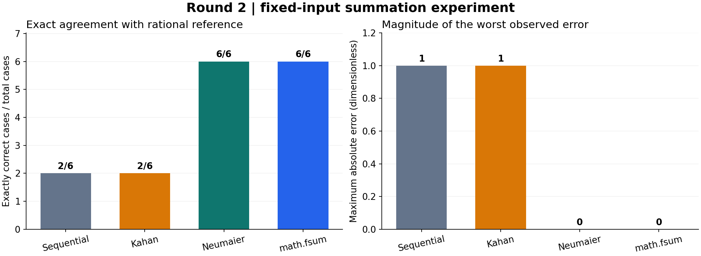

# 探索02：Kahan补偿为何仍会在三项抵消中失败？

## 问题、输入与比较方法

第一轮说明逐项累加存在顺序误差。本轮将输入缩短为三个可精确表示的数 $[10^{16},1,-10^{16}]$，枚举全部6种排列。每种排列的精确和都为1；没有随机抽样。比较同一份脚本中的逐项累加、Kahan、Neumaier与math.fsum。

## Kahan的补偿递推

$$
y_i=\operatorname{fl}(x_i-c_{i-1}),\quad
t_i=\operatorname{fl}(s_{i-1}+y_i),\quad
c_i=\operatorname{fl}(\operatorname{fl}(t_i-s_{i-1})-y_i),\quad s_i=t_i.
$$

$s_i$为当前和，$c_i$为下一步需要减去的低位损失，$y_i$为修正后的输入，初值均为0。对排列$[10^{16},1,-10^{16}]$，实际轨迹如下；所有值来自保存的operation-traces.json。

| 步 | $x_i$ | $c_{i-1}$ | 实际$y_i$ | $s_i$ | $c_i$ |
|---|---:|---:|---:|---:|---:|
| 1 | $10^{16}$ | 0 | $10^{16}$ | $10^{16}$ | 0 |
| 2 | 1 | 0 | 1 | $10^{16}$ | −1 |
| 3 | $-10^{16}$ | −1 | $-10^{16}$ | 0 | 0 |

第二步确实记录了−1，但第三步计算 $-10^{16}-(-1)$ 时又舍入成 $-10^{16}$，补偿没有进入最终和。因此本实现返回0，绝对误差为1。观察不能表述成“Kahan没有进行补偿”，也不能推广为“Kahan总是失败”。

## Neumaier的差异与最终校正

$$
t_i=\operatorname{fl}(s_{i-1}+x_i),\qquad
\delta_i=\begin{cases}(s_{i-1}-t_i)+x_i,&|s_{i-1}|\ge|x_i|,\\
(x_i-t_i)+s_{i-1},&|s_{i-1}|<|x_i|,\end{cases}
\quad c_i=\operatorname{fl}(c_{i-1}+\delta_i).
$$

这里右侧加减均按脚本执行浮点运算，$s_i=t_i$；最后返回 $\operatorname{fl}(s_n+c_n)$。本排列三步的$(s_i,c_i)$依次为$(10^{16},0)$、$(10^{16},1)$、$(0,1)$，最终结果为1。注意第二步即时返回$s_i+c_i$仍可能舍入为大数，低位校正要在最后相加才对这组抵消起效。

## 基准与误差定义

基准针对程序实际接收到的binary64数值，而不是假设任意十进制字符串均可精确表示：

$$
S_{\mathrm{ref}}=\sum_{i=1}^{n}\operatorname{Fraction}(x_i),\qquad
e_{\mathrm{abs}}=\left|\operatorname{Fraction}(\widehat S)-S_{\mathrm{ref}}\right|.
$$

其中，$x_i$为实际输入浮点数，$n$为项数，$\widehat S$为算法输出。Fraction将每个已表示的浮点数转换为精确有理数；本研究又用整数累加核对该基准。精确命中表示有理数误差恰为0，不使用浮点容差判断。

## 实际结果

| 方法 | 完全一致的样本数 | 最大绝对误差 |
|---|---:|---:|
| 显式逐项累加 | 2/6 | 1 |
| Kahan | 2/6 | 1 |
| Neumaier | 6/6 | 0 |
| math.fsum | 6/6 | 0 |

| 排列（按保存顺序） | 逐项累加 | Kahan | Neumaier | math.fsum |
|---|---:|---:|---:|---:|
| `1e16, 1, -1e16` | 0 | 0 | 1 | 1 |
| `1e16, -1e16, 1` | 1 | 1 | 1 | 1 |
| `1, 1e16, -1e16` | 0 | 0 | 1 | 1 |
| `1, -1e16, 1e16` | 0 | 0 | 1 | 1 |
| `-1e16, 1e16, 1` | 1 | 1 | 1 | 1 |
| `-1e16, 1, 1e16` | 0 | 0 | 1 | 1 |



## 讨论、限制与下一步

六种排列中Kahan与逐项累加均只精确命中2种，Neumaier和math.fsum均命中6种。下一轮增加重复和排列数量，检验这个反例结构是否继续出现。不能据6种特例证明任何算法普遍正确，也未比较性能。

## 计算环境与复算

实际数值环境为CPython 3.12.10、Windows 11 x64，浮点有效位53位。本说明使用本机实际binary64操作，按默认最近舍入解释轨迹；没有切换舍入模式，也没有检验其他平台或编译器。所有中间数字可在固定轨迹中核对，未把CPython内部fsum实现推断成已观察状态。

在工作区根目录执行下面命令，输出必须选不存在的新目录；数值复算仅用标准库：

```powershell
.\automation\python.ps1 research/floating-point-summation/runs/run-20260908t215458z-04c7d84d40d8/reproduce.py --root . --manifest research/floating-point-summation/runs/run-20260908t215458z-04c7d84d40d8/source-manifest.json --output .local/summation-numerical-recheck --no-plots
```

图片由已记录版本的Matplotlib作者环境生成；阅读已保存PNG无需安装绘图库。重新绘图的环境版本见固定Run中的plot-requirements.lock.txt，不把绘图环境失败解释成数值算法失败。

## 证据与复核范围

本说明补写于 `2026-09-08T21:59:52.326179Z`，根据旧轮次保存的输入/结果和本次新执行的逐步复核整理；不是当时已经存在的记录。

- [原轮次 Run](../runs/run-20260908t201228z-a0980824dc18/README.md)：实际输入、原脚本、结果及原时间。
- [本次逐步复核](../runs/run-20260908t215458z-04c7d84d40d8/README.md)：150个最终结果及精确误差逐项一致；111组显式算法轨迹。
- [固定复算程序](../runs/run-20260908t215458z-04c7d84d40d8/reproduce.py)：数值部分只使用标准库；math.fsum只记录实际返回，不编造内部部分和。

全部输入无量纲。图表来自本次对固定输入的实际复核，图下数字可以在结果JSON中逐项找到。当前结论未人工复核，不用于任意浮点输入或真实业务模型的有效性保证。

本次说明修订时间：2026-09-08T22:04:32.365436Z。保留上述首次补写时间；环境、固定复算入口及采样核对为随后补充。
