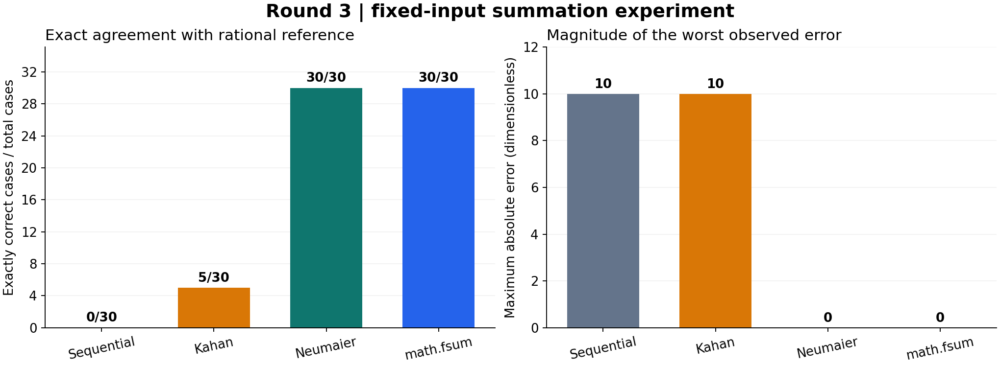
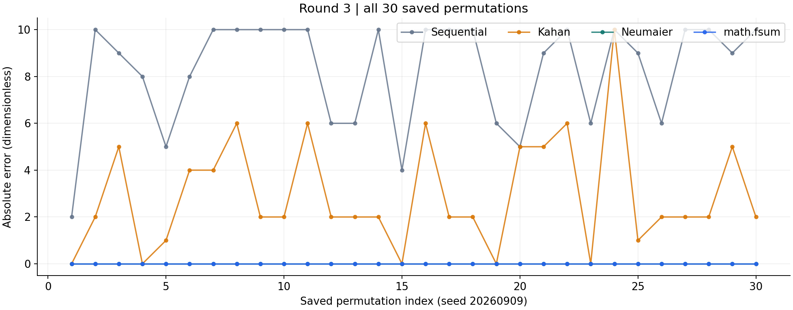

# 探索03：反例扩大到30项和30种排列后是否仍成立？

## 从反例到复验

第二轮已经给出Kahan的具体失败轨迹。本轮把三项序列重复10次，得到30项多重集合，再按保存的随机种子20260909产生30种排列。这里30是排列样本数，也是每个排列的项数；输入中的正大数、1和负大数各10个。所有样本的精确和均为10。

| 参数 | 本次取值 | 作用与边界 |
|---|---:|---|
| 大数幅值 | $10^{16}$ | 保持前两轮的舍入尺度 |
| 三项重复次数 | 10 | 精确小量总和为10 |
| 每样本项数 | 30 | 有限长度，不检验长序列极限 |
| 保存排列数 | 30 | 固定输入列表；不是独立同分布误差概率估计 |
| 随机种子 | 20260909 | 用于再现样本构造；复算优先读取保存数组 |

## 方法与可复核步骤

1. 读取已保存的30组具体输入并核对SHA，不重新随机生成一个不同题集。
2. 分别执行四种方法；显式算法记录每一步的和、补偿值、输入及精确前缀误差。
3. 按前述精确有理数基准计算绝对误差，与旧Run的150个合计方法结果中的本轮120个逐项比较。
4. 展示全部30种排列的误差序列与每种方法的精确命中数，不只选择好看的样本。

本轮方法定义和误差公式与前两轮一致；每个输入都是已表示的整数浮点值，所有数量无量纲。

## 基准与误差定义

基准针对程序实际接收到的binary64数值，而不是假设任意十进制字符串均可精确表示：

$$
S_{\mathrm{ref}}=\sum_{i=1}^{n}\operatorname{Fraction}(x_i),\qquad
e_{\mathrm{abs}}=\left|\operatorname{Fraction}(\widehat S)-S_{\mathrm{ref}}\right|.
$$

其中，$x_i$为实际输入浮点数，$n$为项数，$\widehat S$为算法输出。Fraction将每个已表示的浮点数转换为精确有理数；本研究又用整数累加核对该基准。精确命中表示有理数误差恰为0，不使用浮点容差判断。

### 采样配方的独立核对

原配方使用 `rng = random.Random(20260909)`，每轮重置 `values = ['1e16', '1', '-1e16'] * 10` 后调用 `rng.shuffle(values)`；30轮连续使用同一个随机数生成器。本次另行执行[固定采样程序](../runs/run-20260908t215458z-04c7d84d40d8/sampling_recipe.py)，生成的30组、每组30项字符串数组与保存输入逐项一致，见[采样核对结果](../runs/run-20260908t215458z-04c7d84d40d8/outputs/sampling-verification.json)。

```powershell
.\automation\python.ps1 research/floating-point-summation/runs/run-20260908t215458z-04c7d84d40d8/sampling_recipe.py --input runs/run-20260908t201240z-90107a617cf8/inputs.json --output .local/summation-sampling-recheck.json
```

配方复现已在上述Python环境验证；其他Python版本优先读取保存数组，不据同一seed推断跨版本排列一定相同。

## 实际结果

| 方法 | 完全一致的样本数 | 最大绝对误差 |
|---|---:|---:|
| 显式逐项累加 | 0/30 | 10 |
| Kahan | 5/30 | 10 |
| Neumaier | 30/30 | 0 |
| math.fsum | 30/30 | 0 |

### 误差分布（保留所有样本）

| 方法 | 绝对误差 → 出现次数 |
|---|---|
| 显式逐项累加 | 2 → 1；4 → 1；5 → 2；6 → 5；8 → 2；9 → 4；10 → 15 |
| Kahan | 0 → 5；1 → 2；2 → 12；4 → 2；5 → 4；6 → 4；10 → 1 |
| Neumaier | 0 → 30 |
| math.fsum | 0 → 30 |





## 讨论、限制与下一步

Kahan在30种排列中仅5种精确，说明所选抵消结构在增加项数后仍可能失败；Neumaier和math.fsum本次30种全部精确。该有限构造样本不提供真实输入分布下的失败概率或任意输入正确性。后续应分别测试非整数、指数跨度、溢出/下溢、其他平台和速度；这些尚未执行。

## 计算环境与复算

实际数值环境为CPython 3.12.10、Windows 11 x64，浮点有效位53位。本说明使用本机实际binary64操作，按默认最近舍入解释轨迹；没有切换舍入模式，也没有检验其他平台或编译器。所有中间数字可在固定轨迹中核对，未把CPython内部fsum实现推断成已观察状态。

在工作区根目录执行下面命令，输出必须选不存在的新目录；数值复算仅用标准库：

```powershell
.\automation\python.ps1 research/floating-point-summation/runs/run-20260908t215458z-04c7d84d40d8/reproduce.py --root . --manifest research/floating-point-summation/runs/run-20260908t215458z-04c7d84d40d8/source-manifest.json --output .local/summation-numerical-recheck --no-plots
```

图片由已记录版本的Matplotlib作者环境生成；阅读已保存PNG无需安装绘图库。重新绘图的环境版本见固定Run中的plot-requirements.lock.txt，不把绘图环境失败解释成数值算法失败。

## 证据与复核范围

本说明补写于 `2026-09-08T21:59:52.326179Z`，根据旧轮次保存的输入/结果和本次新执行的逐步复核整理；不是当时已经存在的记录。

- [原轮次 Run](../runs/run-20260908t201240z-90107a617cf8/README.md)：实际输入、原脚本、结果及原时间。
- [本次逐步复核](../runs/run-20260908t215458z-04c7d84d40d8/README.md)：150个最终结果及精确误差逐项一致；111组显式算法轨迹。
- [固定复算程序](../runs/run-20260908t215458z-04c7d84d40d8/reproduce.py)：数值部分只使用标准库；math.fsum只记录实际返回，不编造内部部分和。

全部输入无量纲。图表来自本次对固定输入的实际复核，图下数字可以在结果JSON中逐项找到。当前结论未人工复核，不用于任意浮点输入或真实业务模型的有效性保证。

本次说明修订时间：2026-09-08T22:04:32.365436Z。保留上述首次补写时间；环境、固定复算入口及采样核对为随后补充。
