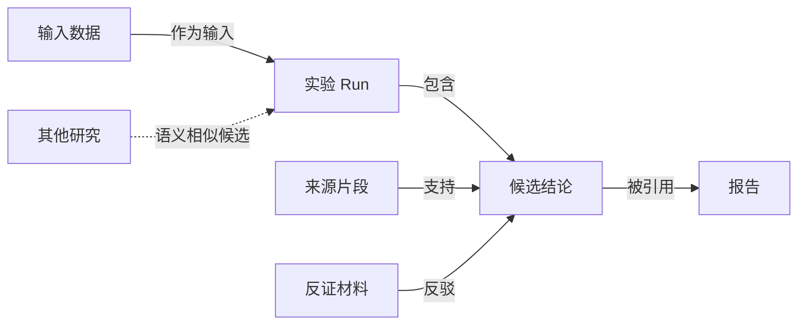

# 材料关联展示：工具调研与工作台方案

日期：2026-09-07。性质：工程建议，尚未实施或经过业务复核。实现盘点固定于 Run（历史记录已从 main 移除，原路径：`../../runs/run-20260907t063633z-159b86592cdd/README.md`），来源逐项见 [证据台账](EVIDENCE_LEDGER.md)。

## 判断

适合用于当前材料。建议在工作台增加“材料关系”入口，支持问题辐射、主题聚合和证据链三种视图；相似性作为可切换的候选层。原文、元数据、Run 和复核记录继续作为事实源，图是可重建的阅读视图。

“只在展示层制作”可以覆盖布局、颜色、折叠、过滤与选中范围的关系摘要。当前接口没有暴露的材料属性仍需要轻量只读适配；若以后需要发现从未记录的语义联系，必须读取已授权正文或复用嵌入结果进行计算。前端布局本身无法产生有依据的新关系。无需为此新增图数据库、全量知识本体、自动复核或完整 GraphRAG 索引流程。

## 一、工具特点与可借鉴部分

| 工具 | 组织方式 | 本工作区可借鉴的功能 |
|---|---|---|
| Obsidian Graph | 笔记及其显式链接；支持全局/局部图、过滤与颜色组 | 从当前材料展开一至两跳、突出孤立材料、点击回到原文。[官方说明](https://obsidian.md/help/plugins/graph) |
| Obsidian Canvas | 卡片、连接标签、空间分组；使用 JSON Canvas 保存画布 | 问题讨论中把来源摆成不同区块，保留原件引用。[官方说明](https://obsidian.md/help/plugins/canvas) |
| Heptabase | 白板与卡片，结合双向链接、PDF 标注 | 按研究问题聚合不同格式材料，在同一视图中对照内容。[官网](https://heptabase.com/) |
| TheBrain | 一个想法允许多个父节点、子节点及横向跳转 | 用当前问题作中心，按关系分区辐射，同时保留跨主题联系。[官方介绍](https://www.thebrain.com/km/limitless-mind-mapping) |
| Smart Connections | 用本地嵌入寻找含义相近的笔记，组织所选上下文 | 在显式关系之外推荐“可能相关”，让用户选取后交给 AI 阅读。[源项目](https://github.com/brianpetro/obsidian-smart-connections) |
| InfraNodus | 概念共现网络、主题簇及簇间连接缺口 | 聚合零散想法，提示可能值得共同研究的主题组合。[方法](https://infranodus.com/about/how-it-works)、[缺口分析](https://infranodus.com/tutorial/content-gap-analysis) |

这里的关系图、思维导图、白板和语义图用途不同：思维导图突出层级；关系图允许多对多连接；白板保存空间整理；语义图提示尚未显式记录的相似性。研发材料通常同时需要后面三种能力。

## 二、展示背后的原理

### 辐射：以一个问题为中心的局部图

选取问题或材料，再沿指定关系展开一跳、两跳。中心可以是已有算法或研究，也可以只是本次查询的临时视图节点。按“定义/模型、实现、实验、反证、交付”分成扇区，有助于看清一个问题的依据分布。一个材料可以关联多个中心，其源身份保持相同。

展开半径表示关系跳数。扇区表示材料角色。两者都不表示证据可信程度。默认只显示局部范围，可避免整个工作区一起出现造成密集连线。

### 空间布局：让图可读

力导向布局让连接节点相互吸引、节点间相互排斥，使图逐渐形成可阅读的分布；D3 提供这类模拟。[D3 force 文档](https://d3js.org/d3-force)

布局只决定坐标。同一批关系可以用辐射、层次、力导向等不同方式摆放，因此“靠得近”不应解释为支持更强或推理更可靠。界面需要稳定初始位置、允许固定节点、减少持续晃动；选中关系时展示其真实类型与来源。

### 聚合：主题分组与自动聚类

优先使用已有算法、研究、项目关联作为可解释的组。组折叠时显示材料数量与跨组引用；展开后显示成员。多重归属保留引用或别名视图，不能移动文件来强行形成互斥分类。

若一个主题有 n 份材料，两两连线会形成 n(n−1)/2 条边；改成“主题主体—成员”的组织只需 n 条归属边。这是本工作区减少密集连线的直接办法，不能改变原有证据依赖。

自动社区发现则依据网络连接结构计算分组。Microsoft GraphRAG 使用层次 Leiden 社区和社区摘要，但这是其额外索引流程的一部分。[官方数据流](https://microsoft.github.io/graphrag/index/default_dataflow/)

建议第一版只做已有主题聚合。自动聚类留作可重建的展示结果，标记算法、输入范围和生成时间；簇名称经 AI 命名时标记“AI 概括”。不能据自动分组创建真实的核心算法卡。

### 相关性：显式关系之外的候选

已有标签和关键词交集可以形成“共享关键词”；本地嵌入可以形成“语义相似候选”。常见相似度为：

$$
\operatorname{sim}(a,b)=\frac{\mathbf{v}_a^\mathsf{T}\mathbf{v}_b}{\lVert\mathbf{v}_a\rVert_2\lVert\mathbf{v}_b\rVert_2}.
$$

其中 a、b 为材料片段，向量 v 来自同一个嵌入模型；结果无量纲，表示该模型空间的接近程度。它不是概率，也不直接表示支持、因果或实验数据的统计相关性。

长文档应保留匹配片段及定位，不能仅用整份文档的单个分数连线。相互矛盾的观点也可能高度语义相似，因此“相似”与“反证”可能并存。每个中心只展示少量候选，按需展开；阈值需用实际材料校准，不能把当前查询检索阈值直接当作材料连边阈值。

### 桥接与缺口：生成可检查的问题

跨两个主题的材料可以是连接线索；两个主题联系较弱，可以提示“是否值得共同研究”。InfraNodus 将此用于问题生成。[官方说明](https://infranodus.com/tutorial/content-gap-analysis)

在本工作区中，“没有发现关联”需要同时说明索引范围、过滤和未读材料。它可能表示未登记或未检索到，而不是现实中不存在关系。桥接建议应写成待核对问题，例如“两个实验是否共享同一种温度误差来源？”，不能直接写成确定机制。

## 三、当前结构能直接支持什么

| 当前数据/实现 | 可以展示 | 仍需处理 |
|---|---|---|
| Run、算法、研究和证据旁文件的 ID、标题、状态 | 材料主体、结论子节点、复核与风险标记 | 普通文件无证据旁文件时仍需作为普通材料显示 |
| claims/evidence_refs、dependencies | 支持、输入、背景、反证关系及定位 | 保留原始方向和关系，不把四类关系混成普通连线 |
| parent_run_ids、输入与产物引用 | 实验前后关系、输入与输出链 | 输入/产物文件需独立节点；引用路径和 owner 不等同 |
| related_module_ids、related_research_ids、sources.related | 主题归属与显式关联 | 通用 related 不具有“支持”语义 |
| Markdown 链接和检索缓存 | 材料间引用、原文导航 | 普通链接仅表示引用，标题相同不自动合并 |
| evidence_observer.collect | 指纹、风险、复核历史、报告影响路径 | 当前并非全材料图，只返回证据主体及来源清单 |
| context_engine.plan | 已有按关联跳数补材料的能力 | 需要更清楚地给 AI 展示完整路径及每一段的类型 |

关键实现限制：`retrieval.relations()` 输出无类型、双向的邻接集合，还会把同主题材料两两连接。它适合现有候选扩展，但不能直接作为有类型展示图的唯一来源。`EvidenceGraph.edges` 主要用于失效传播，包含 owner/claim 等内部生成关系；展示时应区分显式引用、归属及程序推导的影响路径。[检索实现](../../automation/scripts/retrieval.py)、[证据实现](../../automation/scripts/evidence.py)

盘点时旧索引有 63 份材料、277 对无向邻接；正式证据图有 7 节点、0 条 claim，包含本次新建研究与 Run。合成沙盒有 6 节点、1 条 claim，以及 3 条 supports、1 条 input 引用。上述数字是固定 Run 的实现盘点，不是业务覆盖率或图谱质量评估。

## 四、建议的工作台交互

### 1. 问题辐射视图：默认入口

搜索或选择一个问题/算法/材料，以其为中心。周边按角色分区，默认一跳；点击节点查看摘要、版本、来源及复核，双击或“以此为中心”重新聚焦。支持返回上一个中心。

临时问题主体标记“本次视图”。已有算法/研究主体使用真实 ID；临时主体不写入业务对象。

### 2. 主题聚合视图：看材料分布

展示算法、研究及所选交付目标的分块，组可折叠。对跨组材料保留多重关联，突出关联主体与少量桥接材料。默认隐藏导航文件、模板、缓存和纯日志；显示当前过滤范围及隐藏计数。材料量大时按组展开，而不是先下载全部正文再用前端隐藏。

### 3. 证据链视图：看依据和影响

围绕一个结论展示来源 → 结论 → 研究/报告。节点同时显示执行状态、复核状态及输入变化风险。支持沿已登记依赖查看上游和下游；与现有证据详情页互相跳转。

示意，非真实业务结论：

依赖元数据通常记录“使用者引用目标”，画面若改为“依据流向使用者”的箭头，必须明确标签，并在导出中保留原字段和方向；不能静默反转成含义相反的关系。

### 4. 统一图例与操作

- 实线：已记录的有类型关系；中性细线：普通引用或归属；虚线：相似/AI 候选。关系的已记录状态不表示对应结论已复核。
- 颜色用于材料类别，风险使用独立徽标和文字；连线有标签，避免只依赖颜色理解。
- 节点大小默认统一，或明确切换为连接数；连接数不作为可信度。
- 点选连线可见“为什么相连、字段/原文定位、版本、记录来源”；缺失内容标为未记录。
- 布局、折叠、过滤和固定位置只保存视图偏好。删除视图或清空偏好可完整恢复；不改材料和证据状态。

## 五、让 AI 感知关联

AI 更适合读取带类型和来源的局部关系表。建议工作台增加“复制关联摘要”，导出当前选中范围的 Markdown 或 JSON；用户可直接交给当前 AI 会话。第一版由浏览器根据已获准的图数据整理，不需要新增常驻代理或自动调用大模型。

导出内容建议为：

| 信息 | 作用 |
|---|---|
| 当前问题、中心对象、视图范围、生成时间 | 明确本次调查的边界 |
| 稳定对象 ID、材料标题、路径、内容指纹 | 回到原始记录，检测过期 |
| 起点、终点、关系类型、原始方向、来源字段/定位 | 解释为何连接；区别原始关系与派生路径 |
| 节点的复核、执行状态、风险和适用范围 | 避免把检索相关误作证据有效 |
| 候选相似度、模型身份、匹配片段、推断者 | 可检查候选来源；缺失则留空 |
| 已选/排除、隐藏/超限、未读/缺失项 | 防止将局部图误当完整知识 |

例如：“报告 A 引用了结论 B；B 使用 Run C 的结果；C 的输入文件版本已改变；研究 D 仅因共享关键词进入候选，尚无证据支持关系。”AI 可以据此先核对输入版本，再决定是否阅读 D。对实际问题的帮助是定位关键依赖、反证、缺口和下一份应读材料。

现有 `retrieve-context` 已支持指定材料、排除项和有限关联扩展，可先由 AI 将图中选择映射为现有上下文选择。后续如需自动化，只增加只读导出/适配接口；沿用权限、预算、版本校验与正式用途准入。不能把浏览器可见等同于当前任务允许读取，也不能把视觉分组、屏幕距离或虚线候选写成正式依赖。

发现值得保存的新联系时，仍在正常研究/Run 中忠实记录“提出了什么、基于哪些片段、哪些待验证”。当前依赖枚举仅接受四种关系；不要把 similar_to 等展示类型直接写进该字段。候选提议可先放研究笔记，复核后再按已有语义登记支持、输入、背景或反证。

## 六、实现取舍与分期

前端优先评估 Cytoscape.js：已有图选择、布局、复合节点和遍历能力，适合类型明确的材料网络。[文档](https://js.cytoscape.org/)

D3 更适合定制辐射和特殊交互，但选中、命中检测及图操作需要更多组装。[文档](https://d3js.org/d3-force) Sigma.js 可作为材料量扩大后的 WebGL 候选，本次没有实测性能，不据官网宣称容量。[文档](https://www.sigmajs.org/)

建议第一版限定如下：

1. 工作台入口、局部辐射、已有主题折叠、证据链、连线详情与回源。
2. 只读适配现有元数据和缓存，覆盖普通材料、数据卡、工具、项目、片段定位；保留孤立、缺失和无类型引用。
3. 浏览器复制关联摘要；前端仅保存视图偏好。需要跨会话复用时可保存可删除的本机视图快照，带来源指纹，不建立第二份事实库。
4. 用既有合成数据验证方向、去重、多归属、反证、版本变化、隐藏节点及摘要范围；用真实问题评估查找依据是否更容易。

第二版再考虑按需相似候选、自动主题簇和桥接问题。这些都作为派生结果，可以重算；暂不进行全量两两相似度计算或自动生成业务关系。

网页资源应随工作区本地分发，保持离线部署。当前 CSP 不允许外部脚本且尚无静态资源白名单；若采用前端库，需要添加受控本地资源路由和匹配策略，固定版本/许可。当前证据 HTTP API 无全材料图或导出入口，因此不能宣称仅换一段 HTML 就完成全部功能。图加载不应触发模型下载、全量索引或大文件正文装载。

## 七、限制与验证边界

本次完成官方功能检索、代码核对及只读关系盘点，未安装被比较产品、未实现图界面、未验证交互性能。当前正式材料主要为框架研究与验证记录，真实业务图谱仍需实际材料验收。

研究记录和原始结果继续忠实保存；布局、分块、相似性及 AI 概括的作用是帮助阅读和提出可验证问题。关系展示本身不提高结论的复核等级。
